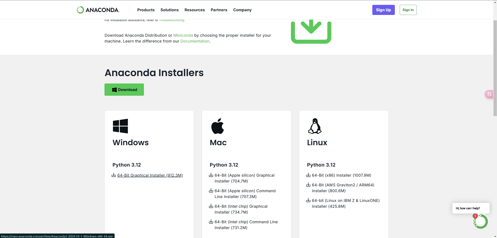
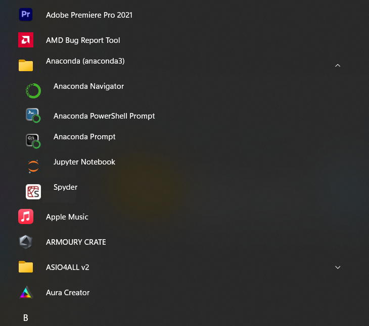
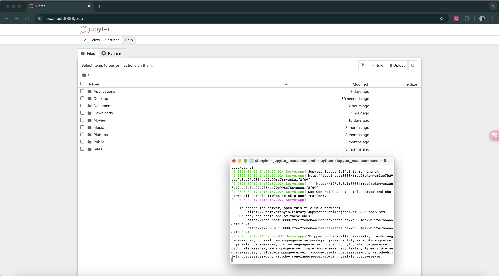
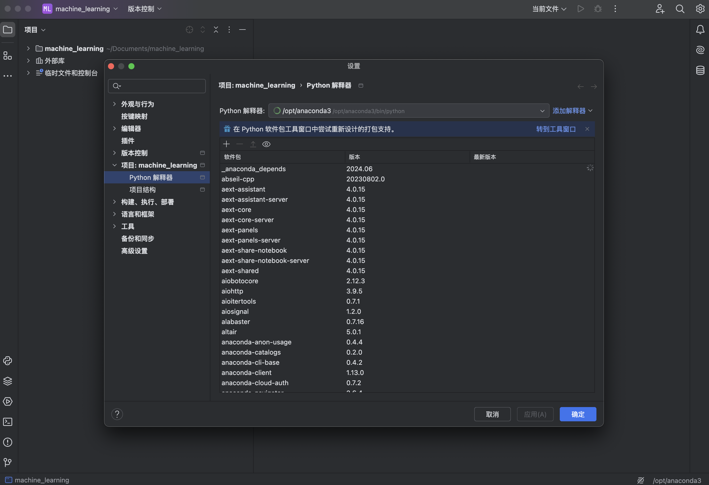
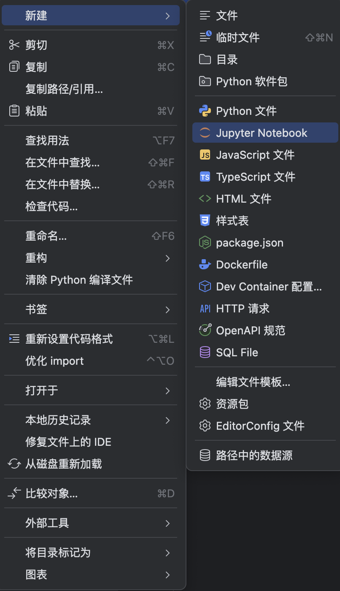

# 0.1. Environment Setup

This article gets you ready to run the course: **Python**, **Anaconda (conda)**, **Jupyter Notebook**, and **PyCharm**. If you already have a working conda environment and can open a notebook, you can skip ahead to [0.2](../0.2/0.2._Download,_Install,_and_Test_the_Required_Packages_Matplotlib,_NumPy,_and_Pandas.md).

We cover **Windows**, **macOS**, and **Linux**. Install steps differ by OS; conda / Jupyter / PyCharm steps are mostly the same afterward.

## 0.1.1. What You Need

| Tool | Role |
|------|------|
| **Python** | Language for the course. Prefer **3.11** or **3.12** (avoid old EOL versions such as 3.8). |
| **Anaconda** | Installer that bundles Python, `conda`, and many scientific packages. Recommended for beginners. |
| **Jupyter Notebook** | Browser-based notebooks for interactive code and notes. |
| **PyCharm** | Editor / IDE; can use your conda environment as the project interpreter. |

**Do you need a separate Python from [python.org](https://www.python.org/)?**  
Usually **no**. Anaconda already includes Python. For this course, install Anaconda and create an environment with Python 3.11 or 3.12. A standalone python.org install is optional (handy for non-conda projects); if you install it on Windows, check **Add python.exe to PATH**.

**Anaconda vs Miniconda:** Anaconda is larger and beginner-friendly. [Miniconda](https://www.anaconda.com/download) is a smaller conda-only bootstrap. Either works; this guide assumes **Anaconda**.

## 0.1.2. Install Anaconda

### Download (all platforms)

1. Open the official download page: [https://www.anaconda.com/download](https://www.anaconda.com/download).
2. Download the installer for **your OS** (Windows / macOS / Linux). The site usually offers the right build; on macOS, pick **Apple Silicon** or **Intel** to match your Mac.



You may be asked for an email before download; that is optional for getting the installer. Prefer the official Anaconda site over third-party mirrors unless you know you need one.

### Windows

1. Run the downloaded `.exe` installer.
2. Accept the defaults unless you have a reason to change the install location.
3. Prefer using **Anaconda Prompt** or **Anaconda PowerShell Prompt** from the Start menu for conda commands (safest for beginners). You do not have to put Anaconda on the system `PATH`.
4. Confirm installation: open **Anaconda Prompt** and run:

```bash
conda --version
```



If Anaconda lives under `C:\Program Files` (or another protected folder), run Anaconda Prompt **as Administrator** when creating environments or installing packages, or install Anaconda in a user-writable folder instead.

### macOS

1. Run the downloaded installer (`.pkg`, or follow the on-page instructions for the shell installer).
2. After install, open **Terminal** and initialize conda for your shell (most Macs use zsh):

```bash
conda init zsh
```

Close the terminal completely, open a new one, then check:

```bash
conda --version
```

**Apple Silicon vs Intel:** use the installer that matches your chip (Apple menu → **About This Mac**). Mixing the wrong architecture can cause obscure package errors later.

### Linux

1. Download the Linux installer (`.sh`) from the same official page.
2. In a terminal, run it with `bash` (example filename; yours will include a version number):

```bash
bash ~/Downloads/Anaconda3-*.sh
```

3. Accept the license, choose an install location (default under your home directory is fine), and allow the installer to run `conda init` for your shell when asked.
4. Close and reopen the terminal, then run:

```bash
conda --version
```

Use the **official `.sh` installer**, not a random distro package from `apt` / `dnf` / `pacman`, unless you already know how those packages are maintained. You normally should **not** run the Anaconda installer with `sudo`.

## 0.1.3. Create a Conda Environment (Recommended)

Do not pile every course package into `base`. Create a dedicated environment:

**Windows:** Anaconda Prompt (or Anaconda PowerShell Prompt).  
**macOS / Linux:** Terminal (after `conda init`).

```bash
conda create -n machine_learning python=3.12
```

- Replace `machine_learning` with any **English-only** name you like.
- Use `python=3.11` if you prefer 3.11; both are fine for this course.

When prompted, type `y` and press Enter. Then activate it:

```bash
conda activate machine_learning
```

Your prompt should show the environment name (for example `(machine_learning)`) instead of only `(base)`.

```text
(base) user@hostname ~ % conda activate machine_learning
(machine_learning) user@hostname ~ %
```

Useful checks:

```bash
conda env list
python --version
```

```text
(base) user@hostname ~ % conda env list

# conda environments:
#
base                  * /opt/anaconda3
machine_learning        /opt/anaconda3/envs/machine_learning
```

The active environment is marked with `*`.

You can also start a Python REPL to confirm the interpreter responds:

```text
(base) user@hostname ~ % python
Python 3.12.2 | packaged by conda-forge | (main, Feb 16 2024, 20:54:21) [Clang 16.0.6 ] on darwin
Type "help", "copyright", "credits" or "license" for more information.
>>> 
```

## 0.1.4. Install and Open Jupyter Notebook

With your course environment **activated**:

```bash
pip install notebook
```

Start Notebook:

```bash
jupyter notebook
```

A browser window should open. To open a specific project folder, `cd` there first, then run `jupyter notebook`:

```bash
cd /path/to/your/project
jupyter notebook
```



Current `pip install notebook` installs **Notebook 7+**. Themes and dark mode are available in the Notebook UI settings; you do not need third-party theme packages for this course.

Package installs for matplotlib, NumPy, and pandas are covered in [0.2](../0.2/0.2._Download,_Install,_and_Test_the_Required_Packages_Matplotlib,_NumPy,_and_Pandas.md) — do that next after this setup works.

## 0.1.5. PyCharm + Anaconda

[PyCharm](https://www.jetbrains.com/pycharm/download/) from JetBrains is a solid Python IDE for beginners. Since PyCharm 2025.1, JetBrains ships **one unified PyCharm** product: download PyCharm from the official site, try Pro features during the free trial if you want, then keep the free core features (including Jupyter support) or subscribe to Pro.

1. Download and install PyCharm for your OS; accept the installer defaults.
2. Open PyCharm → **New Project**.
3. For the interpreter, choose a **conda** option (for example **Base conda**, or point at the `machine_learning` environment you created).


You can change the interpreter later under **Settings** → search for **Python Interpreter**:



### Create a notebook in PyCharm

In a project that uses your conda interpreter, you can create a Jupyter Notebook from the IDE (for example **New** → **Jupyter Notebook**).



## 0.1.6. Quick Checklist

Before moving on, you should be able to:

1. Run `conda --version` in Anaconda Prompt (Windows) or a terminal (macOS / Linux).
2. `conda activate` your course environment and see `python --version` report 3.11 or 3.12.
3. Run `jupyter notebook` and open a browser UI.
4. (Optional) Create a PyCharm project that uses that conda environment.

Next: [0.2. Download, Install, and Test the Required Packages](../0.2/0.2._Download,_Install,_and_Test_the_Required_Packages_Matplotlib,_NumPy,_and_Pandas.md) (matplotlib, NumPy, pandas).
