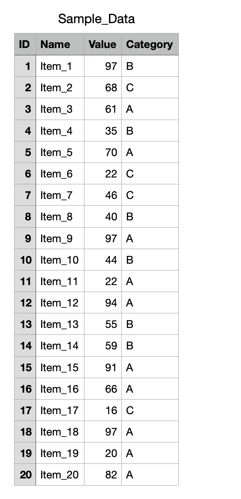

# 0.2. Download, Install, and Test the Required Packages Matplotlib, NumPy, and Pandas

## 0.2.1. Install `matplotlib` and Test It
You need to download and install Anaconda first (the installation tutorial is in the previous article, [0.1. Environment Setup](../0.1/0.1._Environment_Setup.md)).

### Step 1: Switch Environments (Optional)
If you need to install packages into a specific environment, you must first switch to that environment manually.

On macOS, open a terminal. On Windows, open Anaconda Prompt or Anaconda Powershell Prompt (note: if you installed Anaconda on the C drive, you need to open it as administrator, otherwise you may encounter errors in later operations). Then enter:
```bash
conda env list
```
- This command helps you check which environments exist on your computer and which environment you are currently in

```text
(base) user@hostname ~ % conda env list

# conda environments:
#
base                  * /opt/anaconda3
machine_learning        /opt/anaconda3/envs/machine_learning
```

- The environment with `*` in front of the path is the one you are currently using

If you want to switch environments, use this command:
```bash
conda activate specified_environment_name
```

```text
(base) user@hostname ~ % conda activate machine_learning
(machine_learning) user@hostname ~ %
```

- If the command-line prefix changes to the environment name you want, then everything is correct

### Step 2: Download and Install
Use the `pip` command to download it:
```bash
pip install matplotlib
```

Note: since `numpy` is a dependency of `matplotlib`, installing `matplotlib` will automatically install `numpy`. So we do not need to install `numpy` separately with a dedicated command.

### Step 3: Test It
Next, we can use `matplotlib` in code to see whether it was installed successfully:
```python
import matplotlib
from matplotlib import pyplot as plt

x = [1, 2, 3, 4, 5]
y = [1, 2, 3, 4, 5]

fig1 = plt.figure(figsize = (5, 5))
plt.plot(x,y)
plt.show()
```
- `pyplot` is a submodule of the `matplotlib` library. It provides a MATLAB-like plotting interface and is usually imported under the alias `plt`
- `plt.figure()` is used to create a new `Figure` object, which is the canvas for plotting
- `figsize=(5, 5)` specifies the canvas size in inches

Output:


## 0.2.2. Install `numpy` and Test It
In general, since `numpy` is a dependency of `matplotlib`, installing `matplotlib` will automatically install `numpy`. So we do not need to install `numpy` separately with a dedicated command.

Still, just in case, let's go over the command for installing `numpy`.

### Step 1: Switch Environments (Optional)
Same as above, so I will not repeat it here.

### Step 2: Download and Install
Use the `pip` command to download it:
```bash
pip install numpy
```

### Step 3: Test It
Next, we can use `numpy` in code to see whether it was installed successfully:
```python
import numpy as np
a = np.eye(5)
print(type(a))
print(a)
```
- `np.eye(5)` is used to create a 5×5 identity matrix. An identity matrix is a matrix whose diagonal elements are 1 and whose other elements are 0:

Output:
```
<class 'numpy.ndarray'>
[[1. 0. 0. 0. 0.]
 [0. 1. 0. 0. 0.]
 [0. 0. 1. 0. 0.]
 [0. 0. 0. 1. 0.]
 [0. 0. 0. 0. 1.]]
```

---

`numpy` also has some interesting functions:
```python
b = np.ones([5,5])
print(type(b))
print(b)
```
- `np.ones([5,5])` generates a 5×5 NumPy array in which every element is 1. `ones()` is a NumPy function for creating an all-ones array

Output:
```
<class 'numpy.ndarray'>
[[1. 1. 1. 1. 1.]
 [1. 1. 1. 1. 1.]
 [1. 1. 1. 1. 1.]
 [1. 1. 1. 1. 1.]
 [1. 1. 1. 1. 1.]]
```

---

One of the most powerful things about `numpy` is direct array arithmetic, so let us also show a code example here:
```python
import numpy as np  
  
a = np.eye(5)  
print(f"a =\n {a}\n")  
  
b = np.ones([5,5])  
print(f"b =\n {b}\n")  
  
c = a + b # magically  
print(f"c =\n {c}\n")
```

Output:
```
a =
 [[1. 0. 0. 0. 0.]
 [0. 1. 0. 0. 0.]
 [0. 0. 1. 0. 0.]
 [0. 0. 0. 1. 0.]
 [0. 0. 0. 0. 1.]]

b =
 [[1. 1. 1. 1. 1.]
 [1. 1. 1. 1. 1.]
 [1. 1. 1. 1. 1.]
 [1. 1. 1. 1. 1.]
 [1. 1. 1. 1. 1.]]

c =
 [[2. 1. 1. 1. 1.]
 [1. 2. 1. 1. 1.]
 [1. 1. 2. 1. 1.]
 [1. 1. 1. 2. 1.]
 [1. 1. 1. 1. 2.]]
```

## 0.2.3. Install `pandas` and Test It

### Step 1: Switch Environments (Optional)
Same as above, so I will not repeat it here.

### Step 2: Download and Install
Use the `pip` command to download it:
```bash
pip install pandas
```

### Step 3: Test It
The power of the `pandas` library lies in data loading, saving, and indexing. I created the following CSV file locally:



We can use functions from the `pandas` library to read it:
```python
import pandas as pd  
data = pd.read_csv('Sample_Data.csv')  
print(type(data))  
print(data)
```
- Use `pd.read_csv('Sample_Data.csv')` to read the `Sample_Data.csv` file and store it in the `data` variable
- After reading it, `data` will be a `pandas.DataFrame`, which is a two-dimensional tabular data structure similar to an Excel sheet

Output:
```
<class 'pandas.core.frame.DataFrame'>
    ID     Name  Value Category
0    1   Item_1     97        B
1    2   Item_2     68        C
2    3   Item_3     61        A
3    4   Item_4     35        B
4    5   Item_5     70        A
5    6   Item_6     22        C
6    7   Item_7     46        C
7    8   Item_8     40        B
8    9   Item_9     97        A
9   10  Item_10     44        B
10  11  Item_11     22        A
11  12  Item_12     94        A
12  13  Item_13     55        B
13  14  Item_14     59        B
14  15  Item_15     91        A
15  16  Item_16     66        A
16  17  Item_17     16        C
17  18  Item_18     97        A
18  19  Item_19     20        A
19  20  Item_20     82        A
```

---

Since we already know how to read data, let's also store some of it:
```python
value = data.loc[:,'Value']  
print(type(value))  
print(value)  
```
- `data.loc[:, 'Value']` selects **all rows** (`:`) and the **"Value" column** (`'Value'`) from this `DataFrame`
- `loc[]` is the method Pandas uses for label-based selection, and `:` represents selecting all rows

Output:
```
<class 'pandas.core.series.Series'>
0     97
1     68
2     61
3     35
4     70
5     22
6     46
7     40
8     97
9     44
10    22
11    94
12    55
13    59
14    91
15    66
16    16
17    97
18    20
19    82
```

---

Let's also try Pandas' data filtering capability:
```python
import pandas as pd  
data = pd.read_csv('Sample_Data.csv')  
  
values = data.loc[:, 'Value']  
  
special_category = data.loc[:,'Category'][values > 50]  
  
print(special_category)
```
- `data.loc[:, 'Category'][values > 50]`:
  - `values > 50` returns a boolean index used to filter rows where the `Value` column is greater than 50
  - First, it takes the `Category` column with `data.loc[:, 'Category']`, and then it **keeps only the rows where `Value` is greater than 50**
  - The result is a filtered `Series` from the `Category` column

Output:
```
0     B
1     C
2     A
4     A
8     A
11    A
12    B
13    B
14    A
15    A
17    A
19    A
Name: Category, dtype: object
```

---

We can also use `pandas` to store data as a local file. For example, let us add 10 to all values and then save the result:
```python
import pandas as pd  
  
data = pd.read_csv('Sample_Data.csv')  
  
data['Value'] = data['Value'] + 10  
  
data.to_csv('Sample_Data_modified.csv')  
  
print(data.head())
```
- `to_csv` can save data as a `.csv` file, and its parameter is the filename to save
- The `head` method can print the first few rows instead of everything, which is convenient for large tables

Output:
```
   ID    Name  Value Category
0   1  Item_1    107        B
1   2  Item_2     78        C
2   3  Item_3     71        A
3   4  Item_4     45        B
4   5  Item_5     80        A
```

A new file called `Sample_Data_modified.csv` has also been created:
```
,ID,Name,Value,Category  
0,1,Item_1,107,B  
1,2,Item_2,78,C  
2,3,Item_3,71,A  
3,4,Item_4,45,B  
4,5,Item_5,80,A  
5,6,Item_6,32,C  
6,7,Item_7,56,C  
7,8,Item_8,50,B  
8,9,Item_9,107,A  
9,10,Item_10,54,B  
10,11,Item_11,32,A  
11,12,Item_12,104,A  
12,13,Item_13,65,B  
13,14,Item_14,69,B  
14,15,Item_15,101,A  
15,16,Item_16,76,A  
16,17,Item_17,26,C  
17,18,Item_18,107,A  
18,19,Item_19,30,A  
19,20,Item_20,92,A
```

## 0.2.4. Working with `pandas` and `numpy` Together

We can very easily convert a `pandas` `DataFrame` into a `numpy` `ndarray`:
```python
import pandas as pd  
import numpy as np  
  
data = pd.read_csv('Sample_Data.csv')  
data_array = np.array(data)  
  
print(type(data_array))  
print(data_array)
```

Output:
```
<class 'numpy.ndarray'>
[[1 'Item_1' 97 'B']
 [2 'Item_2' 68 'C']
 [3 'Item_3' 61 'A']
 [4 'Item_4' 35 'B']
 [5 'Item_5' 70 'A']
 [6 'Item_6' 22 'C']
 [7 'Item_7' 46 'C']
 [8 'Item_8' 40 'B']
 [9 'Item_9' 97 'A']
 [10 'Item_10' 44 'B']
 [11 'Item_11' 22 'A']
 [12 'Item_12' 94 'A']
 [13 'Item_13' 55 'B']
 [14 'Item_14' 59 'B']
 [15 'Item_15' 91 'A']
 [16 'Item_16' 66 'A']
 [17 'Item_17' 16 'C']
 [18 'Item_18' 97 'A']
 [19 'Item_19' 20 'A']
 [20 'Item_20' 82 'A']]
```
