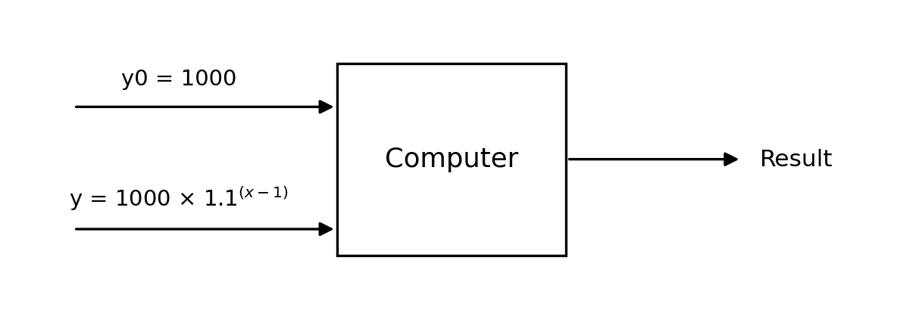
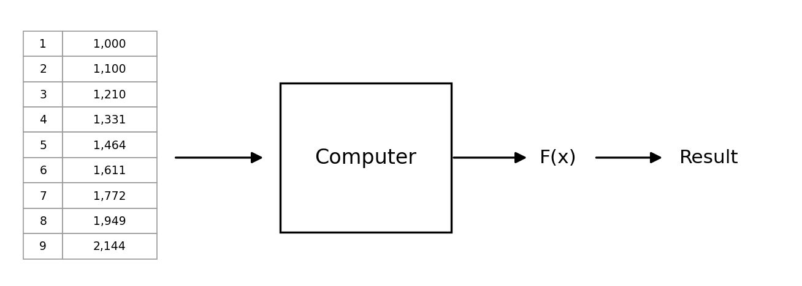
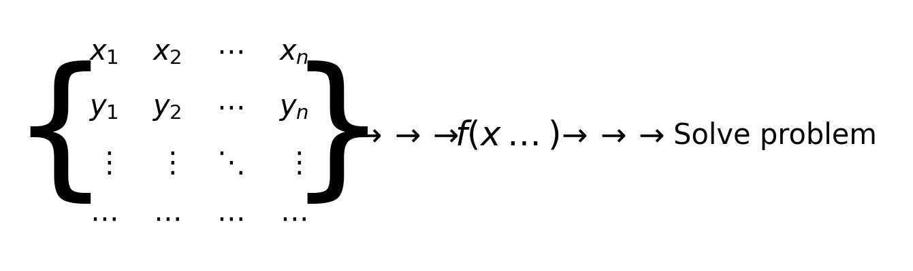

# 1.1. Introduction to Machine Learning

## 1.1.1. What Is Machine Learning?
Here is a simple example:

Xiaoming earns 1,000 in January, and his salary increases by 10% every month. What is his salary in month 10?

| Month x | Salary y |
| ---- | ----- |
| 1    | 1,000 |
| 2    | 1,100 |
| 3    | 1,210 |
| 4    | 1,331 |
| 5    | 1,464 |
| 6    | 1,611 |
| 7    | 1,772 |
| 8    | 1,949 |
| 9    | 2,144 |
| 10   | ???   |

It is easy to write the function: `y = 1000 × 1.1^(x-1)`

This is exactly how a traditional algorithm works: you tell the computer the starting salary `y0` (1,000 yuan), then tell it the salary formula `y = 1000 × 1.1^(x-1)` for each month, and let the computer calculate the salary for month 10.

Machine learning, by contrast, directly gives the computer the monthly salary data and lets the computer infer the function relationship on its own, thereby obtaining the salary for month 10.

In one sentence: ***Machine learning is a set of algorithms and techniques that enables computers to automatically learn patterns from data and make predictions or decisions.***

## 1.1.2. Do We Still Need ML and DL If Transformers Are So Dominant?
Many students may have this question: Transformers are extremely popular now, so why do I still need to learn machine learning (ML) and deep learning (DL)?

Let us see what ChatGPT, the most remarkable product of the Transformer model, has to say:

*Q: Please answer this question in one paragraph: now that Transformers are so dominant, is it still necessary to learn Machine Learning and Deep Learning?*

*A: Absolutely yes! Although Transformers have achieved great success in natural language processing, computer vision, and other fields, Machine Learning (ML) and Deep Learning (DL) are still the foundation of the entire AI field. A Transformer is essentially a deep learning architecture, and understanding it requires a solid grasp of deep learning knowledge such as neural networks, gradient descent, and optimization methods. In addition, traditional machine learning methods (such as decision trees, SVMs, clustering, and so on) still have advantages in scenarios with small datasets, high interpretability requirements, or limited computing resources. Therefore, systematically studying machine learning and deep learning not only helps you better understand and optimize Transformers, but also helps you find suitable solutions in a wider range of application scenarios.*

I think GPT’s answer is already very clear — machine learning (ML) and deep learning (DL) are the foundation, and understanding them is the basis for learning Transformers.

## 1.1.3. The Basic Framework of Machine Learning

The core of machine learning (ML) and deep learning (DL) is **data**, especially training data. In the figure, the matrix on the left shows the basic structure of training data. It contains multiple samples; each sample consists of a set of input features (`x1`, `x2`, ..., `xn`) and a corresponding output label `y`. These data are used to guide the model in learning the mapping relationship between input and output, providing the basis for later prediction and decision-making.

In ML and DL, the goal of the model is to find a mapping function `f(x)` so that for a new input `x`, it can predict a reasonable output `y`. This process involves **training**, which means letting the computer automatically learn the relationships in the data based on the provided data and continuously optimizing the model parameters so that the mapping from input to output becomes more accurate. ML may rely on manual feature engineering, while DL automatically learns features through neural networks.

After training is complete, the model can be used to solve real-world problems. For a new input `x`, the model uses the learned `f(x)` to make a prediction and output the corresponding result. This process is called **inference**.

A key feature of ML and DL is “automatic learning of data relationships.” In traditional programming, programmers need to manually write rules to process data, while in ML and DL, the computer learns these rules automatically from training data. ML is suitable for structured data, while DL is suitable for more complex data types such as images, speech, and text. This greatly improves the adaptability of models, enabling them to handle complex real-world problems.

## 1.2. Categories of Machine Learning
### Supervised Learning

Supervised learning means that the **training data contains the correct results (labels)**. During training, the model learns from the input data and the corresponding correct labels, with the goal of finding the mapping relationship between input and output so that it can make accurate predictions on new data.

### Unsupervised Learning

The training data in unsupervised learning **does not contain correct results**. The model needs to learn the intrinsic structure or patterns of the data by itself. It is usually used for **clustering** and **dimensionality reduction** tasks.

### Semi-supervised Learning

Semi-supervised learning lies between supervised learning and unsupervised learning. The training data **contains a small amount of correct results**, but most of the data are unlabeled. This method combines the advantages of both and can improve model performance when labeled data are limited.

### Reinforcement Learning

Reinforcement learning is a machine learning method that learns the optimal strategy through **interaction with the environment**. An agent takes actions in an environment and adjusts its strategy according to **rewards** in order to maximize long-term returns. Unlike supervised learning, reinforcement learning has no fixed correct answer; it optimizes decisions through exploration and trial and error.

## 1.3. Course Content
In the following series of articles, we will cover these parts:
### 1. Supervised Learning
- Linear Regression - ML
- Logistic Regression - ML
- Decision Trees - ML
- Neural Networks (NN), Convolutional Neural Networks (CNN), Recurrent Neural Networks (RNN) - DL

### 2. Unsupervised Learning
- Clustering Algorithms - ML

### 3. Hybrid Learning
- Supervised Learning + Unsupervised Learning - ML
