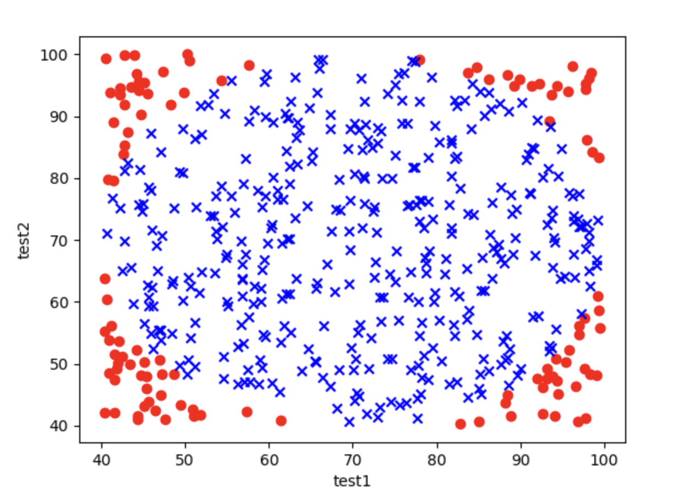
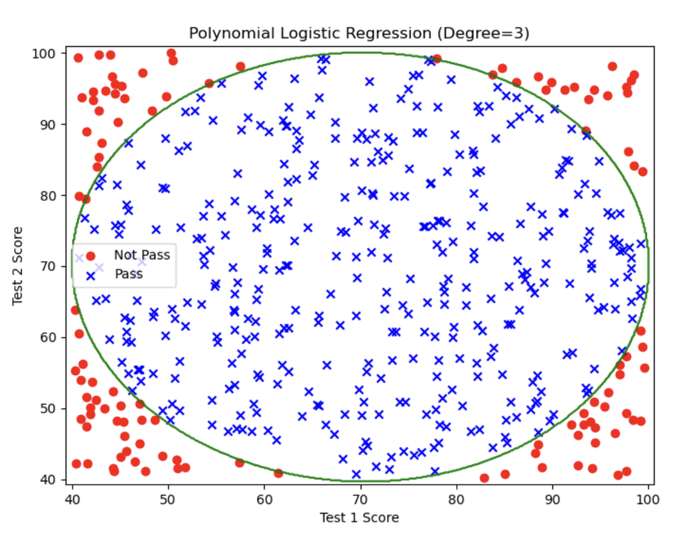

# 1.10. Logistic Regression Practice (Advanced): Higher-Order Logistic Regression

## 1.10.1. Some Preparation
In this article, we will go one step further based on [1.9. Logistic Regression Practice (Advanced)](../1.9/1.9._Logistic_Regression_Practice_(Advanced)_Building_a_Second_Order_Boundary_Model.md) and explain how to find a (quasi-)circular decision boundary.

Most circular regression boundaries are second-order, but sometimes the data are very complex and require higher orders. This article covers that part.

Next, make sure your Python environment has `pandas`, `matplotlib`, `scikit-learn`, and `numpy`. If not, enter this command in the terminal to download and install them:
```bash
pip install pandas matplotlib scikit-learn numpy
```

I have placed the `.csv` data file on [GitHub](https://github.com/SomeB1oody/learning_examples/blob/main/machine_learning_example/1.10/Chip_Test_Data.csv); click the link to download it.

The training data has three columns: `test1`, `test2`, and `pass_or_not`. `test1` and `test2` contain the values from two different tests on the chip, and `pass_or_not` indicates whether the final chip passed inspection, where pass is 1 and fail is 0. Our goal is to train a logistic regression model to find the decision boundary for `pass_or_not`.

After downloading it, move it into your Python project folder.

## 1.10.2. Writing the Code for a Second-Order Decision Boundary

This part is actually the same as in the previous article, [1.9. Logistic Regression Practice (Advanced)](../1.9/1.9._Logistic_Regression_Practice_(Advanced)_Building_a_Second_Order_Boundary_Model.md), so I will go through it quickly.
### Step 1: Read the Data
```python
# Read the data  
import pandas as pd  
data = pd.read_csv('Chip_Test_Data.csv')  
  
print(data.head())
```

Output:
```
       test1      test2  pass_or_not
0  62.472407  81.889703            1
1  97.042858  72.165782            1
2  83.919637  58.571657            1
3  75.919509  88.827701            1
4  49.361118  81.083870            1
```

Then we can also use `matplotlib` to visualize the data:
```python
# Read the data  
import pandas as pd  
data = pd.read_csv('Chip_Test_Data.csv')  
  
# Visualize  
import matplotlib.pyplot as plt  
  
x1 = data.loc[:, 'test1'].to_numpy()  
x2 = data.loc[:, 'test2'].to_numpy()  
y = data.loc[:, 'pass_or_not'].to_numpy()  
  
class0 = (y == 0)  
class1 = (y == 1)  
  
plt.scatter(x1[class0], x2[class0], c='r', marker='o')  
plt.scatter(x1[class1], x2[class1], c='b', marker='x')  
plt.xlabel('test1')  
plt.ylabel('test2')  
plt.show()
```

Output image:



### Step 2: Assign Values to `x` and `y`
We need to first clarify what `x` and `y` represent:
- `y` is the data in the `pass_or_not` column

`x` is a bit special. Since we are building a second-order model, the terms in the equation are more complex than before:
$$
\theta_0 + \theta_1 X_1 + \theta_2 X_2 + \theta_3 X_1^2 + \theta_4 X_2^2 + \theta_5 X_1 X_2 = 0
$$
There are terms such as `x_1`^2, `x_2`^2, and `X_1 * x_2`. So we need to package these terms into a dictionary, and then convert it into a `DataFrame` format that the model can use.

```python
# Assign values to x and y  
y = data.loc[:, 'pass_or_not']  
x1 = data.loc[:, 'test1']  
x2 = data.loc[:, 'test2']  
x = {  
    'x1': x1,  
    'x2': x2,  
    'x1^2': x1 ** 2,  
    'x2^2': x2 ** 2,  
    'x1*x2': x1 * x2,  
}  
  
x = pd.DataFrame(x)  
print(x.head())
```

Output:
```
          x1         x2         x1^2         x2^2        x1*x2
0  62.472407  81.889703  3902.801653  6705.923431  5115.846856
1  97.042858  72.165782  9417.316363  5207.900089  7003.173761
2  83.919637  58.571657  7042.505392  3430.639001  4915.312163
3  75.919509  88.827701  5763.771855  7890.360497  6743.755464
4  49.361118  81.083870  2436.520012  6574.594031  4002.390527
```

We can also use the simple method mentioned in the previous article, [1.9. Logistic Regression Practice (Advanced)](../1.9/1.9._Logistic_Regression_Practice_(Advanced)_Building_a_Second_Order_Boundary_Model.md), to generate this dictionary:
```python
from sklearn.preprocessing import PolynomialFeatures
poly = PolynomialFeatures(degree=2, include_bias=False)
x = data.drop(['pass_or_not'], axis=1)
x = poly.fit_transform(x)
```

### Step 3: Train the Model
```python
# Train the model  
from sklearn.linear_model import LogisticRegression  
model = LogisticRegression()  
model.fit(x, y)
```

### Step 4: Get the Decision Boundary
```python
# Get the decision boundary  
theta1, theta2, theta3, theta4, theta5 = model.coef_[0]  
theta0 = model.intercept_[0]

print(f'Decision Boundary: {theta0} + {theta1}x1 + {theta2}x2 + {theta3}x1^2 + {theta4}x2^2 + {theta5}x1*x2')
```

Each variable here corresponds to a parameter in the equation:
$$
\theta_0 + \theta_1 X_1 + \theta_2 X_2 + \theta_3 X_1^2 + \theta_4 X_2^2 + \theta_5 X_1 X_2 = 0
$$

Output:
```
Decision Boundary: -1.55643301596937 + 0.0687019597360078x1 + 0.04589152052058807x2 + -0.001380801702595371x1^2 + -0.0012980632178920715x2^2 + 0.0018080315329989266x1*x2
```

### Step 5: Get the Predicted Values and Calculate Accuracy
```python
# Get the predicted values and calculate accuracy  
prediction = model.predict(x)  
from sklearn.metrics import accuracy_score  
print(f"accuracy: {accuracy_score(y, prediction)}")
```

Output:
```
accuracy: 0.842
```

### Step 6: Visualize the Decision Boundary
```python
# Visualize  
import matplotlib.pyplot as plt  
import numpy as np  
  
x1 = x1.to_numpy()  
x2 = x2.to_numpy()  
y = y.to_numpy()  
  
class0 = (y == 0)  
class1 = (y == 1)  
  
plt.scatter(x1[class0], x2[class0], c='r', marker='o')  
plt.scatter(x1[class1], x2[class1], c='b', marker='x')  
plt.xlabel('exam1')  
plt.ylabel('exam2')  
  
# Visualize the second-order decision boundary  
  
# Define the ranges of exam1 and exam2 for drawing the grid  
x1_min, x1_max = x1.min() - 1, x1.max() + 1  
x2_min, x2_max = x2.min() - 1, x2.max() + 1  
  
# Generate grid data  
xx1, xx2 = np.meshgrid(np.linspace(x1_min, x1_max, 500),  
                       np.linspace(x2_min, x2_max, 500))  
  
# Compute the decision boundary value for each point  
z = (theta0 +  
     theta1 * xx1 +  
     theta2 * xx2 +  
     theta3 * xx1 ** 2 +  
     theta4 * xx2 ** 2 +  
     theta5 * xx1 * xx2)  
  
# Plot the sample points  
plt.scatter(x1[class0], x2[class0], c='r', label='Not Pass', marker='o')  
plt.scatter(x1[class1], x2[class1], c='b', label='Pass', marker='x')  
  
# Plot the decision boundary  
plt.contour(xx1, xx2, z, levels=[0], colors='g')  
  
# Add labels and legend  
plt.xlabel('Test1 Score')  
plt.ylabel('Test2 Score')  
plt.legend()  
plt.title('Decision Boundary')  
plt.show()
```
- **Grid generation (`np.meshgrid`)**: generates coordinate grids for `exam1` and `exam2`, used to compute the decision value at each point
- **Decision value computation (`z`)**: `z` is the value of the decision function, based on the logistic regression coefficients and intercept
- **Contour plot (`plt.contour`)**: `plt.contour()` can draw the contour line for a specific value (for example, `0` corresponds to the decision boundary)

Output image:


You will find that this graph only draws the two lines in the upper-left and lower-right, while the lower-left and upper-right parts where there should also be decision boundaries are missing. This is because the order is too low, so the fit is incomplete. If we keep increasing the order, the fit will become better.

## 1.10.3. Third-Order Decision Boundary
In fact, writing the code for a third-order decision boundary is basically the same as writing the second-order one. The only difference is that, in the part where we assign `x` as a dictionary and then convert it to a `DataFrame`, we need to add a few more fields to match the higher-order features:
```python
# Assign values to x and y  
y = data.loc[:, 'pass_or_not']  
x1 = data.loc[:, 'test1']  
x2 = data.loc[:, 'test2']  
  
# Manually create a higher-order feature dictionary  
x = {  
    'x1': x1,  
    'x2': x2,  
    'x1^2': x1 ** 2,  
    'x2^2': x2 ** 2,  
    'x1*x2': x1 * x2,  
    'x1^3': x1 ** 3,  
    'x2^3': x2 ** 3,  
    'x1^2*x2': (x1 ** 2) * x2,  
    'x1*x2^2': x1 * (x2 ** 2),  
}  
  
# Convert the feature dictionary to a DataFrame
x = pd.DataFrame(x)
```

This way, each field in the dictionary corresponds to a term in the third-order `g(x)`:
$$
g(x) = \theta_0 + \theta_1 X_1 + \theta_2 X_2 + \theta_3 X_1^2 + \theta_4 X_2^2 + \theta_5 X_1 X_2 + \theta_6 X_1^3 + \theta_7 X_2^3 + \theta_8 X_1^2 X_2 + \theta_9 X_1 X_2^2 = 0
$$

We can also use `PolynomialFeatures` to create the dictionary:
```python
from sklearn.preprocessing import PolynomialFeatures
poly = PolynomialFeatures(degree=3, include_bias=False)
x = data.drop(['pass_or_not'], axis=1)
x = poly.fit_transform(x)
```

The rest is basically unchanged. I will paste the complete third-order code here:
```python
# Import required modules  
import numpy as np  
import pandas as pd  
import matplotlib.pyplot as plt  
from sklearn.linear_model import LogisticRegression  
from sklearn.metrics import accuracy_score  
  
# Part 1: Read the data  
file_path = "Chip_Test_Data.csv"  
data = pd.read_csv(file_path)  
  
# Assign values to x and y  
y = data.loc[:, 'pass_or_not']  
x1 = data.loc[:, 'test1']  
x2 = data.loc[:, 'test2']  
  
# Manually create a higher-order feature dictionary  
x = {  
    'x1': x1,  
    'x2': x2,  
    'x1^2': x1 ** 2,  
    'x2^2': x2 ** 2,  
    'x1*x2': x1 * x2,  
    'x1^3': x1 ** 3,  
    'x2^3': x2 ** 3,  
    'x1^2*x2': (x1 ** 2) * x2,  
    'x1*x2^2': x1 * (x2 ** 2),  
}  
  
# Convert the feature dictionary to a DataFrame
x = pd.DataFrame(x)  
  
# Part 3: Train the logistic regression model  
model = LogisticRegression(max_iter=10000)  
model.fit(x, y)  
  
# Get the model coefficients and intercept  
theta = model.coef_[0]  
theta0 = model.intercept_[0]  
  
# Get the predicted values and calculate accuracy  
prediction = model.predict(x)  
accuracy = accuracy_score(y, prediction)  
print(f"Accuracy: {accuracy}")  
  
# Part 4: Generate the grid and compute the decision boundary  
# Define the ranges of x1 and x2 for drawing the grid decision boundary  
x1_min, x1_max = x1.min() - 1, x1.max() + 1  
x2_min, x2_max = x2.min() - 1, x2.max() + 1  
  
# Generate grid data  
xx1, xx2 = np.meshgrid(np.linspace(x1_min, x1_max, 500),  
                       np.linspace(x2_min, x2_max, 500))  
  
# Use the generated grid to compute polynomial features  
grid_x = {  
    'x1': xx1.ravel(),  
    'x2': xx2.ravel(),  
    'x1^2': xx1.ravel() ** 2,  
    'x2^2': xx2.ravel() ** 2,  
    'x1*x2': xx1.ravel() * xx2.ravel(),  
    'x1^3': xx1.ravel() ** 3,  
    'x2^3': xx2.ravel() ** 3,  
    'x1^2*x2': (xx1.ravel() ** 2) * xx2.ravel(),  
    'x1*x2^2': xx1.ravel() * (xx2.ravel() ** 2),  
}  
  
grid_x = pd.DataFrame(grid_x)  
  
# Compute the predicted value of each grid point  
z = model.predict(grid_x)  
z = z.reshape(xx1.shape)  
  
# Part 5: Visualization  
# Plot the sample points  
class0 = (y == 0)  
class1 = (y == 1)  
  
plt.figure(figsize=(8, 6))  
  
# Plot Not Pass and Pass sample points  
plt.scatter(x1[class0], x2[class0], c='r', label='Not Pass', marker='o')  
plt.scatter(x1[class1], x2[class1], c='b', label='Pass', marker='x')  
  
# Plot the decision boundary  
plt.contour(xx1, xx2, z, levels=[0.5], colors='g')  
  
# Add labels and title  
plt.xlabel('Test 1 Score')  
plt.ylabel('Test 2 Score')  
plt.legend()  
plt.title('Polynomial Logistic Regression (Degree=3)')  
plt.show()
```

Output:
```
Accuracy: 1.0
```

Output image:



This is already a perfect decision boundary! The accuracy is 100%!
