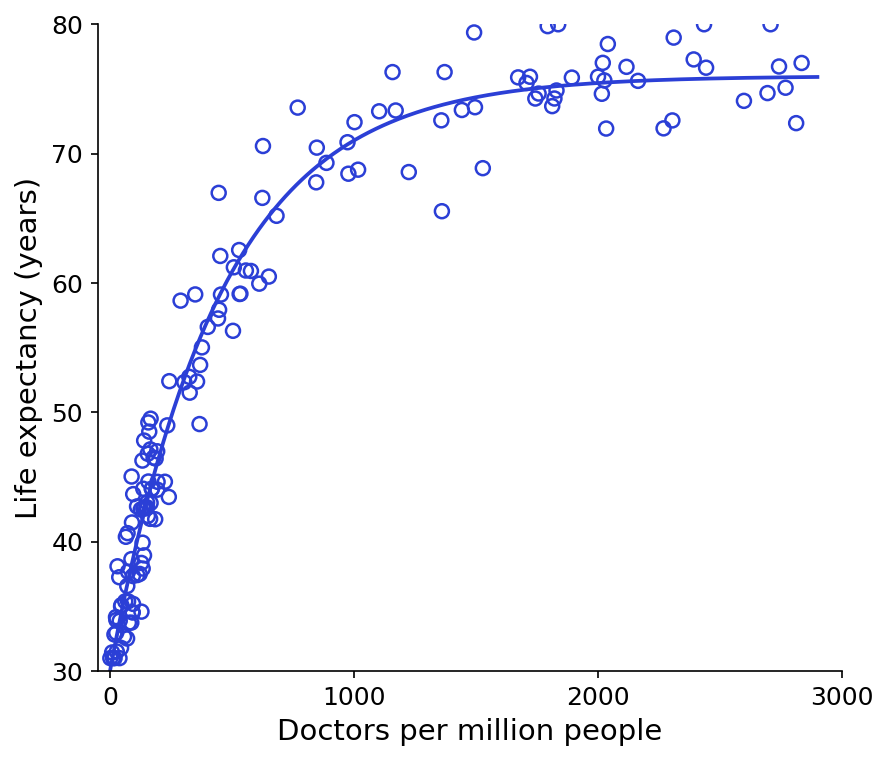
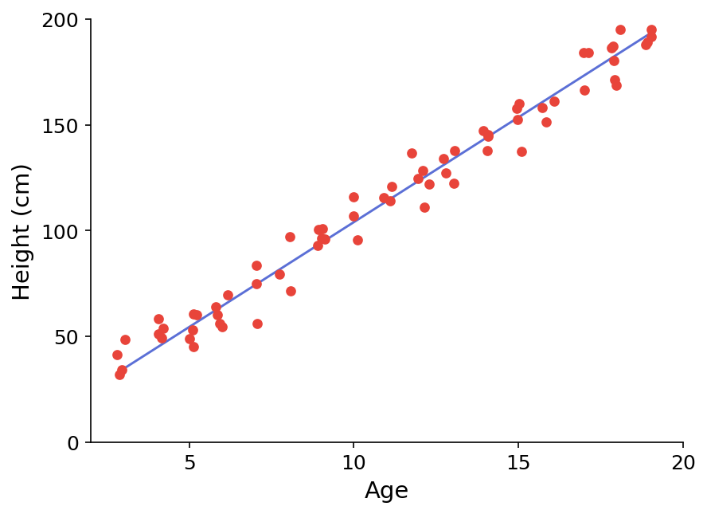
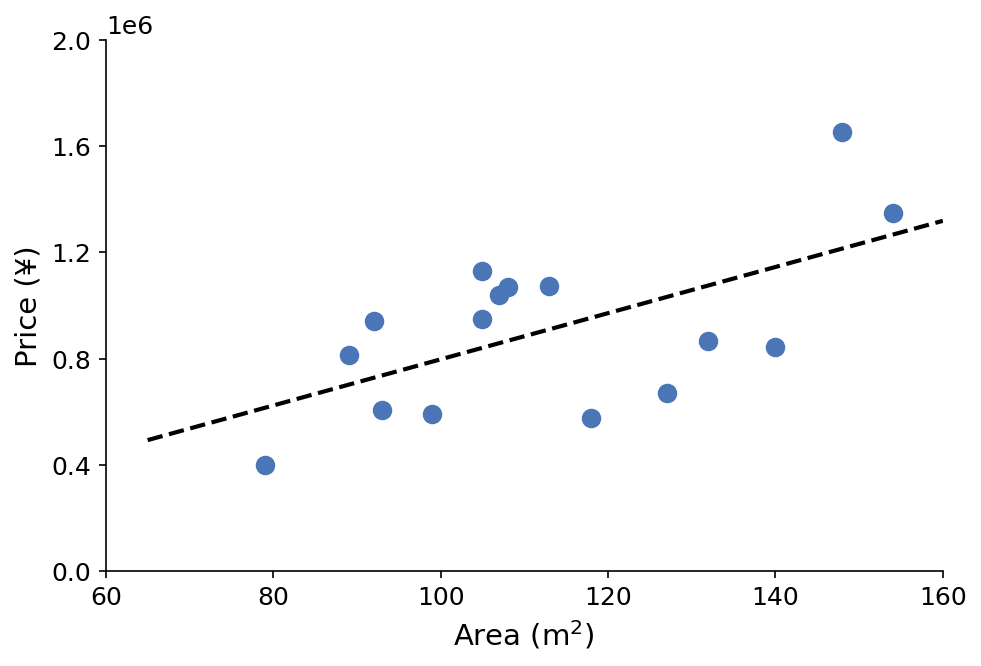
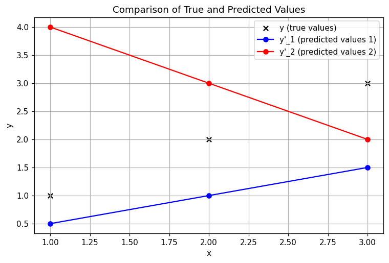

# 1.2. Linear Regression Theory

## 1.2.1. What Is Regression Analysis?

### Some Examples
Let us look at a few examples:

The figure below shows the relationship between the number of doctors per million people and life expectancy. The scatter points are the data we collected, and the fitted curve is what we need to find:



The figure below shows the relationship between age and height. The scatter points are the collected data, and our goal is to find a fitted curve:



### Definition
After seeing the two examples above, you should have a better understanding of regression analysis. Here I will directly give the definition:

*Given data, determine the quantitative relationship of mutual dependence between two or more variables.*

Its function expression is: `y = f(x_1, x_2, ..., x_n)`

### Types of Regression Analysis
There are many kinds of regression analysis.

If we classify by number of variables, we have:
- Univariate regression: `y = f(x)`
- Multivariate regression: `y = f(x_1, x_2, ..., x_n)`

If we classify by functional relationship, we have:
- Linear regression: `y = ax + b`
- Nonlinear regression: `y = ax^2 + bx + c`

## 1.2.2. Linear Regression
Linear regression means that **there is a linear relationship between the variable and the dependent variable in regression analysis**. Its function expression is: `y = ax + b`

### Solving a Regression Problem
Question: Is it worth investing in a house with an area of 110 square meters and a sale price of 1.5 million?

| Area (A) | Price (P) |
| ----- | --------- |
| 79    | 404,976   |
| 92    | 948,367   |
| ...   | ...       |
| 108   | 1,049,007 |
| 110   | ???       |
| 118   | 578,142   |
| ...   | ...       |

To answer this question, we generally go through the following steps:
- Determine the relationship between `P` and `A`: `P = f(A)`
- Predict a reasonable price based on that relationship: `P(A = 110) = f(110)`
- Make a decision

The most critical problem in these three steps is the first one — finding the relationship.

The figure below is the scatter plot organized from the table data:



Our goal is to find the function form of the corresponding black fitted curve.

Here we assume that the fitted curve is a linear function, namely `y = ax + b`, so our real goal is to find reasonable values for parameters `a` and `b`.

## 1.2.3. The Sum of Squared Errors Formula
Let us transform the problem as follows: assume `x` is the variable, `y` is the corresponding result, and `y'` (that is, `ax + b`) is the model output. Our goal is to make `y'` as close to `y` as possible, that is, to minimize the Sum of Squared Errors (SSE):
$$
\textit{minimize} \left\{ \sum_{i=1}^{m} (y'_i - y_i)^2 \right\}
$$
- `m`: the number of data samples.
- `y_i`: the ground-truth value of the `i`-th sample.
- `y'_i`: the predicted value of the `i`-th sample (computed by the model).
- `(y'_i - y_i)^2`: the **squared error** of each sample, representing the deviation between the predicted value and the true value.
- `i = 1`: `i` is the index of the data point, and `i = 1` means the index starts at 1.

We also need to transform this formula:
$$
\textit{minimize} \left\{ \frac{1}{2m} \sum_{i=1}^{m} (y'_i - y_i)^2 \right\}
$$

The extra `1/2m` is mainly to make it easier to take derivatives during **gradient descent**:
$$
\frac{d}{d\theta} \frac{1}{2m} \sum_{i=1}^{m} (y{\prime}_i - y_i)^2
$$
The `2` in the derivative is canceled, making the update formula simpler. Since `m` is a constant, this transformation does not affect the final values of `a` and `b`.

*A brief explanation of terms*:
- Gradient descent is an **optimization algorithm** used to minimize a function, such as the loss function of a machine learning model. In machine learning and deep learning, gradient descent is used to optimize model parameters so that the value of the loss function becomes smaller.
- Taking a derivative means computing the slope of a function, describing how one variable changes as another variable changes.

---
### A Small Example
Let us look at a small example:



- **Black scatter points**: represent the true values `y`
- **Blue polyline**: represents the predicted values `y'_1`
- **Red polyline**: represents the predicted values `y'_2`
It is easy to see that the trends of `y'_1` and `y'_2` differ from the distribution of `y`. `y'_1` is close to the true values, while `y'_2` has the opposite trend.

The following table shows the data:

| x | y | y'_1 | y'_2 |
|----|----|------|------|
| 1 | 1 | 0.5 | 4 |
| 2 | 2 | 1 | 3 |
| 3 | 3 | 1.5 | 2 |
Next, we use the transformed SSE formula from above to compute the errors:
$$
J_1 = \frac{1}{2m} \sum_{i=1}^{m} (y'_1 - y)^2 = \frac{1}{2 \times 3} \times \left( (0.5 - 1)^2 + (1 - 2)^2 + (1.5 - 3)^2 \right) = 0.583
$$
$$
J_2 = \frac{1}{2m} \sum_{i=1}^{m} (y'_2 - y)^2 = \frac{1}{2 \times 3} \times \left( (4 - 1)^2 + (3 - 2)^2 + (2 - 3)^2 \right) = 1.83
$$
As you can see, just as the figure shows, `J_1` is clearly smaller than `J_2`, which means the error of `y'_1` is much smaller than that of `y'_2`.

---

By the way, the line chart above was generated with `matplotlib`. You can also try writing the same effect in Python using the data in the table. I provide the Python source code below; after writing it, you can compare the result:
```python
import matplotlib.pyplot as plt

# Data
x = [1, 2, 3]
y = [1, 2, 3]        # True values
y1_pred = [0.5, 1, 1.5]  # Predicted values 1
y2_pred = [4, 3, 2]  # Predicted values 2

# Create the figure
plt.figure(figsize=(8, 5))

# Plot the scatter plot of true values
plt.scatter(x, y, color='black', marker='x', label="y (true values)")

# Plot the line for y'_1
plt.plot(x, y1_pred, marker='o', linestyle='-', color='blue', label="y'_1 (predicted values 1)")

# Plot the line for y'_2
plt.plot(x, y2_pred, marker='o', linestyle='-', color='red', label="y'_2 (predicted values 2)")

# Labels
plt.xlabel("x")
plt.ylabel("y")
plt.title("Comparison of True and Predicted Values")
plt.legend()
plt.grid(True)

# Show the figure
plt.show()
```

---
## 1.2.4. Gradient Descent
OK, let us get back to the main point. What we really want are the values of `a` and `b` in `y = ax + b`, so we need to transform the SSE formula again and make the function parameters `a` and `b`. This step is actually very simple: replace `y'_i` in the original formula with `ax_i + b`:
$$
J = \frac{1}{2m} \sum_{i=1}^{m} (y'_i - y_i)^2 = \frac{1}{2m} \sum_{i=1}^{m} (a x_i + b - y_i)^2 = g(a, b)
$$

To make this loss function as small as possible, we need **gradient descent**:
- It is a method for finding a minimum. By iteratively searching in the direction opposite to the gradient at the current point on the function, moving a fixed step size each time, it converges at a local minimum.
- “Converge” means tending toward a certain limit value, such as the maximum or minimum of a function.

Assume:
$$
J = f(p)
$$
Then the gradient descent formula for `p` is:
$$
p_{i+1} = p_i - \alpha \frac{\partial}{\partial p_i} f(p_i)
$$
- `p_{i+1}` **is the updated parameter value**, adjusted from the current value `p_i`
- `α` (learning rate): controls the step size of each update
- The part after `α` is the gradient (partial derivative) of the function `f(p)` at the current point `p_i`, indicating the direction and magnitude of change of `f(p)` at that point.

Let us explain gradient in a more approachable way. You can think of **gradient** as the **steepness and direction of a slope**:
- If the slope is steep (the gradient is large), you go downhill quickly.
- If the slope is gentle (the gradient is small), you go downhill more slowly.
- If you reach a valley (the gradient is close to 0), it means you have reached the lowest point (the optimal solution).

Mathematically, the gradient simply tells you:
- **“From your current position, which direction decreases the fastest, and how fast does it decrease?”**

Let us use this example again to explain the steps of gradient descent:
- You are standing on a hill and do not know where the lowest point is (start training)
- You feel the direction of the slope with your feet (compute the gradient)
- You take one step in the steepest downhill direction (update parameters)
- You repeat this process and adjust the direction each time (continuous optimization)
- When you reach a place where the slope changes almost not at all (the gradient is close to 0), you reach the valley (find the optimal solution)

Let us compute step by step with an example. Suppose we have a **simple function**:
$$
J(a) = (a - 3)^2
$$

Anyone with a middle school education can see immediately that the minimum is at 3, but let us pretend we do not know that and use gradient descent to compute it step by step:
#### 1. Compute the gradient
The gradient is the **derivative** of the function. First, let us find the derivative of `J(a)` with respect to `a`:
$$
\frac{dJ}{da} = 2(a - 3)
$$
This gradient tells us how far the current `a` is from 3 and in which direction it should be adjusted.

#### 2. Set an initial value
We **pick a starting point arbitrarily**, for example `a = 0`, and then optimize it step by step.

#### 3. Update `a`
The update formula for gradient descent is:
$$
a := a - \alpha \cdot \frac{dJ}{da}
$$
- `α` is the **learning rate**; let us set `α = 0.1` (step size)

Since we set `a = 0`, the gradient is:
$$
\frac{dJ}{da} = 2(0 - 3) = -6
$$
Substitute it into the update formula:
$$
a := 0 - 0.1 \times (-6)
$$
$$
a = 0 + 0.6 = 0.6
$$
After the update, `a` changes from 0 to 0.6 and moves in the correct direction.

#### 4. Repeat continuously
We keep repeating this step:

| Iteration | Current a | Computed gradient | Updated a |
| ---- | ------ | ------- | ------- |
| 1    | 0.0    | -6      | 0.6     |
| 2    | 0.6    | -4.8    | 1.08    |
| 3    | 1.08   | -3.84   | 1.464   |
| 4    | 1.464  | -3.072  | 1.7712  |
| 5    | 1.7712 | -2.4576 | 2.01696 |
You can see that `a` gradually approaches 3! If you continue iterating, it will eventually get very close to `a = 3`.

We will encounter this method again when discussing regression, logistic regression, and neural networks later, so everyone should remember it well.

---

## 1.2.5. Applying Gradient Descent to `a` and `b`
Returning to the transformed SSE function whose parameters are `a` and `b`:
$$
J = \frac{1}{2m} \sum_{i=1}^{m} (y'_i - y_i)^2 = \frac{1}{2m} \sum_{i=1}^{m} (a x_i + b - y_i)^2 = g(a, b)
$$

Applying gradient descent to `a` and `b` is very straightforward and brute-force:
$$
\begin{cases}

temp_a = a - \alpha \frac{\partial}{\partial a} g(a,b) = a - \alpha \frac{1}{m} \sum\limits_{i=1}^{m} (a x_i + b - y_i)x_i \\

temp_b = b - \alpha \frac{\partial}{\partial b} g(a,b) = b - \alpha \frac{1}{m} \sum\limits_{i=1}^{m} (a x_i + b - y_i)

\end{cases}
$$
`temp_a` and `temp_b` are temporary variables. After one calculation, we update `a` and `b` once by assigning `temp_a` and `temp_b` to them respectively:
$$
a = temp_a
$$
$$
b = temp_b
$$
Then we compute again, update again, and repeat this process until the function converges.

Here we show univariate linear regression, but multivariate linear regression follows the same idea and also uses gradient descent. The only difference is that the parameters are not limited to `a` and `b`; there can also be `c`, `d`, `e`, and so on.
