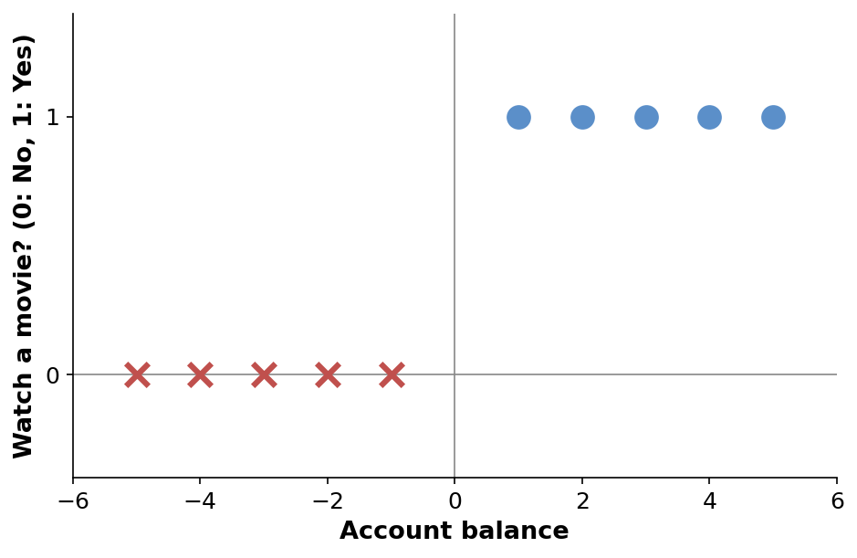
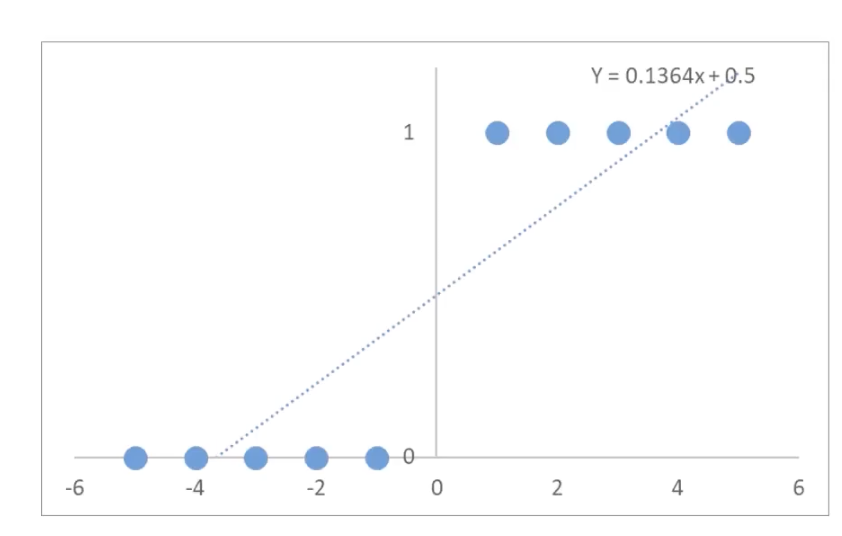
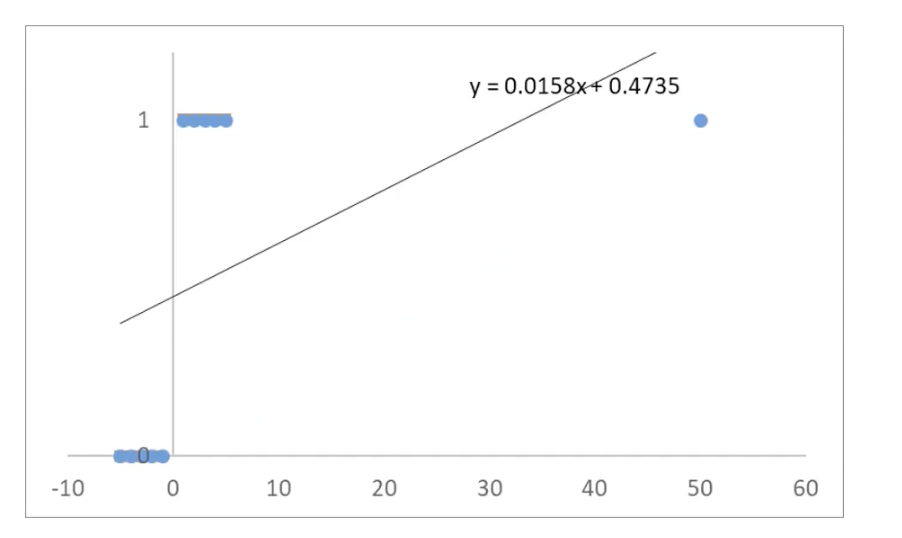
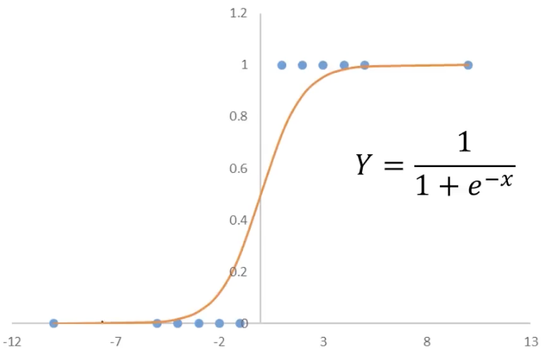

# 1.6. Logistic Regression Theory (Basic)

## 1.6.1. How Do We Solve Classification Problems?
Here is a simple example: determine whether Xiaoming will go to the movies based on his balance.

From this figure, we can see:
- `y = 0` means not going to the movies, and `y = 1` means going to the movies
- When the balance is 1, 2, 3, 4, or 5, Xiaoming goes to the movies (positive samples)
- When the balance is -1, -2, -3, -4, or -5, Xiaoming does not go to the movies (negative samples)

## 1.6.2. The Basic Framework of Classification Tasks
So how do we let the computer perform such a classification task? We need mathematical help:
$$
\left\{
\begin{array}{l}
y = f(x_1, x_2 \cdots x_n) \\
\text{Classify as category } N, \text{ if } y = n
\end{array}
\right.
$$
Classification tasks are divided into two steps:
- The first step is to solve the predicted result. This result is not yet the final category we want, but a discrete number like 0, 1, or 2.
- The second step is to determine which category it belongs to based on that number, for example, `0` means not going to the movies and `1` means going to the movies

In the movie example here, the mathematical expression is:
$$
y = f(x) \in \{0,1\}
$$
The result of `f(x)`, namely `y`, belongs to `{0, 1}`, meaning it is either 0 or 1. And in the figure above, we already said that `y = 0` means not going to the movies (negative sample), while `y = 1` means going to the movies (positive sample).

***At this point, the core problem of this example becomes finding `f(x)`.***

## 1.6.3. Solving Classification Problems with Linear Regression

We first use a very simple model, the linear regression model we discussed earlier (see [1.2. Linear Regression Theory](../1.2/1.2._Linear_Regression_Theory_Univariate_Linear_Regression,_the_Sum_of_Squared_Errors_(SSE),_and_Gradient_Descent.md) for details). The purpose of using this model is to predict the distribution of points.

For now, we do not care whether a point is a positive or negative sample. What we need to do is only simulate the distribution of the points:

The fitted line is `y = 0.1364x + 0.5`, which is the function that represents the possible distribution of the points.

What if the points on this line are not only 0 and 1? Very simple: we just take the midpoint of 0 and 1, which is 0.5. As long as the `y` value of the distribution function is greater than 0.5, we regard it as 1, meaning going to the movies; otherwise, we regard it as 0, meaning not going to the movies.

More professionally, we call 0.5 the *threshold*. And the operation of turning many values (the values on the distribution function) into two final values (0 or 1) according to a threshold is called *binarization*.

In this way, we have completed a very simple classification prediction task. Let us summarize the steps again:
$$
\begin{aligned}
(1) \quad Y &= 0.1364x + 0.5 \\
(2) \quad y &= f(x) =
\begin{cases}
1, & Y \geq 0.5 \\
0, & Y < 0.5
\end{cases}
\end{aligned}
$$
- The first step is to find `f(x)`, that is, `Y` here
- The second step is to determine the threshold and perform a second screening according to the threshold

Let us substitute `Y` into the original data points and see the effect:

| x | Value of Y(x) distribution function | Binarized value of y(x) | Actual y |
| --- | ---------- | ----------- | --- |
| -5  | -0.18      | 0           | 0   |
| -4  | -0.05      | 0           | 0   |
| -3  | 0.09       | 0           | 0   |
| -2  | 0.23       | 0           | 0   |
| -1  | 0.36       | 0           | 0   |
| 1   | 0.64       | 1           | 1   |
| 2   | 0.77       | 1           | 1   |
| 3   | 0.91       | 1           | 1   |
| 4   | 1.05       | 1           | 1   |
| 5   | 1.18       | 1           | 1   |

At first glance, linear regression seems to work quite well, but in fact it has quite a few limitations.

## 1.6.4. Limitations of Using Linear Regression for Classification Problems

***The main problem with linear regression is that extreme outliers can severely distort the fitted line and hurt classification accuracy.***

In the original data, the values of `x` are only between -5 and 5. If we then add a point far away, such as `(50, 1)`, it will have a huge impact on the line computed by linear regression.

Let us again substitute `Y` into the original data points and see the effect:

| x | Value of Y(x) distribution function | Binarized value of y(x) | Actual y |
| --- | ---------- | ----------- | --- |
| -5  | 0.39       | 0           | 0   |
| -4  | 0.41       | 0           | 0   |
| -3  | 0.43       | 0           | 0   |
| -2  | 0.44       | 0           | 0   |
| -1  | 0.46       | 0           | 0   |
| 1   | ***0.49*** | ***0***     | 1   |
| 2   | 0.51       | 1           | 1   |
| 3   | 0.52       | 1           | 1   |
| 4   | 0.54       | 1           | 1   |
| 5   | 0.55       | 1           | 1   |
| 50  | 1.26       | 1           | 1   |
When `x = 1`, because the result of `Y(x)` is 0.49, which is less than 0.5, the binarized result becomes `y(x) = 0`, but the actual value should be `y = 1`.

## 1.6.5. The Principle of Logistic Regression
Logistic regression optimizes the first step of solving classification problems:
$$
\begin{aligned}
(1) \quad Y &= \frac{1}{1 + e^{-x}} \\
(2) \quad y &= f(x) =
\begin{cases}
1, & Y \geq 0.5 \\
0, & Y < 0.5
\end{cases}
\end{aligned}
$$
It is called logistic regression because the function in the first step is the **Sigmoid function** (logistic function), which **maps the input `x` to the interval `(0,1)`**.

It calculates the probability `P(x)` that a sample belongs to a certain category based on its features or attributes, and then uses that probability value to determine the category.

Its main application scenario is binary classification, that is, problems with only two possible outcomes.

Its mathematical expression is:
$$
\begin{aligned}
P(x) &= \frac{1}{1 + e^{-x}} \\
y &=
\begin{cases}
1, & P(x) \geq 0.5 \\
0, & P(x) < 0.5
\end{cases}
\end{aligned}
$$
- `y` is the category result
- `P` is the probability distribution
- `x` is the feature value

Its effect is shown below:

If we use the logistic function as `Y`:

| x | Y(x) using the logistic function | Binarized value of y(x) | Actual y |
| ---- | ---------- | ----------- | --- |
| -5   | 0.01       | 0           | 0   |
| -4   | 0.02       | 0           | 0   |
| -3   | 0.05       | 0           | 0   |
| -2   | 0.12       | 0           | 0   |
| -1   | 0.27       | 0           | 0   |
| 1    | 0.73       | 1           | 1   |
| 2    | 0.88       | 1           | 1   |
| 3    | 0.95       | 1           | 1   |
| 4    | 0.98       | 1           | 1   |
| 5    | 0.99       | 1           | 1   |
| 50   | 1.00       | 1           | 1   |
| 1000 | 1.00       | 1           | 1   |

You can see that even after adding the extreme point `x = 50` (and even `x = 1000`), the classifications remain correct.

Logistic regression is only **one model** for solving classification problems (you can use other models, but the results may not be as good). In fact, its idea is similar to linear regression, except that it uses the logistic function.

## 1.6.6. Using the Logistic Function to Solve the Problem
Let us use logistic regression to solve the problem raised at the beginning of this article: based on the balance, determine whether Xiaoming will go to the movies (in the cases of balances of -10 and 100)

You only need to substitute into the logistic equation:

---

In the case of a balance of -10:
$$
P(x = -10) = \frac{1}{1 + e^{10}} = 4.5 \times 10^{-5} < 0.5
$$
Since the calculated value is less than 0.5, it will be binarized to 0, meaning he will not go to the movies.

---

In the case of a balance of 100:
$$
P(x = 100) = \frac{1}{1 + e^{-100}} = 1 > 0.5
$$
Since the calculated value is greater than 0.5, it will be binarized to 1, meaning he will go to the movies.
