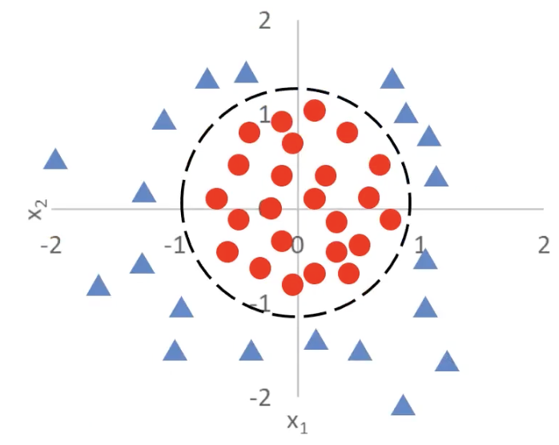

# 1.7. Logistic Regression Theory (Advanced)

## 1.7.1. Multidimensional (Factor) Logistic Regression Problems
In the previous article, [1.6. Logistic Regression Theory (Basic)](../1.6/1.6._Logistic_Regression_Theory_(Basic)_The_Logistic_Function,_the_Principle_of_Logistic_Regression,_the_Basic_Framework_for_Classification_Tasks,_and_Solving_Classification_Problems_with_Linear_Regression.md), we discussed a simple logistic regression problem. In this article, we will discuss a more complex one:

Originally we had only one dimension, such as Xiaoming’s balance, but in this figure we have two dimensions — `x_1` and `x_2`.

Although this figure still looks like a two-dimensional image, both of its axes are input variables. The actual outputs are the triangles and circles in the figure.

In other words, the goal here is to distinguish triangles from circles through `x_1` and `x_2`.

How do we solve it? For a logistic regression problem, we must use the logistic function:
$$
P(x) = \frac{1}{1 + e^{-x}}
$$
But this function has only one parameter, so we need to modify it:
$$
\begin{aligned}
P(x) &= \frac{1}{1 + e^{-g(x)}} \\
g(x) &= \theta_0 + \theta_1 x_1 + \theta_2 x_2
\end{aligned}
$$
- We replace the `x` in the exponent of `e` with `g(x)`
- And `g(x)` is actually a linear regression equation, representing the blue line in the figure, where:
  - `θ_0` is the **intercept (bias)**
  - `θ_1` and `θ_2` are the **feature weights (regression coefficients)**
  - `x_1` and `x_2` are the two input features (factors)

Not only that, the case shown here has only two input variables, but `g(x)` can also have more input variables:
$$
g(x) = \theta_0 + \theta_1 x_1 + \theta_2 x_2 + \dots + \theta_n x_n
$$

The blue line of `g(x)` passes through `(4,0)` and `(0,4)`, so it can be expressed as:
$$
x_1 + x_2 = 4
$$
which can be equivalently written as:
$$
g(x) = -4 + x_1 + x_2 = 0
$$

This line is also called the *decision boundary*. With a decision boundary, we can separate the triangles and circles:
$$
\begin{aligned}
g(x) = -4 + x_1 + x_2 > 0 & : \text{ triangle} \\
g(x) = -4 + x_1 + x_2 < 0 & : \text{ circle}
\end{aligned}
$$

***For multidimensional (factor) logistic regression problems, the most important and most difficult step is finding this decision boundary.***

---

Now let us make it a little harder: what if the decision boundary is a circle?

First, the logistic function remains unchanged:
$$
P(x) = \frac{1}{1 + e^{-g(x)}}
$$
The goal is to find the decision curve, that is, the expression of the `g(x)` term in the logistic function.

Here I provide two solutions:
### Method 1: Derive It from the Equation of a Circle
It is actually very simple. Do you still remember the equation of a circle in the Cartesian coordinate system?
$$
(x - a)^2 + (y - b)^2 = r^2
$$
Since the center here is at the origin, it can be simplified to:
$$
x^2 + y^2 = r^2
$$
Because the decision curve in the figure passes through `(1,0)`, `(-1,0)`, `(0,1)`, and `(0,-1)`, we know that the radius is `r = 1`. Substitute into the original equation:
$$
x^2 + y^2 = 1
$$
Then rearrange:
$$
g(x) = -1 + x^2 + y^2 = 0
$$
This is the analytical expression of the decision boundary we want. Therefore, we get:
$$
g(x) = -1 + x_1^2 + x_2^2 \begin{cases} > 0, & \text{triangle} \\
< 0, & \text{circle}
\end{cases}
$$

---
### Method 2: Derive It from the Regression Equation
We all know that the basic linear regression equation looks like this:
$$
g(x) = \theta_0 + \theta_1 x_1 + \theta_2 x_2
$$
But here we have a curve, so it cannot be linear. In other words, the exponent of `x` cannot be only first order. So we need to introduce quadratic terms:
$$
g(x) = \theta_0 + \theta_1 x_1 + \theta_2 x_2 + \theta_3 x_1^2 + \theta_4 x_2^2
$$
- `x_1`^2 and `x_2`^2 are new **nonlinear features** used to capture **curve patterns (especially circles)**
- In this way, our decision boundary no longer has to be a straight line; it can be a more complex shape, such as an **ellipse or circle**

If we simplify further and keep only the quadratic terms (assuming `θ_1 = θ_2 = 0`), we get:
$$
g(x) = \theta_0 + \theta_3 x_1^2 + \theta_4 x_2^2
$$
Let `θ_0 = -r^2` and `θ_3 = θ_4 = 1`, then we get:
$$
g(x) = x_1^2 + x_2^2 - r^2
$$
When `g(x) = 0`:
$$
x_1^2 + x_2^2 = r^2
$$
This is exactly the equation of a circle! Then, based on Method 1, we can infer the analytical expression of `g(x)`.

---

***From these examples, we can see that logistic regression combined with polynomial boundary functions can solve complex classification problems.***

## 1.7.2. The Essence of Logistic Regression
Let us put the logistic regression function here:
$$
\begin{aligned}
P(x) &= \frac{1}{1 + e^{-g(x)}} \\
g(x) &= \theta_0 + \theta_1 x_1 + \theta_2 x_2 + ...
\end{aligned}
$$
From the explanation above, we are now clear that: ***the key to a logistic regression problem is finding the decision boundary `g(x)`, and the key to finding the logistic boundary `g(x)` lies in finding the parameters `θ_0`, `θ_1`, `θ_2`, ...***

Does that sound familiar? **Finding the parameters of each term in `g(x)` is exactly what the linear regression model does!** So can I use the objective of minimizing the loss function?
$$
\textit{minimize} \left\{ \frac{1}{2m} \sum_{i=1}^{m} (y'_i - y_i)^2 \right\}
$$

Unfortunately, **squared error is a poor choice here**. Even if we use continuous predicted probabilities from the sigmoid, MSE for logistic regression leads to a non-convex optimization problem, and gradients can become very small when the model is confidently wrong. That makes training unreliable.

The idea of minimizing a loss is still right — we just need a better loss. A common choice is the cross-entropy (log) loss, which fits naturally with logistic regression (it also appears in the broader framework of generalized linear models developed by Nelder and Wedderburn):
$$
J_i =
\begin{cases}
- \log(P(x_i)), & \text{if } y_i = 1 \\
- \log(1 - P(x_i)), & \text{if } y_i = 0
\end{cases}
$$
Its core idea is:
- When `y = 1` (that is, the true situation is 1), the closer your computed `P(x)` (the situation predicted by your model) is to 1, the smaller the loss; the closer it is to 0, the larger the loss
- When `y = 0` (that is, the true situation is 0), the closer your computed `P(x)` (the situation predicted by your model) is to 0, the smaller the loss; the closer it is to 1, the larger the loss

Combining the two formulas, we transform them into the following equation to obtain the average cross-entropy loss:
$$
J = \frac{1}{m} \sum_{i=1}^{m} J_i = -\frac{1}{m} \left[ \sum_{i=1}^{m} \left( y_i \log P(x_i) + (1 - y_i) \log (1 - P(x_i)) \right) \right]
$$
And among them:
$$
\begin{aligned}
P(x) &= \frac{1}{1 + e^{-g(x)}} \\
g(x) &= \theta_0 + \theta_1 x_1 + \theta_2 x_2 + ...
\end{aligned}
$$
So the core of logistic regression is:
$$
\textit{minimize} \left\{ J(\theta) \right\}
$$

## 1.7.3. Minimizing the Loss Function
Now that we know how to compute the loss, how do we minimize it? The idea is actually similar to gradient descent in linear regression.

Let us first review gradient descent:
$$
p_{i+1} = p_i - \alpha \frac{\partial}{\partial p_i} f(p_i)
$$
- `p_{i+1}` **is the updated parameter value**, adjusted from the current value `p_i`
- `α` (learning rate): controls the step size of each update
- The part after `α` is the gradient (partial derivative) of the function `f(p)` at the current point `p_i`, indicating the direction and magnitude of change of `f(p)` at that point.

Logistic regression also uses gradient descent:
$$
\left\{
\begin{array}{l}
\textit{temp}_{\theta_j} = \theta_j - \alpha \frac{\partial}{\partial \theta_j} J(\theta) \\
\theta_j = \textit{temp}_{\theta_j}
\end{array}
\right.
$$
Again, the coefficients are repeatedly updated by subtracting the gradient until the function converges.
