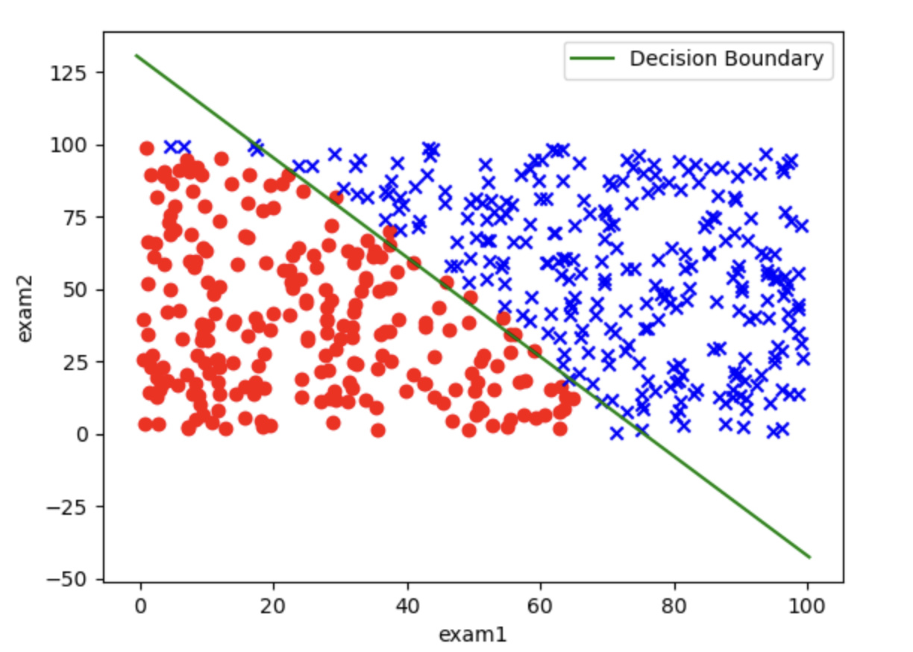
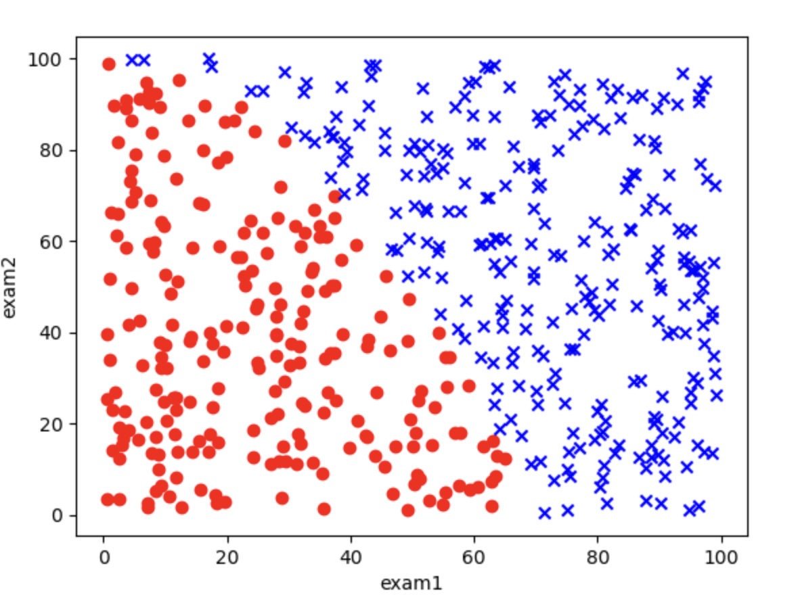

# 1.9. Logistic Regression Practice (Advanced)

## 1.9.1. Some Preparation
Next, make sure your Python environment has `pandas`, `matplotlib`, `scikit-learn`, and `numpy`. If not, enter this command in the terminal to download and install them:
```bash
pip install pandas matplotlib scikit-learn numpy
```

I have placed the `.csv` data file on [GitHub](https://github.com/SomeB1oody/learning_examples/blob/main/machine_learning_example/1.9/exam_results.csv); click the link to download it.

The training data has three columns: `exam1`, `exam2`, and `exam3_pass_or_not`. `exam1` and `exam2` contain the students’ scores from the first two exams (they can be floating-point numbers, with 100 as the maximum), and `exam3_pass_or_not` indicates whether the third exam was passed, where pass is 1 and fail is 0. Our goal is to train a logistic regression model to find the decision boundary for `exam3_pass_or_not`.

After downloading it, move it into your Python project folder.

## 1.9.2. Building a First-Order Boundary Model
In the previous article, [1.8. Logistic Regression Practice (Basic)](../1.8/1.8._Logistic_Regression_Practice_(Basic)_Building_a_First_Order_Boundary_Model,_Plotting_Classified_Scatter_Plots,_Implementing_Logistic_Regression_in_Code,_and_Visualizing_the_Decision_Boundary.md), we introduced how to build a simple first-order boundary model. I will not explain it in detail here, and will directly show the code and output:
```python
# Read the data  
import pandas as pd  
data = pd.read_csv('exam_results.csv')  
  
# Assign values to x and y  
x = data.drop(['exam3_pass_or_not'], axis=1)  
y = data.loc[:, 'exam3_pass_or_not']  
  
# Train the model  
from sklearn.linear_model import LogisticRegression   
model = LogisticRegression()  
model.fit(x, y)  
  
# Get the decision boundary  
theta1, theta2 = model.coef_[0]  
theta0 = model.intercept_[0]  
  
# Get the predicted values  
prediction = model.predict(x)  
  
# Visualize  
import matplotlib.pyplot as plt  
import numpy as np

x1 = data.loc[:, 'exam1'].to_numpy()  
x2 = data.loc[:, 'exam2'].to_numpy()  
y = data.loc[:, 'exam3_pass_or_not'].to_numpy()  
  
class0 = (y == 0)  
class1 = (y == 1)  
  
plt.scatter(x1[class0], x2[class0], c='r', marker='o')  
plt.scatter(x1[class1], x2[class1], c='b', marker='x')  
plt.xlabel('exam1')  
plt.ylabel('exam2')  
  
# Compute the range of x1  
x1_min, x1_max = x1.min() - 1, x1.max() + 1  
x1_range = np.linspace(x1_min, x1_max, 100)  
  
# Use the decision boundary formula to compute x2  
x2_boundary = -(theta1 * x1_range + theta0) / theta2  
  
# Plot the decision boundary  
plt.plot(x1_range, x2_boundary, color='green', label="Decision Boundary")  
  
# Show  
plt.legend()  
plt.show()  
  
# Calculate accuracy  
from sklearn.metrics import accuracy_score  
accuracy = accuracy_score(y, prediction)  
print(f'Accuracy: {accuracy}')
```

Output:
```
Accuracy: 0.972
```

Output image:



You can see that some data points are indeed misclassified by the decision curve, which is the limit of a first-order decision boundary (a straight line). If we want to improve accuracy further, we need to build a second-order decision boundary (a curve).

## 1.9.3. Building a Second-Order Decision Boundary
### Step 1: Read the Data
As before, use the `pandas` library to read the `csv` file, and use the `head` method to inspect the first few rows:
```python
# Read the data  
import pandas as pd  
data = pd.read_csv('exam_results.csv')  
  
print(data.head())
```

Output:
```
       exam1      exam2  exam3_pass_or_not
0  37.454012  69.816171                  0
1  95.071431  53.609637                  1
2  73.199394  30.952762                  1
3  59.865848  81.379502                  1
4  15.601864  68.473117                  0
```

We can also use the classified scatter plot method taught in [1.8. Logistic Regression Practice (Basic)](../1.8/1.8._Logistic_Regression_Practice_(Basic)_Building_a_First_Order_Boundary_Model,_Plotting_Classified_Scatter_Plots,_Implementing_Logistic_Regression_in_Code,_and_Visualizing_the_Decision_Boundary.md) to get a more intuitive look at the data:
```python
# Visualize the raw data  
import matplotlib.pyplot as plt  
x1 = data.loc[:, 'exam1'].to_numpy()  
x2 = data.loc[:, 'exam2'].to_numpy()  
y = data.loc[:, 'exam3_pass_or_not'].to_numpy()  
  
class0 = ( y == 0 )  
class1 = ( y == 1 )  
  
plt.scatter(x1[class0], x2[class0], c='r', marker='o')  
plt.scatter(x1[class1], x2[class1], c='b', marker='x')  
plt.xlabel('exam1')  
plt.ylabel('exam2')  
plt.show()
```

Output image:



### Step 2: Assign Values to `x` and `y`
We need to first clarify what `x` and `y` represent:
- `y` is the data in the `exam3_pass_or_not` column

`x` is a bit special. Since we are building a second-order model, the terms in the equation are more complex than before:
$$
\theta_0 + \theta_1 X_1 + \theta_2 X_2 + \theta_3 X_1^2 + \theta_4 X_2^2 + \theta_5 X_1 X_2 = 0
$$
There are terms such as `x_1`^2, `x_2`^2, and `X_1 * x_2`. So we need to package these terms into a dictionary, and then convert it into a `DataFrame` format that the model can use.

```python
# Assign values to x and y  
y = data.loc[:, 'exam3_pass_or_not']  
x1 = data.loc[:, 'exam1']  
x2 = data.loc[:, 'exam2']  
x = {  
    'x1': x1,  
    'x2': x2,  
    'x1^2': x1 ** 2,  
    'x2^2': x2 ** 2,  
    'x1*x2': x1 * x2,  
}  
  
x = pd.DataFrame(x)  
print(x.head())
```

Output:
```
          x1         x2         x1^2         x2^2        x1*x2
0  37.454012  69.816171  1402.803006  4874.297789  2614.895713
1  95.071431  53.609637  9038.576924  2873.993140  5096.744851
2  73.199394  30.952762  5358.151308   958.073452  2265.723399
3  59.865848  81.379502  3583.919807  6622.623341  4871.852929
4  15.601864  68.473117   243.418162  4688.567787  1068.308266
```

This is the most basic method. There is also a simple way to generate this dictionary:
```python
from sklearn.preprocessing import PolynomialFeatures
poly = PolynomialFeatures(degree=2, include_bias=False)
x = data.drop(['exam3_pass_or_not'], axis=1)
x = poly.fit_transform(x)
```
- `poly = PolynomialFeatures(degree=2, include_bias=False)` first creates a `PolynomialFeatures` instance; `degree` sets the polynomial order (here 2), and `include_bias=False` avoids an extra all-ones bias column (the intercept is still handled by `LogisticRegression.intercept_`).
- Use `data.drop(['exam3_pass_or_not'], axis=1)` to remove the last column and keep the first two columns
- Use the `fit_transform` method on `poly` to generate the feature matrix. Note: the column order from `PolynomialFeatures` is not identical to the manual dictionary above, so the later code that unpacks `theta` values, prints the boundary, and plots it should be used with the manual-dictionary path.

### Step 3: Train the Model
Just feed the data to the logistic regression model in `scikit-learn`:
```python
# Train the model  
from sklearn.linear_model import LogisticRegression  
model = LogisticRegression()  
model.fit(x, y)
```

### Step 4: Get the Decision Boundary
We can obtain the intercept and coefficients through `coef_` and `intercept_`:
```python
# Get the decision boundary  
theta1, theta2, theta3, theta4, theta5 = model.coef_[0]  
theta0 = model.intercept_[0]

print(f'Decision Boundary: {theta0} + {theta1}x1 + {theta2}x2 + {theta3}x1^2 + {theta4}x2^2 + {theta5}x1*x2')
```

Each variable here corresponds to a parameter in the equation:
$$
\theta_0 + \theta_1 X_1 + \theta_2 X_2 + \theta_3 X_1^2 + \theta_4 X_2^2 + \theta_5 X_1 X_2 = 0
$$

Output:
```
Decision Boundary: -204.44094927587327 + -1.0566693402530631x1 + 1.3772537803356335x2 + 0.057584352318122055x1^2 + 0.006716600903162952x2^2 + 0.010830701167147672x1*x2
```

### Step 5: Get the Predicted Values
```python
# Get the predicted values  
prediction = model.predict(x)
```
There are 500 data points, so printing them all would be too much, and I will not print them here.


### Step 6: Visualize the Decision Boundary
Visualizing the decision boundary here is a bit more complicated because there are more second-order terms, but the idea is still simple and brute-force: once we know all the `theta` values, we have the analytical expression. Then we can directly calculate the corresponding points from `x_1` and `x_2`.
```python
# Visualize  
import matplotlib.pyplot as plt  
import numpy as np  
  
x1 = x1.to_numpy()  
x2 = x2.to_numpy()  
y = y.to_numpy()  

class0 = (y == 0)  
class1 = (y == 1)  

plt.scatter(x1[class0], x2[class0], c='r', marker='o')  
plt.scatter(x1[class1], x2[class1], c='b', marker='x')  
plt.xlabel('exam1')  
plt.ylabel('exam2')  

# Visualize the second-order decision boundary  

# Define the ranges of exam1 and exam2 for drawing the grid  
x1_min, x1_max = x1.min() - 1, x1.max() + 1  
x2_min, x2_max = x2.min() - 1, x2.max() + 1  

# Generate grid data  
xx1, xx2 = np.meshgrid(np.linspace(x1_min, x1_max, 500),  
                       np.linspace(x2_min, x2_max, 500))  

# Compute the decision boundary value for each point  
z = (theta0 +  
     theta1 * xx1 +  
     theta2 * xx2 +  
     theta3 * xx1 ** 2 +  
     theta4 * xx2 ** 2 +  
     theta5 * xx1 * xx2)  

# Plot the sample points  
plt.scatter(x1[class0], x2[class0], c='r', label='Not Pass', marker='o')  
plt.scatter(x1[class1], x2[class1], c='b', label='Pass', marker='x')  

# Plot the decision boundary  
plt.contour(xx1, xx2, z, levels=[0], colors='g')  

# Add labels and legend  
plt.xlabel('Exam1 Score')  
plt.ylabel('Exam2 Score')  
plt.legend()  
plt.title('Decision Boundary')  
plt.show()
```
- **Grid generation (`np.meshgrid`)**: generates coordinate grids for `exam1` and `exam2` values, used to compute the decision value at each point
- **Decision value computation (`z`)**: `z` is the value of the decision function, based on the coefficients and intercept of logistic regression
- **Contour plot (`plt.contour`)**: `plt.contour()` can draw the contour line for a specific value (for example, `0` corresponds to the decision boundary)

Output image:


You can see that this decision boundary has a much lower misclassification rate. Next we evaluate it quantitatively by calculating accuracy.

### Step 7: Calculate Accuracy
```python
# Calculate accuracy  
from sklearn.metrics import accuracy_score  
accuracy = accuracy_score(y, prediction)  
print(f'Accuracy: {accuracy}')
```

Output:
```
Accuracy: 1.0
```
An accuracy of 100% means that this model is very successful.
