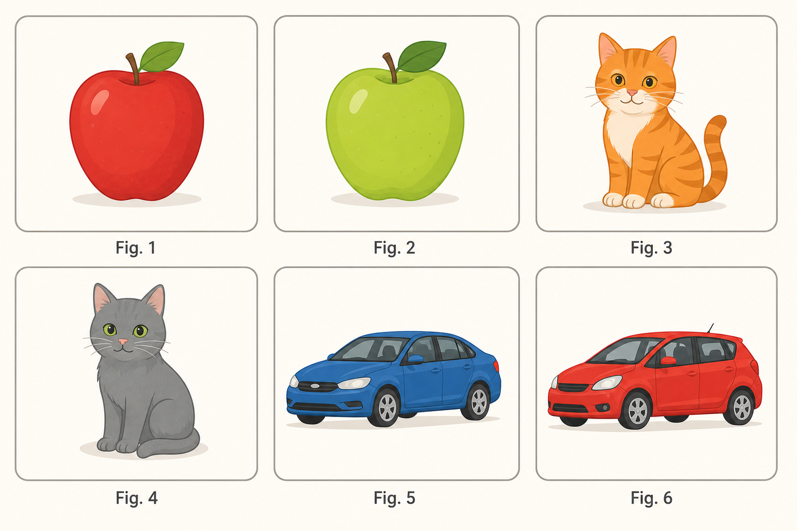
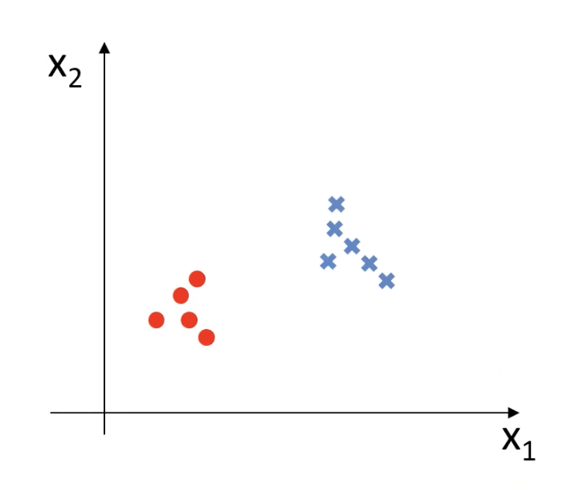
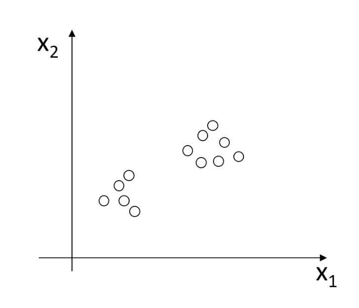

# 2.1. Unsupervised Learning

## 2.1.1. What Is Unsupervised Learning (Unsupervised Learning)?
Let's look at an example:

For the image above, how would you split these into two groups? What basis would you use? You would certainly look for shared and different features in the image.

If we distinguish them by whether there is one person or multiple people in the picture:
- One person: Figures 2, 3, 4, 5
- Multiple people: Figures 1, 6

If we distinguish them by whether the people in the picture are wearing racing helmets:
- No helmet: Figures 2, 4
- Wearing a helmet: Figures 1, 3, 5, 6

And so on...

None of these ways of grouping is right or wrong; they all complete the task of splitting the data into two groups.

This is the core of unsupervised learning: **there is no standard answer (no correct label), as long as you can find commonalities in the data and classify them.**

## 2.1.2. Advantages and Applications of Unsupervised Learning
***Unsupervised learning is a machine learning method that discovers hidden patterns or structures in data without labels or supervisory information, automatically performing classification or grouping.***

The advantages of this learning method are:
- The algorithm is not constrained by supervisory information (biases), so it may consider new information.
  Using the example above, if you tell the computer to distinguish the images by whether there is one person or multiple people, then it will not classify them by whether the people are wearing racing helmets. But in fact, that is also a valid way to distinguish them. In other words, it can help you find additional similarities.

- It does not require labeled data, greatly expanding the data sample size.
  In supervised learning, every data point must have a label indicating whether it is correct or not, but unsupervised learning does not need these labels, which means it can accept much more data.

The main application scenarios of unsupervised learning are:
- Clustering analysis: divide data into different groups so that data points within the same group are similar, while data points in different groups differ significantly
- Association rules: find relationships between data
- Dimensionality reduction: reduce the dimensionality of data while preserving as much important information from the original data as possible

Among these, **clustering analysis** is the most widely used, and it is also the focus of this chapter.

## 2.1.3. Supervised Learning vs. Unsupervised Learning
### Supervised Learning

In supervised learning, every data point is labeled, which is the annotation for the circles and `x` marks in the figure.

Expressed mathematically, the training data for supervised learning is:
$$
\{(x^{(1)}, y^{(1)}), (x^{(2)}, y^{(2)}), \dots, (x^{(m)}, y^{(m)})\}
$$
- There is input `x` and a corresponding label `y`

### Unsupervised Learning

Unsupervised learning has no labels. All the data looks the same, and the computer needs to find the differences on its own.

Expressed mathematically, the training data for unsupervised learning is:
$$
\{x^{(1)}, x^{(2)}, \dots, x^{(m)}\}
$$
- There is only data `x`, and no label `y`

## 2.1.4. Clustering Analysis
Clustering analysis, also known as *group analysis*, automatically divides objects into different categories based on the *similarity of certain attributes*.

It is used in the following fields:
- Business: customer segmentation
- Biology: gene clustering analysis
- News: classify different news items under different keywords

Below we introduce some commonly used clustering algorithms:
### 1. KMeans Clustering
- Classify data according to its distance from the center point
- Update the center point based on the class data
- Repeat the process until convergence

Its advantages are:
- Simple to implement and fast to converge

Its disadvantages are:
- The number of classes must be specified

### 2. Mean Shift Clustering (MeanShift)
- Search for data points within a certain region around the center point
- Update the center
- Repeat the process until the center point stabilizes

Its advantages are:
- It automatically discovers the number of classes and does not require manual selection

Its disadvantages are:
- You need to choose a region radius

### 3. DBScan Algorithm (Density-Based Spatial Clustering Algorithm)
- Filter valid data based on the density of points in a region
- Expand outward from the valid data to neighboring points until no new points are added

Its advantages are:
- Filters noisy data
- Does not require manual selection of the number of classes

Its disadvantages are:
- Different data densities affect the results
