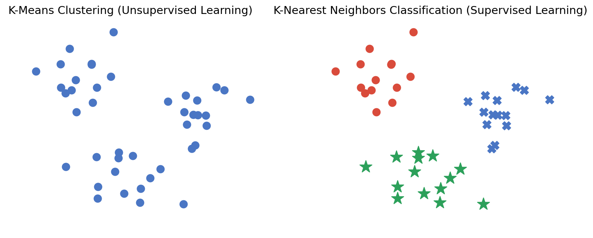

# 2.2. Clustering Analysis Algorithms Theory

## 2.2.1. K-Means Clustering (KMeans Analysis)
The K-Means algorithm clusters data around K points in space and assigns each object to the nearest one. It is the *most basic* but also **most important** algorithm among clustering algorithms.
### Mathematical Principle
Compute the distance between each data point and every cluster center:
$$
{dist}(x_i, u_j^t)
$$
Then classify according to the distance:
$$
x_i \in u^t_{\text{nearest}}
$$
Finally update the center:
$$
u_j^{t+1} = \frac{1}{k} \sum_{x_i \in S_j} x_i
$$
- $S_j$: the $j$-th cluster at time $t$
- $k$: the number of points contained within $S_j$
- $x_i$: the points contained within $S_j$
- $u_j^t$: the center of the $j$-th cluster at time $t$

### Step-by-Step Analysis
Let's expand the process step by step:
#### 1. Compute the distance between each data point and every cluster center
$$
\text{dist}(x_i, u_j^t)
$$
This means computing the distance between the **data point** $x_i$ and the **$j$-th cluster center** $u_j^t$ (note: $u_j^t$ refers to the center of the **$j$-th cluster at the $t$-th iteration**) . The Euclidean distance is usually used:
$$
\text{dist}(x_i, u_j^t) = \sqrt{\sum_{d} (x_{id} - u_{jd}^t)^2}
$$

#### 2. Classify according to distance
$$
x_i \in u^t_{\text{nearest}}
$$
This means **assigning the data point** $x_i$ **to the nearest cluster center** (that is, to the cluster represented by the nearest $u_j^t$).

The specific steps are:
- Compute the distance from data point $x_i$ to all cluster centers $u_j^t$.
- Find the nearest center:
$$
j^* = \arg\min_j \text{dist}(x_i, u_j^t)
$$
- Assign $x_i$ to the nearest cluster, that is, the cluster with index $j^*$.

#### 3. Update the center
$$
u_j^{t+1} = \frac{1}{k} \sum_{x_i \in S_j} x_i
$$
This formula is used to **update the center of each cluster** by computing the **mean** of all points in that cluster.
- $S_j$ is the set of all data points in the $j$-th cluster.
- $k$ is the number of data points in that cluster.

**Calculation steps**:
- **Find all data points in the $j$-th cluster**, that is, all $x_i$ assigned to that cluster.
- **Compute the mean of those points** to update the cluster center:
$$
u_j^{t+1} = \frac{1}{k} \sum_{x_i \in S_j} x_i
$$
- **Repeat the above steps until convergence** (that is, until the cluster centers no longer change).

### Algorithm Workflow
- Choose the number of clusters $k$
- Determine the cluster centers
- Classify points according to their distance to the cluster centers
- Update the cluster centers based on the data in each cluster
- Repeat the above steps until convergence (when the center points no longer change)

### Advantages and Disadvantages
Advantages:
- Simple principle, easy to implement, and fast convergence
- Few parameters, easy to use

Disadvantages:
- The number of clusters must be specified
- Randomly choosing the initial cluster centers can make the results inconsistent

## 2.2.2. KMeans vs. KNN
KMeans in Chinese is K-Means Clustering, and KNN in Chinese is K-Nearest Neighbors Classification. Although the two names look similar, they are completely different algorithms.

Many people easily confuse these two algorithms, so we will compare them here.

This figure clearly shows the essential difference between the two: KMeans is unsupervised learning, while K-Nearest Neighbors Classification is supervised learning.

Here we also introduce KNN:

Given a training dataset, for a new input instance, find the K nearest instances in the training dataset. If the **majority of those K instances belong to a certain class**, then classify the input instance into that class.

## 2.2.3. Mean Shift Clustering (MeanShift)
The Mean Shift algorithm is a clustering algorithm **based on density gradient ascent** (it searches for cluster centers along the direction of increasing density).

The biggest advantage of Mean Shift over K-Means is that **it does not need to know how many clusters the final result should have**.

### Mathematical Principle
First compute the mean shift:
$$
M(x) = \frac{1}{k} \sum_{x_i \in S_h} (x_i - u)
$$

Then update the center:
$$
u^{t+1} = u^t + M^t
$$

Where:
- $S_h$: a high-dimensional spherical region centered at $u$ with radius $h$
- $k$: the number of points contained within $S_h$
- $x_i$: the points contained within $S_h$
- $M^t$: the mean shift vector computed at time $t$
- $u^t$: the center at time $t$

### Step-by-Step Analysis
Next, let's break down the process:

#### 1. Mean shift computation
$$
M(x) = \frac{1}{k} \sum_{x_i \in S_h} (x_i - u)
$$
Where:
- $S_h$: a **high-dimensional spherical region** (that is, the neighborhood) centered at $u$ with radius $h$
- $k$: the number of points in the neighborhood $S_h$
- $x_i$: the points in the neighborhood $S_h$
- $M(x)$: the **mean shift vector**, pointing from the current center toward the mean of the neighboring points (the direction of increasing density)

This formula:
- Computes the deviation $(x_i - u)$ of each neighboring point $x_i$ from the current center $u$
- Averages all deviations to obtain the shift direction $M(x)$ of the center
- **If** $M(x)$ **is nonzero**, **the local density mean is not at** $u$, **so** $u$ **should move in the direction of** $M(x)$

The core idea is:
- Compute the shift amount $M(x)$ of the **current center** $u$
- This shift is computed based on the **neighboring points** around $u$

#### 2. Update the center
$$
u^{t+1} = u^t + M^t
$$
This formula is used to **update the Mean Shift center**:
- The current center $u^t$ **moves along the direction of the mean shift** $M^t$ to obtain the new center $u^{t+1}$
- This iterative process **continuously adjusts the center position** until convergence (that is, $M(x)$ approaches 0)

### Algorithm Workflow
- Randomly select an unclassified point as the center point
- Find points whose distance from the center point is within the bandwidth, and record them as set $S$
- Compute the shift vector $M$ from the center point to each element in set $S$
- Move the center point by vector $M$
- Repeat steps 2 to 4 until convergence
- Repeat all the above steps until all points are classified
- Classification: for each point, based on the visit frequency of each class, take the class with the highest visit frequency as the class of the current set

