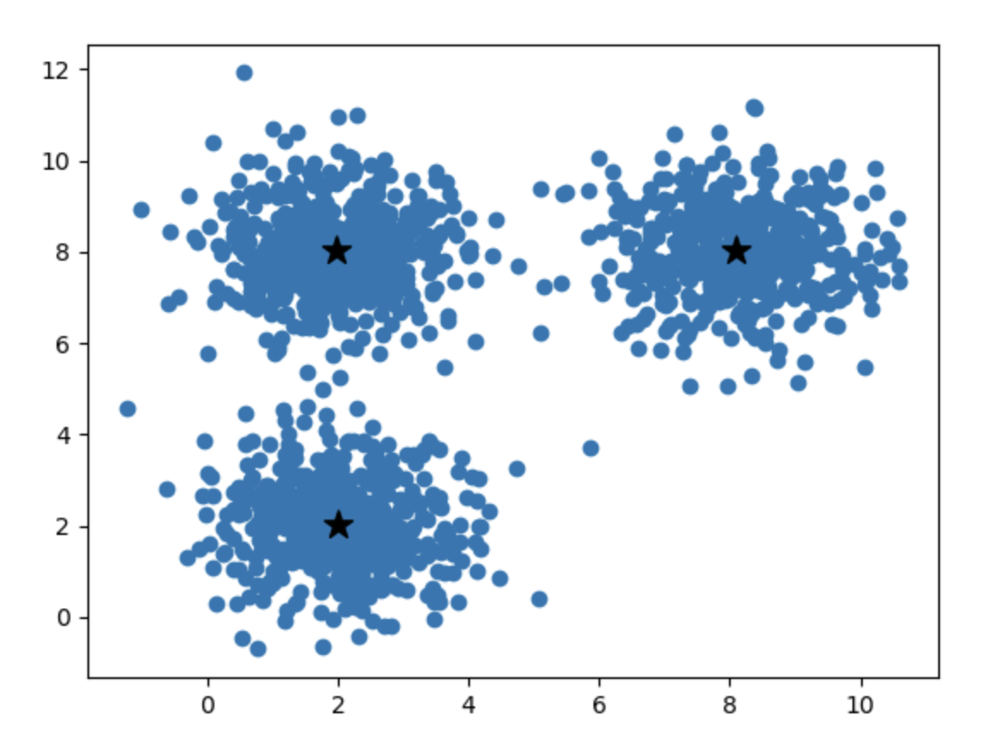
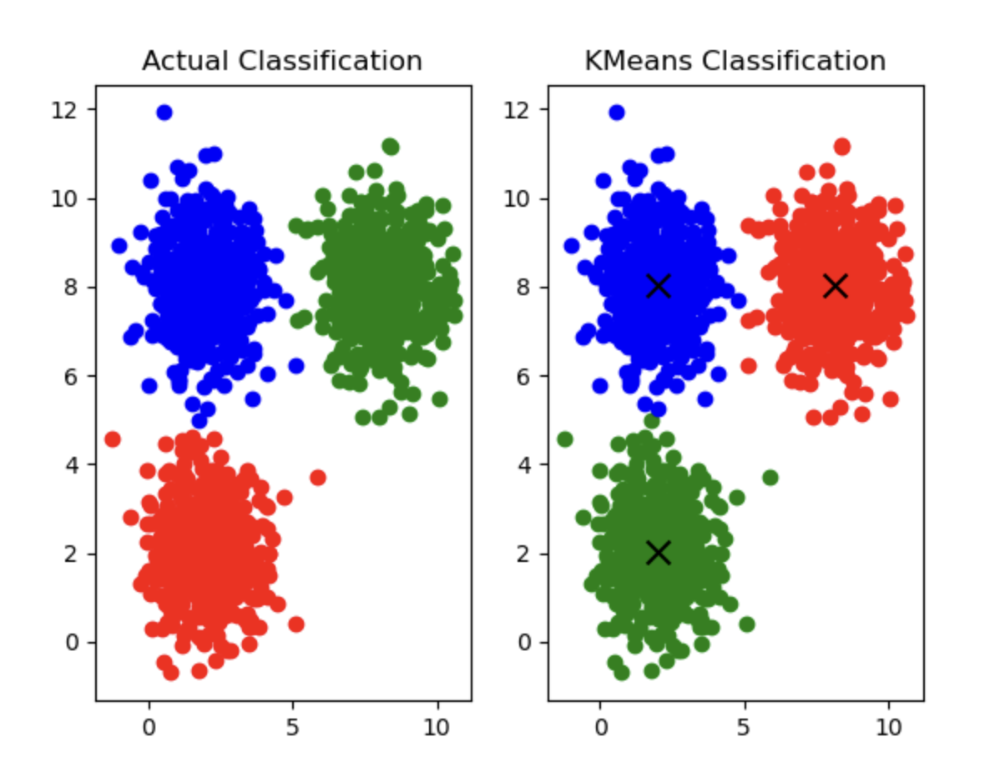

# 2.4. K-Means Clustering (KMeans Analysis) Practice (Advanced)

This article follows [2.3. K-Means Clustering (KMeans Analysis) Practice (Basics)](../2.3/2.3._K_Means_Clustering_(KMeans_Analysis)_Practice_(Basics).md). If you have not read it, please read the previous article first.

## 2.4.1. Get the Prediction Result
We first need to get the prediction result, and then compare it with the `label` values:
```python
# Get the prediction result
y_predict = kmeans.predict(x)
```

## 2.4.2. Compare with the Original Data and Correct It
After obtaining the prediction result, we need to compare it with the values in `label` to calculate the accuracy:
```python
# Compute accuracy
from sklearn.metrics import accuracy_score
print(accuracy_score(y, y_predict))
```

Output:
```
0.332
```

But why is the accuracy so low? The chart clearly shows that the clustering looks good.



This is because we still have one unresolved problem. In fact, I already mentioned it at the end of the previous article:

KMeans classes 0, 1, and 2 are not the same as `label` classes 0, 1, and 2. The KMeans model itself does not know `label`, so its classification is arbitrary. Although it still divides the data into 3 classes, KMeans classes 0, 1, and 2 do not necessarily correspond one-to-one with `label` classes 0, 1, and 2.

This leads to the situation where the classes are actually correct, but because the labels are different, they are treated as wrong. How do we solve this? In general, we can analyze the distribution of the data:

The cluster with the largest number of scatter points in `label` must correspond to the cluster with the largest number of scatter points in the prediction result, and the cluster with the smallest number of scatter points in `label` must correspond to the cluster with the smallest number of scatter points in the prediction result.

In this way, we can map the classes in `label` and the classes in the model one to one.

So how do we view the data distribution? The `pandas` library provides the `value_counts` method:
```python
# View the data distribution
print(pd.value_counts(y_predict))
print(pd.value_counts(y))
```

Output:
```
1    501
0    501
2    498
Name: count, dtype: int64
label
0    500
1    500
2    500
Name: count, dtype: int64
```
You will find that these distributions are too close to each other to distinguish at all. So we have to give up on this idea.

Of course, in most cases this approach is effective; it is just that our situation here is special.

We can also use a plot to illustrate this issue:
```python
# Plot
import matplotlib.pyplot as plt
# Plot the original classification
fig1 = plt.subplot(1, 2, 1)
x1 = data.loc[:, "x1"]
x2 = data.loc[:, "x2"]
label = data.loc[:, "label"]

class0 = (label == 0)
class1 = (label == 1)
class2 = (label == 2)

fig1.scatter(x1[class0], x2[class0], c='r')
fig1.scatter(x1[class1], x2[class1], c='g')
fig1.scatter(x1[class2], x2[class2], c='b')

fig1.set_title("Actual Classification")

# Plot the model classification
fig2 = plt.subplot(1, 2, 2)
predicted_class0 = (y_predict == 0)
predicted_class1 = (y_predict == 1)
predicted_class2 = (y_predict == 2)

fig2.scatter(x1[predicted_class0], x2[predicted_class0], c='r')
fig2.scatter(x1[predicted_class1], x2[predicted_class1], c='g')
fig2.scatter(x1[predicted_class2], x2[predicted_class2], c='b')

fig2.scatter(centers[:, 0], centers[:, 1], c='black', s=100, marker='x', label='Centers')

fig2.set_title("KMeans Classification")

# Show the entire canvas
plt.show()
```

Image output:



You can see that the red and green parts are swapped, which means the KMeans labels 0 and 1 are reversed. So we only need to correct this part:
```python
# Correct the labels
y_correct = []
for i in y_predict:
    if i == 0:
        y_correct.append(1)
    elif i == 1:
        y_correct.append(0)
    else:
        y_correct.append(2)
```
- Correct the labels by iterating through the predictions and creating a new array.
- If the original value is 0, it becomes 1 in the new array; if the original value is 1, it becomes 0; the rest remain 2.

## 2.4.3. Compute the Correct Accuracy
Now the accuracy should improve:
```python
# Compute accuracy
from sklearn import metrics
print(metrics.accuracy_score(y, y_correct))
```

Output:
```
0.9986666666666667
```
That's correct.
