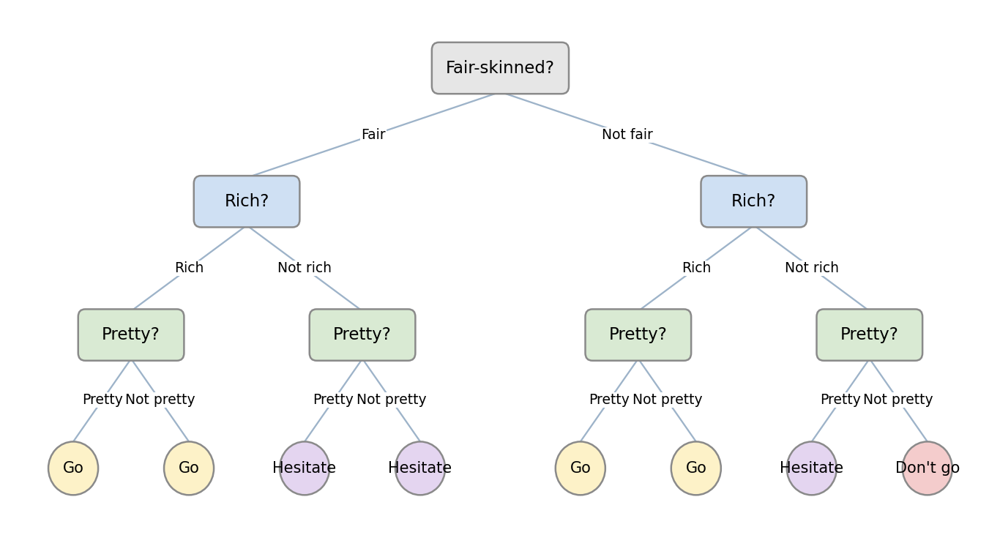
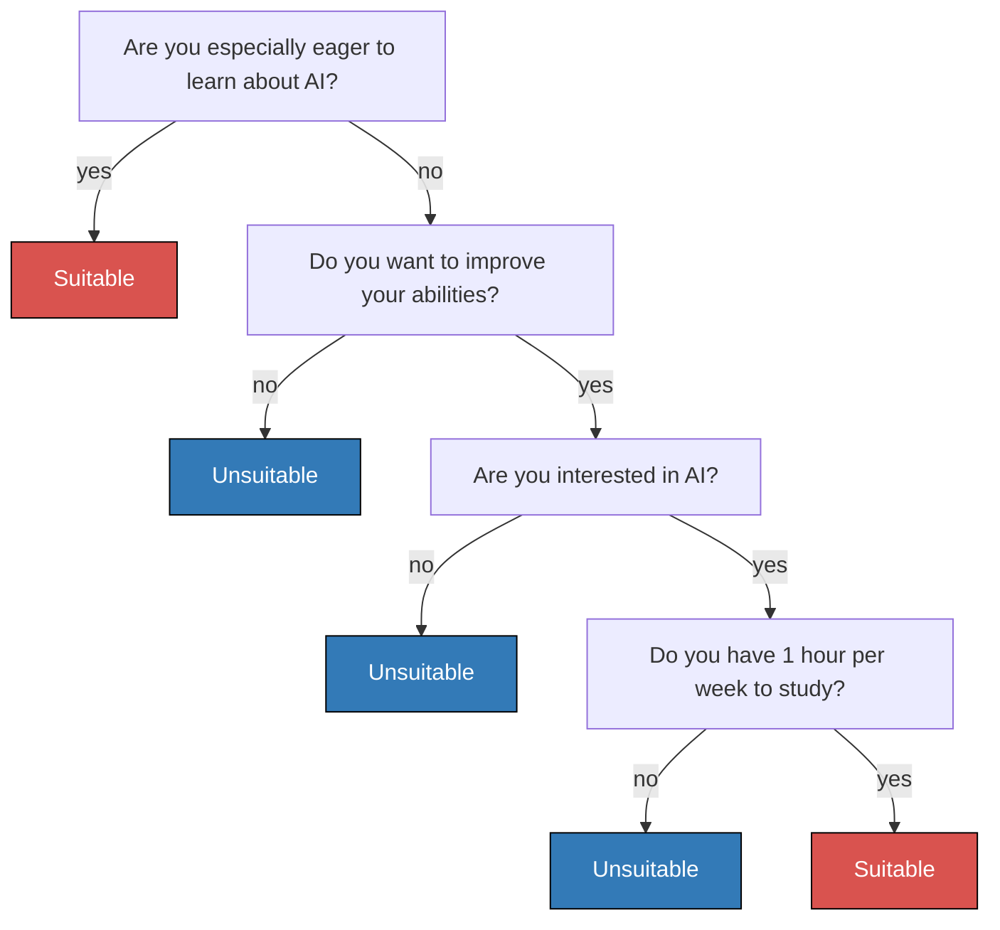
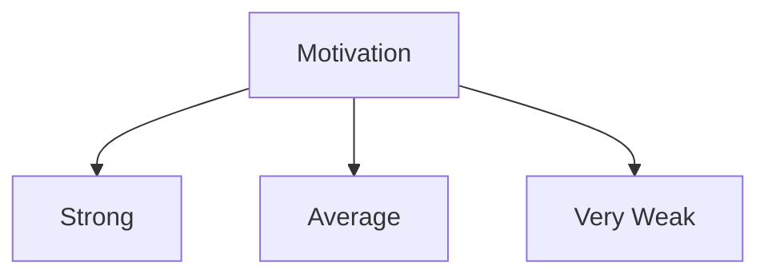
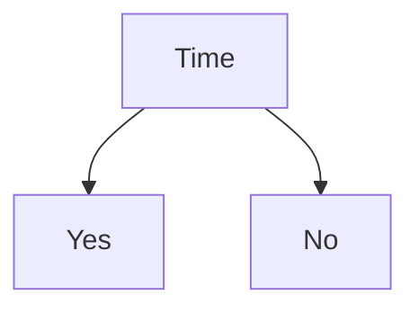

# 3.1. Decision Tree Theory (Basics)

## 3.1.1. Common Classification Methods
In the previous article, we introduced the following classification methods:
- Logistic regression: finding the decision boundary when the labels are known

- KMeans and MeanShift: partitioning data when the labels are unknown

MeanShift:

- KNN: classifying new points from known labeled neighbors

## 3.1.2. A New Classification Method: Decision Trees
Here we introduce a new classification method: decision trees.

Its defining feature is that it forms multiple layers of “yes/no” decisions:

## 3.1.3. Logistic Regression vs. Decision Trees
Let’s use an example to understand decision trees and, along the way, make a clear comparison with logistic regression:

> Based on a user’s motivation to learn, willingness to improve their abilities, level of interest, and available time, determine whether they are suitable for taking an AI course. Assume the decision depends on four factors: motivation, ability, interest, and time.

### Logistic Regression Approach
Using logistic regression to solve this problem first requires building a model:
$$
Z = w_1 \times \text{motivation} + w_2 \times \text{time} + w_3 \times \text{interest} + w_4 \times \text{ability}
$$
- $w_1$, $w_2$, $w_3$, and $w_4$ are weight parameters

Then, combined with the sigmoid function of logistic regression:
$$
P(x) = \frac{1}{1 + e^{-x}}
$$
we can obtain $P(x)$, which is the probability that someone is suitable for learning a course.

### Decision Tree Approach
Using a decision tree, we would use the following framework:

### Summary
The logistic regression approach feeds all factors into the model at once, lets it build an equation, and then predicts the corresponding probability.

Decision trees, by contrast, perform many `if-else` decisions.

## 3.1.4. Definition of Decision Trees
A decision tree is a **tree-structured** model used to **classify** instances by making **multi-level decisions** to distinguish the target category.

In essence, it derives a set of classification rules from the training dataset through repeated decisions.

Its advantages are:
- Small computational cost and fast execution
- Easy to understand, with the importance of each attribute clearly visible

Its disadvantages are:
- It does not consider correlations between attributes
- When class distributions are imbalanced, model performance is easily affected

## 3.1.5. Core Problem in Decision Tree Construction
Suppose we are given a training dataset:

$$
D = \{(x_1, y_1), (x_2, y_2), ..., (x_N, y_N)\}
$$

Here, $x_i = (x_i^{(1)}, x_i^{(2)}, ..., x_i^{(m)})^T$ is the input instance, $m$ is the number of features, $y_i \in \{1,2,3,...,K\}$ is the class label, $i = 1,2,...,N$, and $N$ is the sample size.

Our goal is to create a **decision tree model** based on the structure of the training dataset so that it can classify instances correctly.

The core problem in decision tree construction is **feature selection**. More specifically: **which feature should be chosen at each node?**

After each node, the tree branches by the chosen feature’s possible values, so choosing the feature at the node itself is crucial.

## 3.1.6. Example of Decision Tree Construction
We will still use the simple example above:

> Based on a user’s motivation to learn, willingness to improve their abilities, level of interest, and available time, determine whether they are suitable for taking an AI course. Assume the decision depends on four factors: motivation, ability, interest, and time.

The data are as follows:

| ID  | Motivation | Willing to Improve | Interested | Time | Class |
| --- | --- | ----- | --- | --- | ----- |
| 1   | Average | No | No | Yes | No |
| 2   | Average | No | Yes | No | No |
| 3   | Strong | Yes | Yes | Yes | **Yes** |
| 4   | Average | No | No | Yes | No |
| 5   | Average | No | No | No | No |
| 6   | Average | Yes | No | No | No |
| 7   | Average | Yes | Yes | Yes | **Yes** |
| 8   | Average | Yes | Yes | Yes | **Yes** |
| 9   | Strong | Yes | Yes | Yes | **Yes** |
| 10  | Very Weak | No | No | No | No |

Some of these factors have three branches, while others have only two:

...

**To build a decision tree, we must decide which factor to use as the root node**, and this is very important, because different features lead to different decision trees: should we use motivation? time? or some other factor?

There are generally three methods:
- ID3 (explained in detail in [3.2. Decision Tree Theory (Advanced)](../3.2/3.2._Decision_Tree_Theory_(Advanced)_ID3_Algorithm,_Information_Entropy,_Information_Gain.md))
- C4.5
- CART
