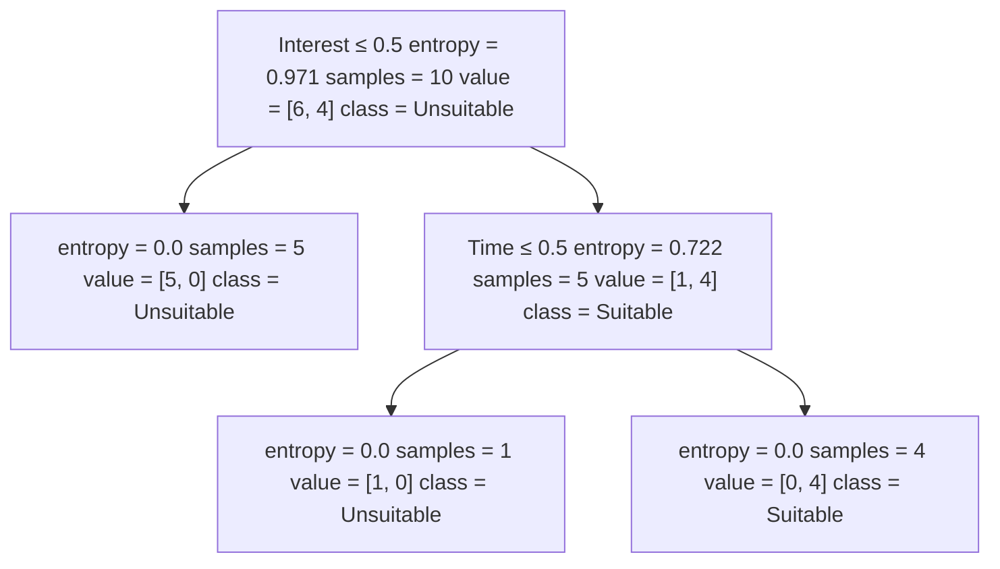

# 3.2. Decision Tree Theory (Advanced): ID3 Algorithm, Information Entropy, Information Gain

This article continues from [3.1. Decision Tree Theory (Basics)](../3.1/3.1._Decision_Tree_Theory_(Basics).md). If you have not read it yet, it is recommended that you do so first.

## 3.2.1. Mathematical Principle of the ID3 Algorithm
The ID3 method uses the *information entropy principle* to select the attribute with the **largest information gain** as the classification attribute, and recursively expands the branches of the decision tree to complete its construction.

Information entropy is a measure of the uncertainty of a random variable. The larger the entropy, the greater the uncertainty of the variable. Suppose the proportion of class-$k$ samples in the current sample set $D$ is $p_k$, then the information entropy of $D$ is:
$$
\text{Ent}(D) = - \sum_{k=1}^{|y|} p_k \log_2 p_k
$$
The smaller the value of $Ent(D)$, the smaller the uncertainty of the variable. When $p_k=1$, there is only one possible case, which means there is no uncertainty, so the entropy is $Ent(D) = 0$.

Based on information entropy, we can calculate the information gain brought by splitting samples with attribute $a$:
$$
\text{Gain}(D, a) = \text{Ent}(D) - \sum_{v=1}^{V} \frac{D^v}{D} \text{Ent}(D^v)
$$
- $V$ is the number of categories split by attribute $a$
- $D$ is the total number of current samples
- $D^v$ is the number of samples in category $v$, that is, the subset when attribute $a$ takes value $v$

Where:
- $\text{Ent}(D)$ is the information entropy before splitting. Before the split, dataset $D$ may contain multiple categories

- $\sum_{v=1}^{V} \frac{D^v}{D} \text{Ent}(D^v)$ is the information entropy after splitting:
  - After splitting by attribute $a$, $D$ is divided into multiple subsets $D^1, D^2, \dots, D^V$, and each subset has its own information entropy $\text{Ent}(D^v)$
  - During calculation, the information entropy of each subset is weighted and summed according to its proportion of the total dataset, $\frac{D^v}{D}$

Suppose we have the following data:

| ID  | Motivation | Willing to Improve | Interested | Time | Class |
| --- | --- | ----- | --- | --- | ----- |
| 1   | Average | No | No | Yes | No |
| 2   | Average | No | Yes | No | No |
| 3   | Strong | Yes | Yes | Yes | **Yes** |
| 4   | Average | No | No | Yes | No |
| 5   | Average | No | No | No | No |
| 6   | Average | Yes | No | No | No |
| 7   | Average | Yes | Yes | Yes | **Yes** |
| 8   | Average | Yes | Yes | Yes | **Yes** |
| 9   | Strong | Yes | Yes | Yes | **Yes** |
| 10  | Very Weak | No | No | No | No |

If we want to compute the information gain of motivation:
- Attribute $a$ is motivation
- The number of categories $V$ is 3, since motivation has three values: average, strong, and very weak
- The total sample count $D$ is 10

## 3.2.2. Example Calculation
The goal of ID3 is to make the sample distribution uncertainty after splitting as small as possible, that is, to obtain a small post-split entropy and a large information gain.

We will use the data in the table above to determine which factor should be used as the root node.

To decide the attribute, we need to compute the information gain for each attribute.

First, calculate the information entropy before attribute splitting using the formula:
- There are two classes in total: “Yes” and “No”
- There are 6 “No” samples
- So $p_1 = 6/10$, $p_2 = 4/10$

Substitute into the formula:
$$
\text{Ent}(D) = - \left( \frac{6}{10} \log_2 \frac{6}{10} + \frac{4}{10} \log_2 \frac{4}{10} \right)  \approx 0.971
$$
This is the information entropy before attribute splitting. Next, let us calculate the entropy after splitting, using interest as an example:

There are two splits for this attribute: “Yes” and “No”. We calculate the entropy for the “Yes” and “No” subsets separately and then weight and sum them by proportion:

For the “No” subset, there are 5 samples, and whenever interest is “No”, the class label is always “No”, so there is no other possibility. Therefore, $Ent(D_1) = 0$.

For the “Yes” subset, there are 5 samples, and when interest is “Yes”, the class labels include 1 “No” and 4 “Yes”, so $p_1 = 1/5$, $p_2 = 4/5$. Substituting into the calculation gives $Ent(D_2)$:
$$
\text{Ent}(D_2) = - \left( \frac{1}{5} \log_2 \frac{1}{5} + \frac{4}{5} \log_2 \frac{4}{5} \right) \approx 0.722
$$
With this information, we can calculate the post-split entropy:
$$
\sum_{v=1}^{V} \frac{D^v}{D} \text{Ent}(D^v) = \frac{5}{10} \times Ent(D_1) + \frac{5}{10} \times Ent(D_2)
$$
The final result is:
$$
\sum_{v=1}^{V} \frac{D^v}{D} \text{Ent}(D^v) \approx 0.361
$$

Substituting this result into the information gain formula gives:
$$
Gain = Ent(D) - \sum_{v=1}^{V} \frac{D^v}{D} \text{Ent}(D^v) \approx 0.971 - 0.361 = 0.610
$$
Let us also calculate the others. The method is the same, so I will only show the results and not the process:

|      | Motivation | Ability | Interest | Time |
|------|------|------|------|------|
| **Ent**  | 0.60  | 0.36  | 0.36  | 0.55  |
| **Gain** | 0.37  | **0.61**  | **0.61**  | 0.42  |

Interest and ability yield the same largest information gain (they produce equivalent purity after the split). Either may be chosen as the root; here we take interest as the first node.

## 3.2.3. Final Result
Let us look at the final result produced by the decision tree algorithm:

You can see that, although the original data had four attributes, only two were used here to separate all possible cases, based on the provided table.
