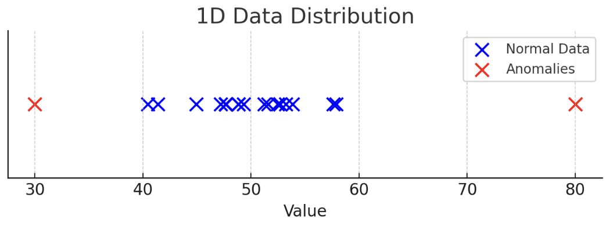
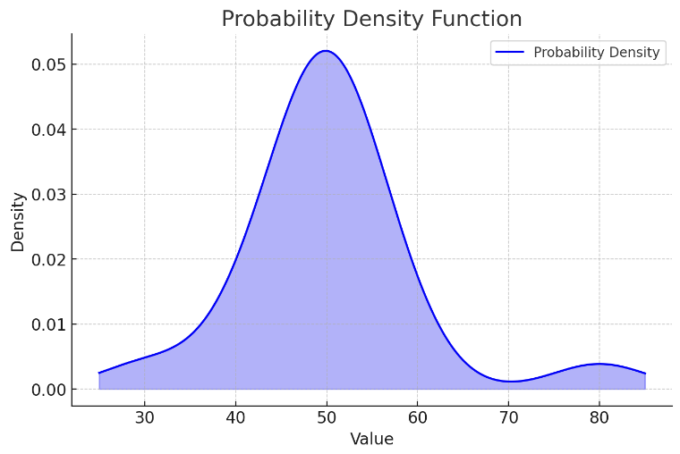
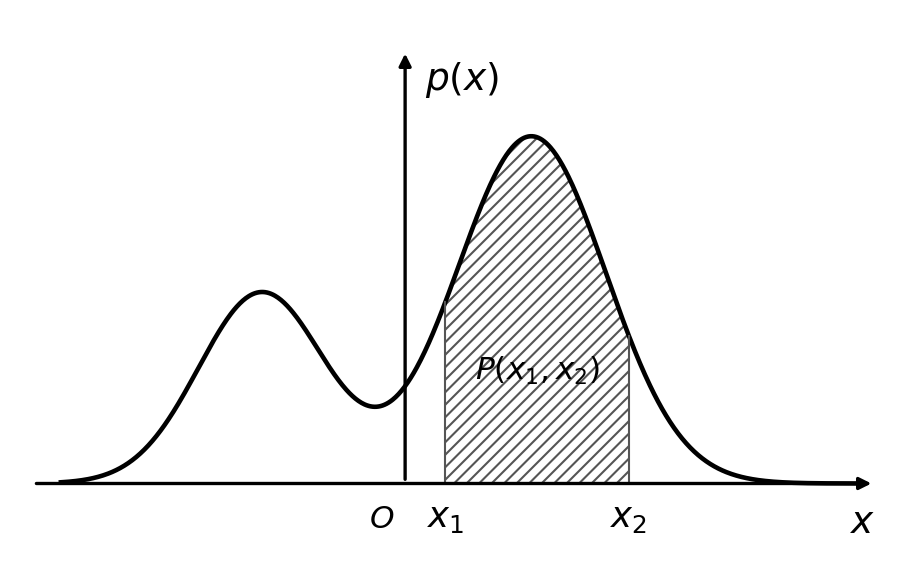

# 3.3. Anomaly Detection Theory: Probability Density, Normal Distribution

## 3.3.1. What Is Anomaly Detection?
Let’s look at a real-world example:

> How does a bank determine whether a credit-card transaction has been stolen and used fraudulently? Two very important factors are the transaction amount and the time of day. Transactions with abnormally large amounts and abnormally late timestamps may be identified as suspicious fraud attempts.

In the figure, the blue dots represent normal transactions, and the red dots represent suspicious transactions. We can use anomaly detection to identify suspicious transactions and block them.

More examples:
- Defective product detection (industry)
- Defective gene detection (medicine)
- ......

## 3.3.2. Mathematical Principles of One-Dimensional Anomaly Detection
### Overall Idea
Anomaly detection identifies data that **do not match the expected pattern** based on the input data.

Suppose we have a one-dimensional dataset:
$$
\{ x^{(1)}, x^{(2)}, \dots, x^{(m)} \}
$$
Its distribution in one dimension is shown below:

To find anomalous points, we first need to draw the probability density, as follows:

The probability is low on both sides and high in the middle. When some data points appear where the data density is lower than $\epsilon$ (the decision threshold), that data point is considered anomalous.

### Probability Density
A probability density function is a function that describes the likelihood of a random variable being near **a specific value**.

Here, the x-axis corresponds to possible data points or a certain event, and $p(x)$ is the probability density (not a probability by itself).

If we want to calculate the probability over the interval $(x_1, x_2)$, we integrate the probability density:
$$
P(x_1, x_2) = \int_{x_1}^{x_2} p(x) \,dx
$$

### Normal Distribution (Gaussian Distribution)
The probability density function of the normal distribution (Gaussian distribution) is:
$$
p(x) = \frac{1}{\sigma \sqrt{2\pi}} e^{-\frac{(x - \mu)^2}{2\sigma^2}}
$$
Where:
- $p(x)$: under a normal distribution, the probability density that random variable $x$ takes a value at a certain position
- $\mu$ (mean): determines the center of the normal distribution and represents the average value of the data
- $\sigma$ (standard deviation): measures the dispersion of the data and determines the **width** of the normal distribution; the larger the value, the flatter the curve; the smaller the value, the steeper the curve
- $\sigma^2$ (variance): the square of the standard deviation, which measures the **dispersion** of the data distribution
- $\sqrt{2\pi}$: normalization constant, ensuring that the total area under the probability density function is 1

The formulas for calculating $\mu$ (data mean) and $\sigma$ (standard deviation) are:
$$
\mu = \frac{1}{m} \sum_{i=1}^{m} x^{(i)}, \quad
\sigma^2 = \frac{1}{m} \sum_{i=1}^{m} (x^{(i)} - \mu)^2
$$
The graph of the normal distribution (Gaussian distribution) is shown below:

This is a symmetric curve with the mean $\mu$ as the axis of symmetry. A smaller $\sigma$ on both sides means the data are more concentrated, which forms a narrower peak in the graph.

### Calculation Process
- Compute the data mean $\mu$ and standard deviation $\sigma$
- Compute the corresponding Gaussian probability function:
$$
p(x) = \frac{1}{\sigma \sqrt{2\pi}} e^{-\frac{(x - \mu)^2}{2\sigma^2}}
$$
- Determine based on the probability density of each data point: if the density corresponding to a point is smaller than the decision threshold $\epsilon$, then treat that point as an anomaly.

## 3.3.3. Mathematical Principles of High-Dimensional Anomaly Detection
In practice, our data are often higher than one dimension:
$$
\left\{
\begin{array}{cccc}
x_1^{(1)}, & x_1^{(2)}, & \dots, & x_1^{(m)} \\
\vdots & \vdots & \ddots & \vdots \\
x_n^{(1)}, & x_n^{(2)}, & \dots, & x_n^{(m)}
\end{array}
\right\}
$$
How should we compute it in this case?

The core idea is actually the same as in one dimension:
- First, compute the data means $\mu_1, \mu_2, \dots, \mu_n$ and standard deviations $\sigma_1, \sigma_2, \dots, \sigma_n$, using the same formulas as above:
$$
\mu = \frac{1}{m} \sum_{i=1}^{m} x^{(i)}, \quad
\sigma^2 = \frac{1}{m} \sum_{i=1}^{m} (x^{(i)} - \mu)^2
$$
- After computing these values, we can obtain the probability density functions $p(x_1), \dots, p(x_n)$ for each dimension. Multiplying them gives the total probability density function in high dimensions:
$$
p(x) = \prod_{j=1}^{n} p(x_j; \mu_j, \sigma_j^2) = \prod_{j=1}^{n} \frac{1}{\sigma_j \sqrt{2\pi}} e^{-\frac{(x_j - \mu_j)^2}{2\sigma_j^2}}
$$
- Finally, compare the total high-dimensional probability density with the decision threshold $\epsilon$. Data points whose density is smaller than the threshold are anomalous:
$$
p(x) < \epsilon
$$
