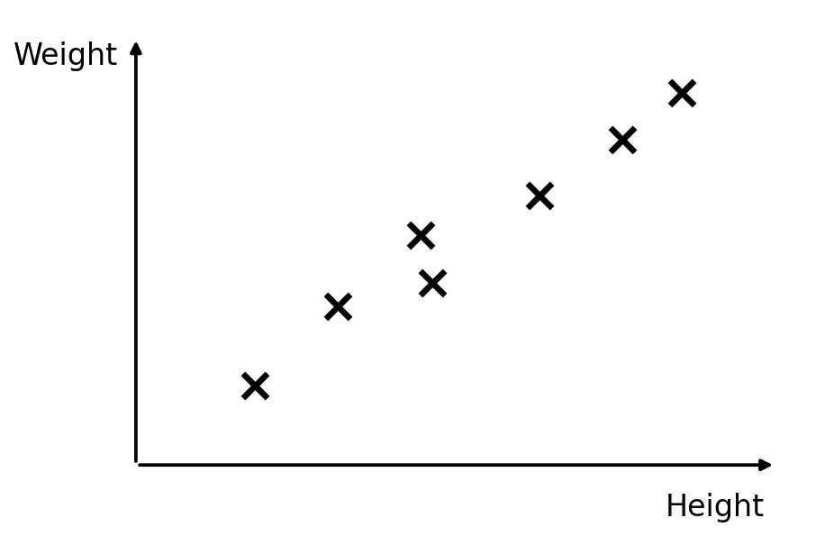
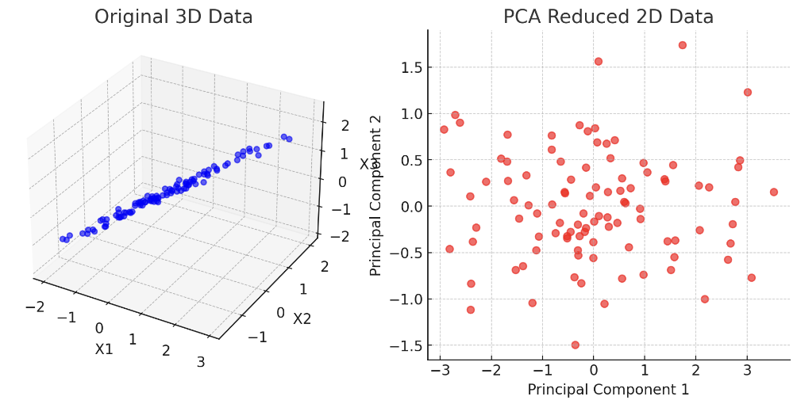

# 3.4. Principal Component Analysis (PCA) Theory

## 3.4.1. Dimensionality Reduction
Dimensionality reduction refers to reducing data from a high-dimensional space to a low-dimensional one while preserving the accuracy of the final model as much as possible.

We can explain this with an example:

> Using annual economic data from the United States between 1929 and 1938, predict national income and expenditure. The data include 17 indicators: employer subsidies, consumption goods and production goods, net public spending, inventory growth, dividends, interest, foreign trade balance, and more...

Under the standard approach, we would need to build a model for every indicator, but that was extremely difficult for the computing power available at the time.

So statisticians of the time used dimensionality reduction and compressed the data down to only 3 dimensions:
- Total income $F_1$
- Rate of change in total income $F_2$
- Economic development trend $F_3$

With only these three indicators, they achieved a prediction accuracy of 97.4%, which is truly impressive.

### Definition
Dimensionality reduction is the process of reducing the number of random variables under certain constraints and obtaining a set of “uncorrelated” principal variables.

Its role is to:
- Reduce the amount of data the model needs to analyze, improve processing efficiency, and lower computational difficulty
- Enable data visualization

### Example
Let’s first look at an example of reducing from 2 dimensions to 1:

Originally, these scatter points are two-dimensional data, but we find a positive correlation between height and weight, so we can project the points onto a straight line and use the analytic expression of that line to replace height and weight.

This line is not called height or weight; it is a composite factor, a combination of height and weight. We then project the corresponding data points onto it.

## 3.4.2. Implementation of Dimensionality Reduction: Principal Component Analysis (PCA)
Principal Component Analysis (PCA) is the most widely used method in dimensionality reduction.

The goal of PCA is to **find a new $k$-dimensional dataset ($k<n$) that reflects the main features of the data**. Its core is to **reduce dimensionality while keeping information loss as small as possible**.

The information lost during dimensionality reduction is the sum of the deviations between the scatter points and the line. In other words, **the sum of the distances $\delta$ from the points to the line should be as small as possible**.

Reducing from 3D to 2D means projecting onto the plane formed by vectors $u_1$ and $u_2$, keeping the total deviation of all scatter points from that plane as small as possible:

Reducing from $n$ dimensions to $k$ dimensions means projecting onto the space formed by $u_1, u_2, \dots, u_k$, keeping the total deviation of all scatter points from that space as small as possible.

---

How can we ensure that the projected space preserves the most important information?

We mentioned earlier that when data are highly dimensional, there are many correlations between dimensions. After dimensionality reduction, you want the correlation within each dimension to be as small as possible. If features across multiple dimensions are highly correlated, it means the information in the data is **redundant**. The same information can be represented with fewer dimensions, so you should continue using PCA.

---

So how do we achieve a reduced space in which the data in each dimension do not have too much correlation?

We need to maximize the variance of the projected data, because the larger the variance, the more dispersed the data.

The process is:
- Preprocess the original data: that is, standardize it, because the units of different dimensions may not be the same. We first transform the data so that the mean $\mu = 0$ and the standard deviation $\sigma = 1$
- Compute the eigenvectors of the covariance matrix, as well as the variance of the data projected onto each eigenvector
- Rank principal directions by projected variance (eigenvalues): keep the $k$ directions with the largest variance, and discard low-variance directions as less informative
- Select those $k$ eigenvectors and compute the projection of the data into the space they form

## PCA vs. Linear Regression
When PCA reduces 2D data to 1D, it involves fitting scatter points to a line, so many people confuse it with linear regression. However, the mathematical methods behind them are completely different:

| **Item** | **PCA (Dimensionality Reduction)** | **Linear Regression (Prediction)** |
| -------------- | ------------------------ | ----------------------------- |
| **Goal** | Discover the direction of **maximum variance** in the data and reduce dimensionality | Predict the dependent variable ($y$) |
| **Method** | Compute the data **covariance matrix** and find the direction of the principal component with the largest variance | Fit the regression line using ordinary least squares (OLS) |
| **Is there a dependent variable (label)?** | **Unsupervised learning** | **Supervised learning** |
| **Fitting approach** | Project data points along the **maximum-variance direction** | Make the predicted value ($\hat{y}$) as close as possible to the actual value ($y$) |
| **Direction of the line** | **Principal component direction**, maximizing the variance of the data distribution | **Optimal regression line**, minimizing prediction error |
| **Loss function** | **Maximize the variance of the data** | **Minimize mean squared error (MSE)** |
| **Use cases** | **Dimensionality reduction, feature extraction**, no dependent variable | **Prediction, regression analysis**, with a dependent variable |
