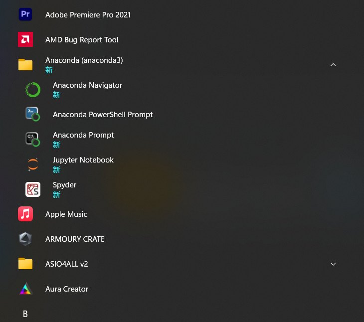
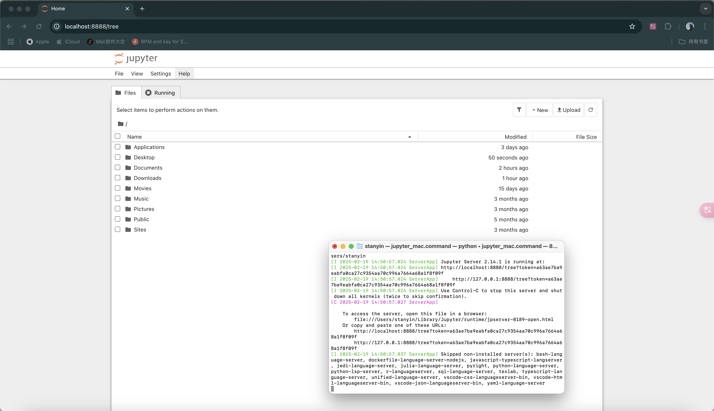
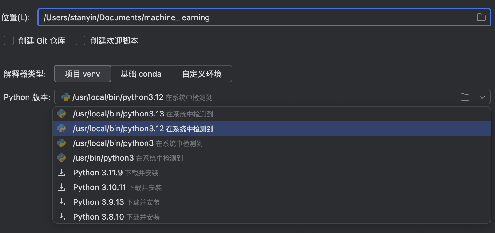

# 0.1. 环境配置

这篇文章会带你搭好本课程需要的环境：**Python**、**Anaconda（conda）**、**Jupyter Notebook**、以及 **PyCharm**。如果你已经有可用的 conda 环境，并且能正常打开 Notebook，可以直接进入 [0.2](../0.2/0.2._下载、安装和试运行需要的包_matplotlib、numpy和pandas.md)。

本文覆盖 **Windows**、**macOS**、**Linux**。安装步骤按系统分开写；装好之后的 conda / Jupyter / PyCharm 操作基本通用。

## 0.1.1. 你需要什么

| 工具 | 作用 |
|------|------|
| **Python** | 本课程使用的语言。建议 **3.11** 或 **3.12**（不要再用已停止维护的旧版本，例如 3.8）。 |
| **Anaconda** | 自带 Python、`conda` 和大量科学计算相关组件的安装包，适合入门。 |
| **Jupyter Notebook** | 浏览器里的交互式笔记本，方便边写代码边做笔记。 |
| **PyCharm** | 编辑器 / IDE，可以把 conda 环境当作项目解释器。 |

**还需要单独去 [python.org](https://www.python.org/) 装一份 Python 吗？**  
一般 **不需要**。Anaconda 已经包含 Python。按本课程的路径，安装 Anaconda，再建一个带 Python 3.11 或 3.12 的环境即可。单独安装 python.org 版本是可选的（做非 conda 项目时有时方便）；若在 Windows 上安装，请勾选 **Add python.exe to PATH**。

**Anaconda 与 Miniconda：** Anaconda 体积更大、对新手更友好；[Miniconda](https://www.anaconda.com/download) 更轻，主要提供 conda。两者都能用；本文默认使用 **Anaconda**。

## 0.1.2. 安装 Anaconda

### 下载（各系统通用）

1. 打开官方下载页：[https://www.anaconda.com/download](https://www.anaconda.com/download)。
2. 按你的操作系统下载对应安装包（Windows / macOS / Linux）。页面通常会推荐合适版本；在 macOS 上请选择 **Apple Silicon** 或 **Intel**，与本机芯片一致。


下载前可能会要求填写邮箱，这不是拿到安装包的必要条件。优先使用 Anaconda 官方站点；除非你清楚自己在做什么，否则不要随便用不明来源的第三方包。

### Windows

1. 运行下载好的 `.exe` 安装程序。
2. 没有特殊需求就保持默认选项；需要时再改安装路径。
3. 初学者建议用开始菜单里的 **Anaconda Prompt** 或 **Anaconda PowerShell Prompt** 执行 conda 命令（不必强行把 Anaconda 加进系统 `PATH`）。
4. 验证安装：打开 **Anaconda Prompt**，执行：

```bash
conda --version
```



若 Anaconda 装在 `C:\Program Files` 等受保护目录，创建环境或装包时请以**管理员身份**打开 Anaconda Prompt，或者一开始就装到用户可写目录。

### macOS

1. 运行下载好的安装程序（`.pkg`，或按官网说明使用 shell 安装脚本）。
2. 安装结束后打开 **终端（Terminal）**，为当前 shell 初始化 conda（多数 Mac 使用 zsh）：

```bash
conda init zsh
```

完全关闭终端再重新打开，然后检查：

```bash
conda --version
```

**Apple Silicon 与 Intel：** 安装包架构必须与本机一致（苹果菜单 → **关于本机**）。装错架构，后面装包时容易出现难排查的错误。

### Linux

1. 同样从官网下载 Linux 安装脚本（`.sh`）。
2. 在终端里用 `bash` 运行（文件名含版本号，按实际为准）：

```bash
bash ~/Downloads/Anaconda3-*.sh
```

3. 接受许可协议，选择安装路径（默认装在用户主目录即可），并在提示时允许为当前 shell 执行 `conda init`。
4. 关闭并重新打开终端，执行：

```bash
conda --version
```

请使用**官方 `.sh` 安装脚本**，不要随便用发行版里来历不明的 `apt` / `dnf` / `pacman` 包，除非你已经了解它们的维护方式。通常**不要**用 `sudo` 运行 Anaconda 安装脚本。

## 0.1.3. 用 Anaconda 新建开发环境（建议）

不要把课程用到的包全部塞进 `base`。单独建一个环境更干净：

**Windows：** Anaconda Prompt（或 Anaconda PowerShell Prompt）。  
**macOS / Linux：** 终端（完成 `conda init` 之后）。

```bash
conda create -n machine_learning python=3.12
```

- 把 `machine_learning` 换成你喜欢的名字，**只能用英文**。
- 若更想用 3.11，写成 `python=3.11` 即可；本课程两者都可用。

出现是否继续的提示时，输入 `y` 回车。然后激活环境：

```bash
conda activate machine_learning
```

命令行提示符应出现环境名（例如 `(machine_learning)`），而不只是 `(base)`。

```text
(base) user@hostname ~ % conda activate machine_learning
(machine_learning) user@hostname ~ %
```

常用检查命令：

```bash
conda env list
python --version
```

```text
(base) user@hostname ~ % conda env list

# conda environments:
#
base                  * /opt/anaconda3
machine_learning        /opt/anaconda3/envs/machine_learning
```

当前环境会在路径前标 `*`。

也可以启动 Python 交互环境，确认解释器能正常响应：

```text
(base) user@hostname ~ % python
Python 3.12.2 | packaged by conda-forge | (main, Feb 16 2024, 20:54:21) [Clang 16.0.6 ] on darwin
Type "help", "copyright", "credits" or "license" for more information.
>>> 
```

## 0.1.4. 安装和打开 Jupyter Notebook

先**激活**你的课程环境，再安装：

```bash
pip install notebook
```

如果下载较慢，可改用国内镜像（清华源示例）：

```bash
pip install notebook -i https://pypi.tuna.tsinghua.edu.cn/simple
```

启动 Notebook：

```bash
jupyter notebook
```

浏览器应自动打开。若要打开指定项目目录，先 `cd` 进去再启动：

```bash
cd /path/to/your/project
jupyter notebook
```



当前 `pip install notebook` 默认安装的是 **Notebook 7+**。主题 / 深色模式可在 Notebook 界面的设置里切换，本课程不需要再装第三方主题包。

matplotlib、NumPy、pandas 的安装与试运行见 [0.2](../0.2/0.2._下载、安装和试运行需要的包_matplotlib、numpy和pandas.md)——环境能跑起来后请接着做那一篇。

## 0.1.5. PyCharm + Anaconda

目前对新手比较友好的 Python IDE 之一是 JetBrains 的 [PyCharm](https://www.jetbrains.com.cn/pycharm/)。从 PyCharm 2025.1 起，JetBrains 提供**统一的 PyCharm** 产品：从官网下载即可；可先试用 Pro 功能，试用结束后可继续免费使用核心功能（已包含 Jupyter 支持），也可订阅 Pro。

1. 按操作系统下载并安装 PyCharm，安装选项保持默认即可。
2. 打开 PyCharm → **新建项目**。
3. 解释器选择 **conda** 相关选项（例如 **基础 conda**，或指向你创建的 `machine_learning` 环境）。



之后也可在 **设置** 里搜索 **Python 解释器** 再改：


### 在 PyCharm 中新建 Notebook

项目已使用 conda 解释器时，可直接在 IDE 里新建 Jupyter Notebook（例如 **新建** → **Jupyter Notebook**）。


## 0.1.6. 快速自检

进入下一篇之前，你应能做到：

1. 在 Anaconda Prompt（Windows）或终端（macOS / Linux）里运行 `conda --version`。
2. `conda activate` 你的课程环境，并且 `python --version` 显示 3.11 或 3.12。
3. 运行 `jupyter notebook` 并打开浏览器界面。
4. （可选）在 PyCharm 中新建项目，并选用该 conda 环境。

下一篇：[0.2. 下载、安装和试运行需要的包](../0.2/0.2._下载、安装和试运行需要的包_matplotlib、numpy和pandas.md)（matplotlib、NumPy、pandas）。
