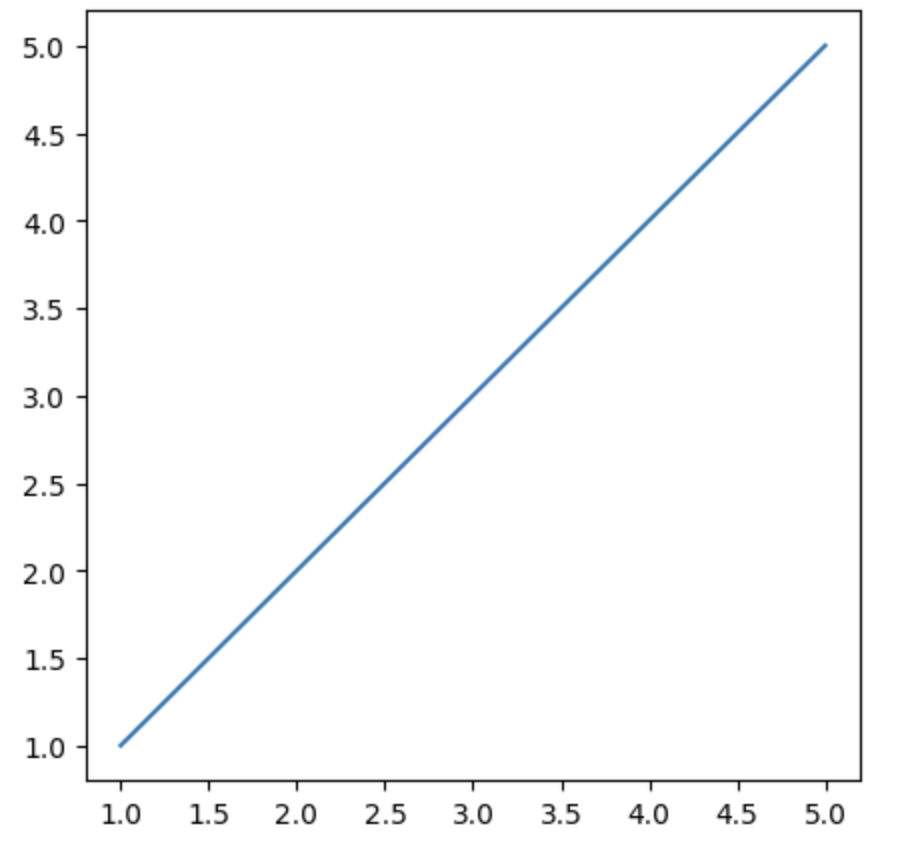

# 0.2. 下载、安装和试运行需要的包 matplotlib、numpy和pandas

## 0.2.1. 安装`matplotlib`和试运行
你需要先下载并安装Anaconda（安装教程在上一篇文章 [0.1. 环境配置](../0.1/0.1._环境配置.md)）。

### Step 1：切换环境（可选）
如果你需要把包安装在你指定的环境的话，你得先手动切换到那个环境去

在MacOS上，打开终端；在Windows上，打开Anaconda Prompt或者Anaconda Powershell Prompt(注意：如果你把Anaconda下载在C盘那就得以管理员身份打开，不然有可能在后续的操作中报错)，接着输入：
```bash
conda env list
```
- 这个命令可以帮助你查看的电脑上有哪些环境和你现在处在什么环境

```text
(base) user@hostname ~ % conda env list

# conda environments:
#
base                  * /opt/anaconda3
machine_learning        /opt/anaconda3/envs/machine_learning
```

- 路径前面带了`*`就是你当前所处的环境

如果你想要切换环境，可以使用这个指令：
```bash
conda activate 指定的环境名
```

```text
(base) user@hostname ~ % conda activate machine_learning
(machine_learning) user@hostname ~ %
```

- 看到命令行的前缀变成了你要的环境名就对了

### Step 2：下载并安装
使用`pip`指令就可以下载了：
```bash
pip install matplotlib
```

如果你身处国内，下载速度慢，那可以换用国内镜像源。这里我推荐清华的镜像源：
```bash
pip install matplotlib -i https://pypi.tuna.tsinghua.edu.cn/simple
```

注意：由于`numpy`是`matplotlib`的依赖，所以安装`matplotlib`时就会自动安装`numpy`。我们就不需要专门输入命令安装`numpy`了

### Step 3：试运行
接下来我们可以在代码中运用一下`matplotlib`来看看有没有安装好：
```python
import matplotlib
from matplotlib import pyplot as plt

x = [1, 2, 3, 4, 5]
y = [1, 2, 3, 4, 5]

fig1 = plt.figure(figsize = (5, 5))
plt.plot(x,y)
plt.show()
```
- `pyplot`是`matplotlib`库的一个子模块，提供类似MATLAB风格的绘图接口，通常使用`plt`作为别名
- `plt.figure()`用于创建一个新的`Figure`对象，即绘图的画布
- `figsize=(5, 5)`指定画布的尺寸，单位是英寸

输出：



## 0.2.2. 安装`numpy`和试运行
一般来说，由于`numpy`是`matplotlib`的依赖，所以安装`matplotlib`时就会自动安装`numpy`。我们就不需要专门输入命令安装`numpy`了。

为了以防万一，这里还是提一下安装`numpy`的命令。

### Step 1：切换环境（可选）
与上文相同，这里不再阐述

### Step 2：下载并安装
使用`pip`指令就可以下载了：
```bash
pip install numpy
```

如果你身处国内，下载速度慢，那可以换用国内镜像源。这里我推荐清华的镜像源：
```bash
pip install numpy -i https://pypi.tuna.tsinghua.edu.cn/simple
```

### Step 3：试运行
接下来我们可以在代码中运用一下`numpy`来看看有没有安装好：
```python
import numpy as np
a = np.eye(5)
print(type(a))
print(a)
```
- `np.eye(5)`用于创建一个5×5的单位矩阵（Identity Matrix）。单位矩阵是一个对角线元素为 1，其余元素为 0 的矩阵：

输出：
```
<class 'numpy.ndarray'>
[[1. 0. 0. 0. 0.]
 [0. 1. 0. 0. 0.]
 [0. 0. 1. 0. 0.]
 [0. 0. 0. 1. 0.]
 [0. 0. 0. 0. 1.]]
```

---

`numpy`还有一些有趣的函数：
```python
b = np.ones([5,5])
print(type(b))
print(b)
```
- `np.ones([5,5])` 生成一个5×5的NumPy数组，其中所有元素均为1。`ones()`是NumPy提供的创建全 1 数组的函数

输出：
```
<class 'numpy.ndarray'>
[[1. 1. 1. 1. 1.]
 [1. 1. 1. 1. 1.]
 [1. 1. 1. 1. 1.]
 [1. 1. 1. 1. 1.]
 [1. 1. 1. 1. 1.]]
```

---

`numpy`最强大的地方在于数组的直接运算，在这里也展示一下这样的代码：
```python
import numpy as np  
  
a = np.eye(5)  
print(f"a =\n {a}\n")  
  
b = np.ones([5,5])  
print(f"b =\n {b}\n")  
  
c = a + b # magically  
print(f"c =\n {c}\n")
```

输出：
```
a =
 [[1. 0. 0. 0. 0.]
 [0. 1. 0. 0. 0.]
 [0. 0. 1. 0. 0.]
 [0. 0. 0. 1. 0.]
 [0. 0. 0. 0. 1.]]

b =
 [[1. 1. 1. 1. 1.]
 [1. 1. 1. 1. 1.]
 [1. 1. 1. 1. 1.]
 [1. 1. 1. 1. 1.]
 [1. 1. 1. 1. 1.]]

c =
 [[2. 1. 1. 1. 1.]
 [1. 2. 1. 1. 1.]
 [1. 1. 2. 1. 1.]
 [1. 1. 1. 2. 1.]
 [1. 1. 1. 1. 2.]]
```

## 0.2.3. 安装`pandas`和试运行

### Step 1：切换环境（可选）
与上文相同，这里不再阐述

### Step 2：下载并安装
使用`pip`指令就可以下载了：
```bash
pip install pandas
```

如果你身处国内，下载速度慢，那可以换用国内镜像源。这里我推荐清华的镜像源：
```bash
pip install pandas -i https://pypi.tuna.tsinghua.edu.cn/simple
```

### Step 3：试运行
`pandas`库的强大点在于数据的加载、保存及索引功能，我在本地创建了这么一个csv文件：


我们可以用`pandas`库的函数来读取出来：
```python
import pandas as pd  
data = pd.read_csv('Sample_Data.csv')  
print(type(data))  
print(data)
```
- 使用`pd.read_csv('Sample_Data.csv')`读取`Sample_Data.csv`文件，并将其存入`data`变量中
- 读取后，`data`将是一个`pandas.DataFrame`，即一个二维数据表结构，类似于Excel表格。

输出：
```
<class 'pandas.core.frame.DataFrame'>
    ID     Name  Value Category
0    1   Item_1     97        B
1    2   Item_2     68        C
2    3   Item_3     61        A
3    4   Item_4     35        B
4    5   Item_5     70        A
5    6   Item_6     22        C
6    7   Item_7     46        C
7    8   Item_8     40        B
8    9   Item_9     97        A
9   10  Item_10     44        B
10  11  Item_11     22        A
11  12  Item_12     94        A
12  13  Item_13     55        B
13  14  Item_14     59        B
14  15  Item_15     91        A
15  16  Item_16     66        A
16  17  Item_17     16        C
17  18  Item_18     97        A
18  19  Item_19     20        A
19  20  Item_20     82        A
```

---

既然我们都知道如何读取数据了，那顺便就转存一下数据吧：
```python
value = data.loc[:,'Value']  
print(type(value))  
print(value)  
```
- `data.loc[:, 'Value']`选取`data`这个DataFrame中**所有行**(`:`)和**“Value” 列** (`'Value'`)
- `loc[]`是Pandas用于基于标签选择数据的方法，`:`代表选取所有行

输出：
```
<class 'pandas.core.series.Series'>
0     97
1     68
2     61
3     35
4     70
5     22
6     46
7     40
8     97
9     44
10    22
11    94
12    55
13    59
14    91
15    66
16    16
17    97
18    20
19    82
```

---

我们再来试一试`pandas`的数据筛选功能：
```python
import pandas as pd  
data = pd.read_csv('Sample_Data.csv')  
  
values = data.loc[:, 'Value']  
  
special_category = data.loc[:,'Category'][values > 50]  
  
print(special_category)
```
- `data.loc[:, 'Category'][values > 50]`：
  - `values > 50`会返回一个布尔索引，用于筛选`Value`列中大于50的行
  - 先取出`Category`列`data.loc[:, 'Category']`，然后**只保留`Value`大于50的行**
  - 结果是`Category`列的一个筛选后的`Series`

输出：
```
0     B
1     C
2     A
4     A
8     A
11    A
12    B
13    B
14    A
15    A
17    A
19    A
Name: Category, dtype: object
```

---

我们还可以通过`pandas`把数据存储为本地的文件。比如说我们现在把所有的数据都加10然后保存：
```python
import pandas as pd  
  
data = pd.read_csv('Sample_Data.csv')  
  
data['Value'] = data['Value'] + 10  
  
data.to_csv('Sample_Data_modified.csv')  
  
print(data.head())
```
- `to_csv`可以将数据保存为`.csv`文件，其参数就是保存的文件名
- `head`方法可以打印列表的前几项而不是所有，这对于打印比较大的列表来说比较方便

输出：
```
   ID    Name  Value Category
0   1  Item_1    107        B
1   2  Item_2     78        C
2   3  Item_3     71        A
3   4  Item_4     45        B
4   5  Item_5     80        A
```

新的叫做`Sample_Data_modified.csv`的文件也被创建了：
```
,ID,Name,Value,Category  
0,1,Item_1,107,B  
1,2,Item_2,78,C  
2,3,Item_3,71,A  
3,4,Item_4,45,B  
4,5,Item_5,80,A  
5,6,Item_6,32,C  
6,7,Item_7,56,C  
7,8,Item_8,50,B  
8,9,Item_9,107,A  
9,10,Item_10,54,B  
10,11,Item_11,32,A  
11,12,Item_12,104,A  
12,13,Item_13,65,B  
13,14,Item_14,69,B  
14,15,Item_15,101,A  
15,16,Item_16,76,A  
16,17,Item_17,26,C  
17,18,Item_18,107,A  
18,19,Item_19,30,A  
19,20,Item_20,92,A
```

## 0.2.4. `pandas`和`numpy`联动操作

我们可以很轻松地将`pandas`的`DataFrame`转换为`numpy`的`ndarray`：
```python
import pandas as pd  
import numpy as np  
  
data = pd.read_csv('Sample_Data.csv')  
data_array = np.array(data)  
  
print(type(data_array))  
print(data_array)
```

输出：
```
<class 'numpy.ndarray'>
[[1 'Item_1' 97 'B']
 [2 'Item_2' 68 'C']
 [3 'Item_3' 61 'A']
 [4 'Item_4' 35 'B']
 [5 'Item_5' 70 'A']
 [6 'Item_6' 22 'C']
 [7 'Item_7' 46 'C']
 [8 'Item_8' 40 'B']
 [9 'Item_9' 97 'A']
 [10 'Item_10' 44 'B']
 [11 'Item_11' 22 'A']
 [12 'Item_12' 94 'A']
 [13 'Item_13' 55 'B']
 [14 'Item_14' 59 'B']
 [15 'Item_15' 91 'A']
 [16 'Item_16' 66 'A']
 [17 'Item_17' 16 'C']
 [18 'Item_18' 97 'A']
 [19 'Item_19' 20 'A']
 [20 'Item_20' 82 'A']]
```
