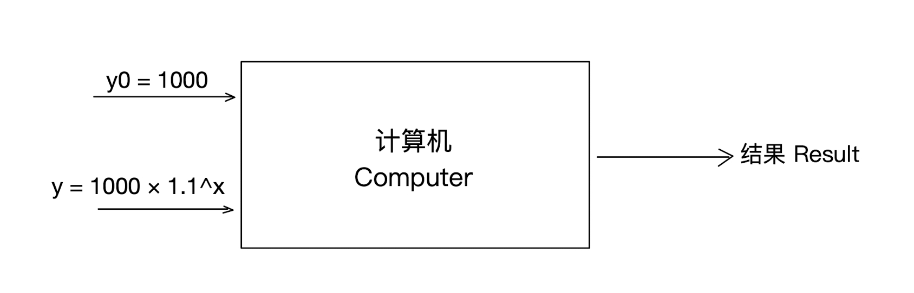
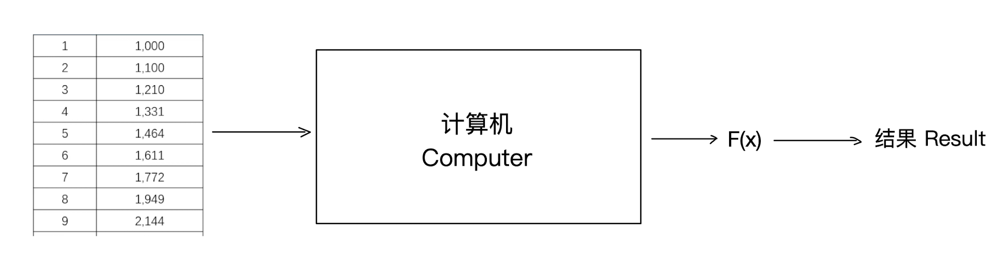
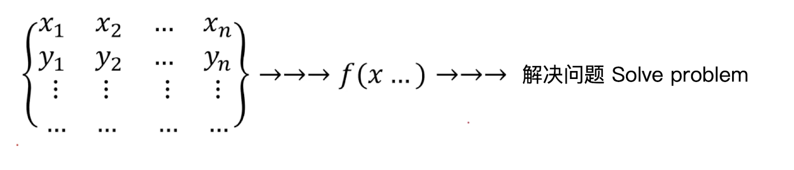

# 1.1. 机器学习(Machine Learning)介绍

## 1.1.1. 什么是机器学习？
举个例子：

小明1月工资1000，每月增长10%，第10月是多少？

| 月份 x | 工资 y  |
| ---- | ----- |
| 1    | 1,000 |
| 2    | 1,100 |
| 3    | 1,210 |
| 4    | 1,331 |
| 5    | 1,464 |
| 6    | 1,611 |
| 7    | 1,772 |
| 8    | 1,949 |
| 9    | 2,144 |
| 10   | ???   |

那么你很轻松就能列出函数：y = 1000 × 1.1^(x-1)

这正是传统算法的写法：你告诉计算机起始工资y0（1000元），再告诉它每一个月工资的函数关系y = 1000 × 1.1^(x-1)，让计算机计算出第10个月的工资

机器学习则会直接告诉计算机月份与工资的数据，让计算机自己推导其中的函数关系，并由此得出第10个月的工资。

一句话总结：***机器学习是一种使计算机能够从数据中自动学习模式并进行预测或决策的算法和技术。***

## 1.1.2. Transformer大行其道，还有必要学ML和DL吗？

有很多同学都会有这个疑问：现在Transformer模型非常火爆，我干嘛还要去学机器学习（ML）和深度学习（DL）的内容呢？

我们来看看作为Transformer模型最杰出的产物ChatGPT对此的回答：

*Q：请你用一段话回答这个问题：现在Transformer大行其道，还有必要学习Machine Learning 和 Deep Learning吗？*

*A：当然有必要！Transformer虽然在自然语言处理、计算机视觉等领域取得了巨大成功，但Machine Learning（机器学习）和Deep Learning（深度学习）仍然是整个AI领域的基础。Transformer本质上是深度学习的一种架构，理解其原理需要扎实的深度学习知识，如神经网络、梯度下降、优化方法等。此外，机器学习中的传统方法（如决策树、SVM、聚类等）在小数据集、可解释性、低计算资源需求等场景下仍然具有优势。因此，系统学习机器学习和深度学习，不仅能帮助更好地理解和优化Transformer，还能在更广泛的应用场景中找到合适的解决方案。*

我想GPT的回答已经很清晰了——机器学习（ML）和深度学习（DL）是基础，了解这两者才能为学习Transformer打好基础。

## 1.1.3. 机器学习的基本框架

机器学习（ML）和深度学习（DL）的核心是**数据**，尤其是训练数据。在图中，左侧的矩阵展示了训练数据的基本结构，其中包含多个样本，每个样本由一组输入特征（x1, x2, ..., xn）和相应的输出标签 y 组成。这些数据用于指导模型学习输入与输出之间的映射关系，为后续的预测和决策提供依据。

在ML和DL中，模型的目标是找到一个映射函数 f(x)，使得对于新的输入 x，能够预测出合理的输出 y。这一过程涉及**训练（Training）**，即让计算机根据提供的数据自动学习数据之间的关系，并不断优化模型参数，使其能够更准确地映射输入到输出。ML 可能依赖手工特征工程，而 DL 通过神经网络自动学习特征。

训练完成后，模型可以用于解决实际问题。对于新的数据输入 x，模型会利用已经学习到的f(x)进行预测，输出相应的结果。这一过程即为**推理（Inference）**。

ML和DL的一个关键特性是“自动求解数据关系”。在传统编程方法中，程序员需要手动编写规则来处理数据，而在 ML 和 DL 中，计算机通过训练数据自动学习这些规则。ML 适用于结构化数据，DL 适用于更复杂的数据类型，如图像、语音和文本。这种方式大大提高了模型的适应能力，使其能够应对复杂的现实问题。

## 1.2.机器学习的类别
### 监督学习 (Supervised Learning)

监督学习是指模型在训练时使用的**数据包含正确的结果（标签-label）**。在训练过程中，模型通过输入数据和对应的正确标签进行学习，目的是找到输入与输出之间的映射关系，以便对新数据进行准确预测。

### 无监督学习 (Unsupervised Learning)

无监督学习的训练数据**不包含正确的结果**，模型需要自己从数据中学习其内在结构或模式。通常用于**聚类（clustering）** 和 **降维（dimensionality reduction）** 任务。

### 半监督学习 (Semi-supervised Learning)

半监督学习介于监督学习和无监督学习之间，训练数据**包含少量正确的结果**，但大部分数据是未标注的。该方法结合了两者的优点，可以在标注数据有限的情况下提升模型性能。

### 强化学习 (Reinforcement Learning)

强化学习是一种通过**与环境交互**来学习最优策略的机器学习方法。智能体（Agent）在环境（Environment）中执行动作（Action），并根据**奖励（Reward）** 来调整策略，以最大化长期收益。与监督学习不同，强化学习没有固定的正确答案，而是通过探索和试错来优化决策。

## 1.3. 课程内容
之后的系列文章中我们会讲到这些部分：
### 1. 监督学习
- 线性回归 - ML
- 逻辑回归 - ML
- 决策树 - ML
- 神经网络(NN)、卷积神经网络(CNN)、循环神经网络(RNN) - DL

### 2. 无监督学习
- 聚类算法 - ML

### 3. 混合学习
- 监督学习 + 无监督学习 - ML
