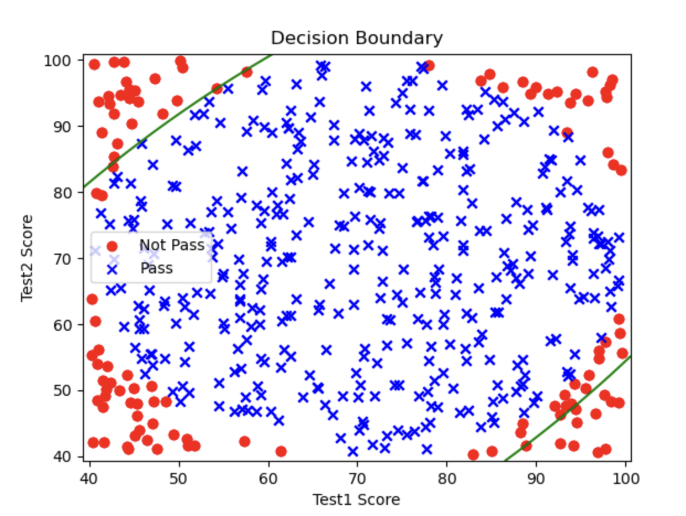

# 1.10. 逻辑回归实战(高阶)

## 1.10.1. 一些准备工作
这篇文章我们会在 [1.9. 逻辑回归实战(进阶)](../1.9/1.9._逻辑回归实战(进阶)_建立二阶边界模型.md) 的基础上再进一步，讲一下如何找（类）圆形的决策边界。

圆形的回归边界大部分时候都会是二阶的，但有的时候数据很复杂，就会需要更多阶，本文涉及的就是这部分。

接下来，请你确保你的Python环境中有`pandas`、`matplotlib`、`scikit-learn`和`numpy`这几个包，如果没有，请在终端输入指令以下载和安装：
```bash
pip install pandas matplotlib scikit-learn numpy
```

我把`.csv`数据文件放在[GitCode](https://gitcode.com/weixin_71793197/machine_learning_guide/blob/main/1.10/Chip_Test_Data.csv?init=initTree)上了，点击链接即可下载。

训练数据有3栏：`test1`、`test2`和`pass_or_not`。`test1`和`test2`里填写的是芯片在两次不同的测试中的数值，`pass_or_not`代表最终芯片是否合格，合格是1，不合格是0。我们的目标就是训练逻辑回归模型去找到`pass_or_not`的决策边界。

下载好后把它移到你的Python项目文件夹里即可。

## 1.10.2. 写二阶决策边界的代码

其实这一部分与上一篇文章 [1.9. 逻辑回归实战(进阶)](../1.9/1.9._逻辑回归实战(进阶)_建立二阶边界模型.md) 的步骤一样，所以这里我就速讲一遍。
### Step 1: 读取数据
```python
# 读取数据  
import pandas as pd  
data = pd.read_csv('Chip_Test_Data.csv')  
  
print(data.head())
```

输出：
```
       test1      test2  pass_or_not
0  62.472407  81.889703            1
1  97.042858  72.165782            1
2  83.919637  58.571657            1
3  75.919509  88.827701            1
4  49.361118  81.083870            1
```

然后我们还可以使用`matplotlib`对数据进行可视化：
```python
# 读取数据  
import pandas as pd  
data = pd.read_csv('Chip_Test_Data.csv')  
  
# 可视化  
import matplotlib.pyplot as plt  
  
x1 = data.loc[:, 'test1'].to_numpy()  
x2 = data.loc[:, 'test2'].to_numpy()  
y = data.loc[:, 'pass_or_not'].to_numpy()  
  
class0 = (y == 0)  
class1 = (y == 1)  
  
plt.scatter(x1[class0], x2[class0], c='r', marker='o')  
plt.scatter(x1[class1], x2[class1], c='b', marker='x')  
plt.xlabel('test1')  
plt.ylabel('test2')  
plt.show()
```

输出图片：


### Step 2: 给`x`和`y`赋值
我们要首先明确`x`和`y`代表什么：
- `y`是`pass_or_not`这一栏的数据

`x`有些特别，由于我们建立的是二阶模型，所以方程的项跟原来比更复杂：
$$
\theta_0 + \theta_1 X_1 + \theta_2 X_2 + \theta_3 X_1^2 + \theta_4 X_2^2 + \theta_5 X_1 X_2 = 0
$$
有`x_1`^2、`x_2`^2、`X_1 * x_2`这些项。所以我们得把这些项打包在字典里，再转为模型能使用的`DataFrame`格式给它使用。

```python
# 给x和y赋值  
y = data.loc[:, 'pass_or_not']  
x1 = data.loc[:, 'test1']  
x2 = data.loc[:, 'test2']  
x = {  
    'x1': x1,  
    'x2': x2,  
    'x1^2': x1 ** 2,  
    'x2^2': x2 ** 2,  
    'x1*x2': x1 * x2,  
}  
  
x = pd.DataFrame(x)  
print(x.head())
```

输出：
```
          x1         x2         x1^2         x2^2        x1*x2
0  62.472407  81.889703  3902.801653  6705.923431  5115.846856
1  97.042858  72.165782  9417.316363  5207.900089  7003.173761
2  83.919637  58.571657  7042.505392  3430.639001  4915.312163
3  75.919509  88.827701  5763.771855  7890.360497  6743.755464
4  49.361118  81.083870  2436.520012  6574.594031  4002.390527
```

我们也可以使用上一篇文章 [1.9. 逻辑回归实战(进阶)](../1.9/1.9._逻辑回归实战(进阶)_建立二阶边界模型.md) 说过的简单的方法来生成这个字典：
```python
from sklearn.preprocessing import PolynomialFeatures
poly = PolynomialFeatures(degree=2, include_bias=False)
x = data.drop(['pass_or_not'], axis=1)
x = poly.fit_transform(x)
```

### Step 3: 训练模型
```python
# 训练模型  
from sklearn.linear_model import LogisticRegression  
model = LogisticRegression()  
model.fit(x, y)
```

### Step 4: 获取决策边界
```python
# 获取决策边界  
theta1, theta2, theta3, theta4, theta5 = model.coef_[0]  
theta0 = model.intercept_[0]

print(f'Decision Boundary: {theta0} + {theta1}x1 + {theta2}x2 + {theta3}x1^2 + {theta4}x2^2 + {theta5}x1*x2')
```

这里面的每个变量都对应着方程中的参数：
$$
\theta_0 + \theta_1 X_1 + \theta_2 X_2 + \theta_3 X_1^2 + \theta_4 X_2^2 + \theta_5 X_1 X_2 = 0
$$

输出：
```
Decision Boundary: -1.55643301596937 + 0.0687019597360078x1 + 0.04589152052058807x2 + -0.001380801702595371x1^2 + -0.0012980632178920715x2^2 + 0.0018080315329989266x1*x2
```

### Step 5: 获取预测值与计算准确率
```python
# 获取预测值与计算准确率  
prediction = model.predict(x)  
from sklearn.metrics import accuracy_score  
print(f"accuracy: {accuracy_score(y, prediction)}")
```

输出：
```
accuracy: 0.842
```

### Step 6: 可视化决策边界
```python
# 可视化  
import matplotlib.pyplot as plt  
import numpy as np  
  
x1 = x1.to_numpy()  
x2 = x2.to_numpy()  
y = y.to_numpy()  
  
class0 = (y == 0)  
class1 = (y == 1)  
  
plt.scatter(x1[class0], x2[class0], c='r', marker='o')  
plt.scatter(x1[class1], x2[class1], c='b', marker='x')  
plt.xlabel('exam1')  
plt.ylabel('exam2')  
  
# 可视化二阶决策边界  
  
# 定义exam1和exam2的范围，为了画网格  
x1_min, x1_max = x1.min() - 1, x1.max() + 1  
x2_min, x2_max = x2.min() - 1, x2.max() + 1  
  
# 生成网格数据  
xx1, xx2 = np.meshgrid(np.linspace(x1_min, x1_max, 500),  
                       np.linspace(x2_min, x2_max, 500))  
  
# 计算每个点的决策边界值  
z = (theta0 +  
     theta1 * xx1 +  
     theta2 * xx2 +  
     theta3 * xx1 ** 2 +  
     theta4 * xx2 ** 2 +  
     theta5 * xx1 * xx2)  
  
# 绘制样本点  
plt.scatter(x1[class0], x2[class0], c='r', label='Not Pass', marker='o')  
plt.scatter(x1[class1], x2[class1], c='b', label='Pass', marker='x')  
  
# 绘制决策边界  
plt.contour(xx1, xx2, z, levels=[0], colors='g')  
  
# 添加标签和图例  
plt.xlabel('Test1 Score')  
plt.ylabel('Test2 Score')  
plt.legend()  
plt.title('Decision Boundary')  
plt.show()
```

输出图片：



你会发现这个图只画了左上和右下的两条线，而左下和右上应该有决策边界的地方却没有。这就是阶数太少导致的拟合不到位，如果我们继续增阶，就会拟合的更好。

## 1.10.3. 三阶的决策边界
其实写三阶决策边界的代码与写二阶的思路基本一致，就是在给`x`赋成字典然后转为`DataFrame`这一块多添加几个字段以符合更高阶的特征：
```python
# 给 x 和 y 赋值  
y = data.loc[:, 'pass_or_not']  
x1 = data.loc[:, 'test1']  
x2 = data.loc[:, 'test2']  
  
# 手动创建高阶特征字典  
x = {  
    'x1': x1,  
    'x2': x2,  
    'x1^2': x1 ** 2,  
    'x2^2': x2 ** 2,  
    'x1*x2': x1 * x2,  
    'x1^3': x1 ** 3,  
    'x2^3': x2 ** 3,  
    'x1^2*x2': (x1 ** 2) * x2,  
    'x1*x2^2': x1 * (x2 ** 2),  
}  
  
# 将特征字典转换为 DataFrame
x = pd.DataFrame(x)
```

这样字典里的每个字段都能对应到3阶`g(x)`的每一项：
$$
g(x) = \theta_0 + \theta_1 X_1 + \theta_2 X_2 + \theta_3 X_1^2 + \theta_4 X_2^2 + \theta_5 X_1 X_2 + \theta_6 X_1^3 + \theta_7 X_2^3 + \theta_8 X_1^2 X_2 + \theta_9 X_1 X_2^2 = 0
$$

也可以使用`PolynomialFeatures`创建字典：
```python
from sklearn.preprocessing import PolynomialFeatures
poly = PolynomialFeatures(degree=3, include_bias=False)
x = data.drop(['pass_or_not'], axis=1)
x = poly.fit_transform(x)
```

其余的部分基本不变，我把三阶的完整代码贴出来：
```python
# 导入必要模块  
import numpy as np  
import pandas as pd  
import matplotlib.pyplot as plt  
from sklearn.linear_model import LogisticRegression  
from sklearn.metrics import accuracy_score  
  
# 第1部分：读取数据  
file_path = "Chip_Test_Data.csv"  
data = pd.read_csv(file_path)  
  
# 给 x 和 y 赋值  
y = data.loc[:, 'pass_or_not']  
x1 = data.loc[:, 'test1']  
x2 = data.loc[:, 'test2']  
  
# 手动创建高阶特征字典  
x = {  
    'x1': x1,  
    'x2': x2,  
    'x1^2': x1 ** 2,  
    'x2^2': x2 ** 2,  
    'x1*x2': x1 * x2,  
    'x1^3': x1 ** 3,  
    'x2^3': x2 ** 3,  
    'x1^2*x2': (x1 ** 2) * x2,  
    'x1*x2^2': x1 * (x2 ** 2),  
}  
  
# 将特征字典转换为 DataFrame
x = pd.DataFrame(x)  
  
# 第3部分：训练逻辑回归模型  
model = LogisticRegression(max_iter=10000)  
model.fit(x, y)  
  
# 获取模型的系数与截距  
theta = model.coef_[0]  
theta0 = model.intercept_[0]  
  
# 获取预测值并计算准确率  
prediction = model.predict(x)  
accuracy = accuracy_score(y, prediction)  
print(f"Accuracy: {accuracy}")  
  
# 第4部分：生成网格，计算决策边界  
# 定义 x1 和 x2 的范围，用于绘制网格决策边界  
x1_min, x1_max = x1.min() - 1, x1.max() + 1  
x2_min, x2_max = x2.min() - 1, x2.max() + 1  
  
# 生成网格数据  
xx1, xx2 = np.meshgrid(np.linspace(x1_min, x1_max, 500),  
                       np.linspace(x2_min, x2_max, 500))  
  
# 使用生成网格计算多项式特征  
grid_x = {  
    'x1': xx1.ravel(),  
    'x2': xx2.ravel(),  
    'x1^2': xx1.ravel() ** 2,  
    'x2^2': xx2.ravel() ** 2,  
    'x1*x2': xx1.ravel() * xx2.ravel(),  
    'x1^3': xx1.ravel() ** 3,  
    'x2^3': xx2.ravel() ** 3,  
    'x1^2*x2': (xx1.ravel() ** 2) * xx2.ravel(),  
    'x1*x2^2': xx1.ravel() * (xx2.ravel() ** 2),  
}  
  
grid_x = pd.DataFrame(grid_x)  
  
# 计算每个网格点的预测值  
z = model.predict(grid_x)  
z = z.reshape(xx1.shape)  
  
# 第5部分：可视化  
# 绘制样本点  
class0 = (y == 0)  
class1 = (y == 1)  
  
plt.figure(figsize=(8, 6))  
  
# 绘制 Not Pass 和 Pass 样本点  
plt.scatter(x1[class0], x2[class0], c='r', label='Not Pass', marker='o')  
plt.scatter(x1[class1], x2[class1], c='b', label='Pass', marker='x')  
  
# 绘制决策边界  
plt.contour(xx1, xx2, z, levels=[0.5], colors='g')  
  
# 添加标签和标题  
plt.xlabel('Test 1 Score')  
plt.ylabel('Test 2 Score')  
plt.legend()  
plt.title('Polynomial Logistic Regression (Degree=3)')  
plt.show()
```

输出：
```
Accuracy: 1.0
```

图片输出：


这已经是一个完美的决策边界了！准确率百分百！
