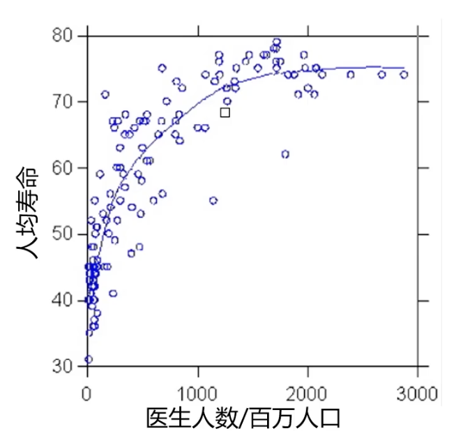
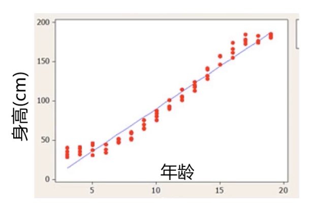
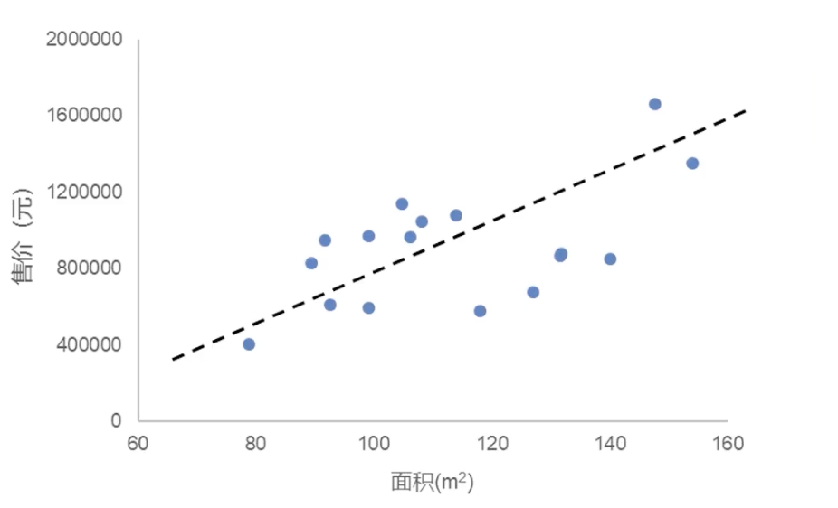
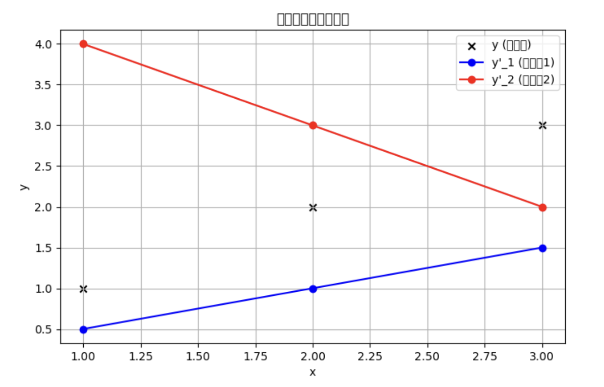

# 1.2. 线性回归理论

## 1.2.1. 什么是回归分析(Regressive Analysis)?

### 一些例子
举一些例子吧：

下图是一个每百万人医生数和人均寿命的关系图，其中散点是我们收集到的数据，而拟合出的曲线是我们需要找出的：



下图是一个年龄与身高的关系图，其中散点是收集到的数据，我们的目标是找到一条拟合曲线：



### 定义
相信看过上文两个例子之后你对回归分析又了一定的认识，这里我直接给出回归分析的定义：

*根据数据，确定两种或两种以上变量间相互依赖的定量关系。*

其函数表达式为: y = f(x_1, x_2 , ..., x_n)

### 回归分析的分类
回归分析有很多种。

如果我们以变量数来分类，有：
- 一元回归：y = f(x)
- 多元回归：y = f(x_1, x_2 , ..., x_n)

如果我们以函数关系来分类，有：
- 线性回归：y = ax + b
- 非线性回归：y = ax^2 + bx + c

## 1.2.2. 线性回归
线性回归指的是**回归分析中，变量与因变量间存在线性关系**。其函数表达式为：y = ax + b

### 回归问题求解
问题：面积为110平方米的房子售价150万是否值得投资？

| 面积(A) | 售价(P)     |
| ----- | --------- |
| 79    | 404,976   |
| 92    | 948,367   |
| ...   | ...       |
| 108   | 1,049,007 |
| 110   | ???       |
| 118   | 578,142   |
| ...   | ...       |

我们要回答这个问题一般来说要分成以下几步去完成：
- 确定`P`、`A`之间的关系：P = f(A)
- 根据关系预测合理价格：P(A = 110) = f(110)
- 做出判断

这3步中最核心的问题就是第一步——找关系。

下图是根据表格数据整理出的散点图：



我们的目标就是要找到这条黑色的拟合曲线的对应的函数式是怎么写的。

这里我们假设这条拟合曲线是线性函数，也就是y = ax + b，所以我们真正的目标其实就是找到合理的参数a和b的值。

## 1.2.3. 最小化平方误差和公式
把问题进行以下转换：假设x为变量，y为对应的结果，y'(也就是ax + b)为模型输出的结果。这时候我们的目标就是让y'尽可能地接近y，也就是最小化 平方误差和（Sum of Squared Errors, SSE）：
$$
\textit{minimize} \left\{ \sum_{i=1}^{m} (y'_i - y_i)^2 \right\}
$$
- `m`：数据样本的数量。
- `y_i`：第i个样本的真实值（ground truth）。
- `y‘_i`：第i个样本的预测值（由模型计算得到）。
- `(y'_i - y_i)^2`：每个样本的**误差平方**，表示预测值与真实值之间的偏差。
- `i = 1`：i是数据点的索引，i = 1是指索引的起始值为1

我们还需要对这个公式进行一个变换：
$$
\textit{minimize} \left\{ \frac{1}{2m} \sum_{i=1}^{m} (y'_i - y_i)^2 \right\}
$$

该公式多了一个1/2m，主要是为了在**梯度下降**时更方便求导：
$$
\frac{d}{d\theta} \frac{1}{2m} \sum_{i=1}^{m} (y{\prime}_i - y_i)^2
$$
导数中的2会被消去，使更新公式更简洁。由于m是一个常数，所以这个变换并不会影响最后得出的a和b的值。

*一点名词解释*：
- 梯度下降是一种**优化算法**，用于最小化函数（如机器学习模型的损失函数）。在机器学习和深度学习中，梯度下降用于优化模型参数，使损失函数的值最小化。
- 求导就是计算函数的斜率，描述一个变量如何随另一个变量的变化而变化。

---
### 一个小例子
我们来看一个小例子吧：



- **黑色散点**：代表真实值`y` 
- **蓝色折线**：代表预测值`y'_1`
- **红色折线**：代表预测值`y'_2`
可以清楚地看到， `y'_1`和`y'_2`的趋势与`y`的分布情况。 `y'_1` 接近真实值，而`y'_2`变化趋势相反。

以下是数据的表格统计：

| x  | y  | y'_1 | y'_2 |
|----|----|------|------|
| 1  | 1  | 0.5  | 4    |
| 2  | 2  | 1    | 3    |
| 3  | 3  | 1.5  | 2    |
接下来我们就用上文讲过的SSE公式的变形来算误差：
$$
J_1 = \frac{1}{2m} \sum_{i=1}^{m} (y'_1 - y)^2 = \frac{1}{2 \times 3} \times \left( (0.5 - 1)^2 + (1 - 2)^2 + (1.5 - 3)^2 \right) = 0.583
$$
$$
J_2 = \frac{1}{2m} \sum_{i=1}^{m} (y'_2 - y)^2 = \frac{1}{2 \times 3} \times \left( (4 - 1)^2 + (3 - 2)^2 + (2 - 3)^2 \right) = 1.83
$$
可以看到，跟图中所展现的关系一样，`J_1`明显小于`J_2`，代表`y'_1`的误差明显小于`y'_2`。

---

一点题外话：上面的折线图是用`matplotlib`生成的哦，你也可以试着使用表格中的数据用Python写出一样的效果。我在下面提供了Python源码，写完之后你可以对照一下：
```python
import matplotlib.pyplot as plt

# 数据
x = [1, 2, 3]
y = [1, 2, 3]        # 真实值
y1_pred = [0.5, 1, 1.5]  # 预测值1
y2_pred = [4, 3, 2]  # 预测值2

# 创建图表
plt.figure(figsize=(8, 5))

# 绘制真实值的散点图
plt.scatter(x, y, color='black', marker='x', label="y (真实值)")

# 绘制 y'_1 折线图
plt.plot(x, y1_pred, marker='o', linestyle='-', color='blue', label="y'_1 (预测值1)")

# 绘制 y'_2 折线图
plt.plot(x, y2_pred, marker='o', linestyle='-', color='red', label="y'_2 (预测值2)")

# 标注
plt.xlabel("x")
plt.ylabel("y")
plt.title("真实值与预测值对比")
plt.legend()
plt.grid(True)

# 显示图表
plt.show()
```

---
## 1.2.4. 梯度下降法
OK，让我们回到正题。我们真正要求的是y  = ax + b中a和b的值，所以我们还得变换一下SSE公式，让函数的参数变为a和b。其实这一步变化也很简单，就是把原函数中的`y'_i`替换成`ax_i + b`即可：
$$
J = \frac{1}{2m} \sum_{i=1}^{m} (y'_i - y_i)^2 = \frac{1}{2m} \sum_{i=1}^{m} (a x_i + b - y_i)^2 = g(a, b)
$$


为了让这个损失函数尽可能的小，我们就需要**梯度下降法**：
- 它是寻找极小值的一种方法。通过向函数上当前点对应梯度（或者是近似梯度）的反方向的规定步长距离点进行迭代搜索，直到在极小点收敛。
- “收敛”指的是趋向于某个极限值（比如一个函数的最大值/最小值）

假设：
$$
J = f(p)
$$
那么对于`p`使用梯度下降法的公式就是：
$$
p_{i+1} = p_i - \alpha \frac{\partial}{\partial p_i} f(p_i)
$$
- `p_i+1`**是更新后的参数值**，由当前值`p_i`进行调整
- `α`（学习率）：控制每次更新的步长
- `α`后面跟的那一串是函数`f(p)` 在当前点`p_i`处的梯度（偏导数），表示`f(p)`在该点变化的方向和大小。

我们以亲民的方式讲解一下梯度，你可以把**梯度（Gradient）** 想象成**坡的陡峭程度和方向**：
- 如果坡很陡（梯度大），你往下走就会很快。
- 如果坡很平缓（梯度小），你往下走就会慢一点。
- 如果到了山谷（梯度接近 0），说明你已经走到了最低点（最优解）。

数学上的梯度，其实就是告诉你：
- **“你现在所处的位置，往哪个方向下降最快？而且下降的速度是多少？”**

我们再用这个例子解释一下梯度下降法的步骤：
- 你站在山上，不知道最低点在哪（开始训练）
- 你用脚感受坡的方向（计算梯度）
- 你沿着坡最陡的下坡方向走一步（更新参数）
- 你重复这个过程，每次都调整方向（不断优化）
- 走到坡度几乎没有变化的地方（梯度接近 0），你就到达了山谷（找到最优解）

举个例子我们来一步步算，假设我们有一个**简单的函数**：
$$
J(a) = (a - 3)^2
$$

只要是有中学学历都能一眼看出来最小值在3，但我们就假装不知道，用梯度下降法一步步算：
#### 1. 计算梯度
梯度就是函数的**导数**，我们先求出`J(a)`对`a`的导数：
$$
\frac{dJ}{da} = 2(a - 3)
$$
这个梯度告诉我们：当前的`a`离3还有多远，以及它应该往哪个方向调整。

#### 2. 设定初始值
我们**随便选个起点**，比如`a = 0`，然后逐步优化它。

#### 3. 更新`a`
梯度下降的更新公式是：
$$
a := a - \alpha \cdot \frac{dJ}{da}
$$
- `α`是**学习率**，我们设`α = 0.1`（步子大小）

刚才我们设了`a = 0`，所以这时候梯度是：
$$
\frac{dJ}{da} = 2(0 - 3) = -6
$$
代入更新公式：
$$
a := 0 - 0.1 \times (-6)
$$
$$
a = 0 + 0.6 = 0.6
$$
更新后，`a`从0变成了0.6，朝着正确的方向移动了！

#### 4. 不断重复
我们一直不断重复这个步骤：

| 迭代次数 | a 当前值  | 计算梯度    | 更新后的 a  |
| ---- | ------ | ------- | ------- |
| 1    | 0.0    | -6      | 0.6     |
| 2    | 0.6    | -4.8    | 1.08    |
| 3    | 1.08   | -3.84   | 1.464   |
| 4    | 1.464  | -3.072  | 1.7712  |
| 5    | 1.7712 | -2.4576 | 2.01696 |
可以看到， `a`一步步向3逼近！如果继续迭代，最终会非常接近`a = 3`。

这个方法以后我们在讲回归逻辑和神经网络时还会遇到的，所以大家务必铭记。

---

## 1.2.5. 对`a`和`b`使用梯度下降法
回到我们之前变换过后，参数是`a`和`b`的SSE函数：
$$
J = \frac{1}{2m} \sum_{i=1}^{m} (y'_i - y_i)^2 = \frac{1}{2m} \sum_{i=1}^{m} (a x_i + b - y_i)^2 = g(a, b)
$$

对`a`和`b`使用梯度下降法非常简单且暴力：
$$
\begin{cases}

temp_a = a - \alpha \frac{\partial}{\partial a} g(a,b) = a - \alpha \frac{1}{m} \sum\limits_{i=1}^{m} (a x_i + b - y_i)x_i \\

temp_b = b - \alpha \frac{\partial}{\partial b} g(a,b) = b - \alpha \frac{1}{m} \sum\limits_{i=1}^{m} (a x_i + b - y_i)

\end{cases}
$$
`temp_a`和`temp_b`是临时的变量。经过一次计算后，我们对`a`和`b`进行一次更新，把`temp_a`和`temp_b`分别赋给它们：
$$
a = temp_a
$$
$$
b = temp_b
$$
然后再进行一次计算，一次更新，就这样一直重复直到函数收敛。

这里我们展示的是一元的线性回归，其实多元线性回归也是一样的思路，使用梯度下降法。只不过参数会不止`a`和`b`，还有`c`、`d`、`e`等等。
