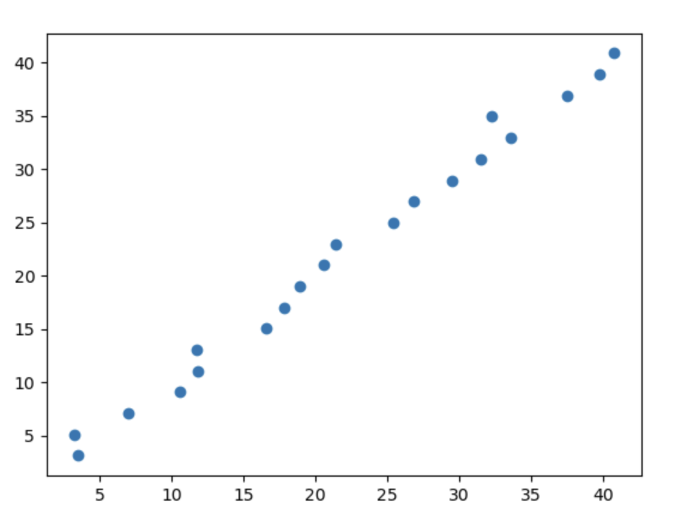

# 1.4. 评估线性回归模型模型表现

后面会有专门的一篇文章来介绍如何评估模型的表现。这里为了让大家对上一篇文章 [1.3. 线性回归实战(基础)](../1.3/1.3._线性回归实战(基础)_单因子线性回归模型.md) 所创建的线性回归模型有一个基本的了解，先讲一些适用于线性回归模型评估的方法。

## 1.4.1. `y`与`y'`的均方误差(MSE)
### 数学公式
均方误差(Mean Square Error)公式如下：
$$
MSE = \frac{1}{m} \sum_{i=1}^{m} (y'_i - y_i)^2
$$

MSE和我们之前讲过的损失函数（平方误差和公式Sum of Square Error）非常像：
$$
{ SSE = \sum_{i=1}^{m} (y'_i - y_i)^2 }
$$

两者的区别在于：
- SSE是所有预测值和真实值之间的**平方误差的总和**，不进行归一化处理。主要用于衡量整体误差的绝对大小，适用于模型拟合质量的评估。

- MSE 是SSE除以样本数量m，即SSE的均值。它表示平均每个数据点的平方误差，能够提供误差的标准化度量，适用于模型优化和比较。

***MSE越小越好，等于0时就是完美的拟合***

### 代码实现
接下来我们来敲代码，数据和之前的代码都与上一篇文章 [1.3. 线性回归实战(基础)](../1.3/1.3._线性回归实战(基础)_单因子线性回归模型.md) 保持一致，这里我还是再敲一边：

data.csv:
```
x,y  
0,3.4941499975136017  
1,3.2195777812087623  
2,7.020239126724705  
3,10.561179685791949  
4,11.829186585662265  
5,11.75496874167899  
6,16.58341895848982  
7,17.851195579820043  
8,18.938095976526668  
9,20.573327586269645  
10,21.402583214283524  
11,25.383074825333473  
12,26.80228829909171  
13,29.477295234061874  
14,31.491963327709488  
15,33.52264335242398  
16,32.243263034545826  
17,37.49084903752127  
18,39.72984009710374  
19,40.75882117159081
```

main.py:
```python
import pandas as pd  
import matplotlib.pyplot as plt  
from sklearn.linear_model import LinearRegression  
  
# 读取数据  
data = pd.read_csv('data.csv')  
x = data.loc[:, ['x']]  
y = data.loc[:, ['y']]  
  
# 训练线性回归模型  
Ir_model = LinearRegression()  
Ir_model.fit(x, y)  
  
# 获取回归系数和截距  
a = Ir_model.coef_[0][0]  # 提取数值  
b = Ir_model.intercept_[0]  # 提取数值  
print('a = ', a)  
print('b = ', b)  
  
# 预测  
predictions = Ir_model.predict(x)  
print(predictions)  
  
# 绘制散点图  
plt.scatter(x, y, color='blue', label='数据点')  
  
# 绘制回归直线  
x_line = x.sort_values(by='x')  # 确保 x 排序  
y_line = a * x_line + b  # 根据模型计算 
plt.plot(x_line, y_line, color='red', label=f'回归线: y = {a:.2f}x + {b:.2f}')  
plt.show()
```

为了计算MSE值，我们需要在上一篇文章 [1.3. 线性回归实战(基础)](../1.3/1.3._线性回归实战(基础)_单因子线性回归模型.md) 的代码上增加这个部分：
```python
from sklearn.metrics import mean_squared_error

# ...中间省略

mse = mean_squared_error(y.to_numpy(), predictions)  
print(f'MSE: {mse:.2f}')
```
- `mean_squared_error`函数可以计算MSE值，只需要传入参数`y`和`y'`即可
- `y`得先使用`to_numpy`方法，因为`mean_squared_error`函数接受的参数是`numpy`的`ndarray`类型而不是`pandas`的`DataFrame`类型

输出：
```
MSE: 1.16
```

## 1.4.2. R方值
### 数学公式
R方值的计算公式为：
$$
R^2 = 1 - \frac{SSE}{SST}
$$
其中SSE的公式就在上文，这里不做详细阐述；SST就是方差少了个1/m，也就是没有归一化处理的方差：
$$
SST = \sum_{i=1}^{m} (y_i - \bar{y})^2
$$
把SSE和SST展开写到R方值公式中就是：
$$
R^2 = 1 - \frac{\sum_{i=1}^{m} (y'_i - y_i)^2}{\sum_{i=1}^{m} (y_i - \bar{y})^2}
$$

***R方值越接近1就代表效果越好，等于1时就是完美的拟合。***

### 代码实现
为了计算R方值，我们需要在上一篇文章 [1.3. 线性回归实战(基础)](../1.3/1.3._线性回归实战(基础)_单因子线性回归模型.md) 的代码上增加这个部分：
```python
from sklearn.metrics import r2_score

# ...中间省略

# R方值计算  
r_square = r2_score(y.to_numpy(), predictions)  
print(f'R^2: {r_square:.2f}')
```
- `r2_score`函数可以计算R方值，参数是`y`和`y'`
- 由于这个函数也只能接受`numpy`的`ndarray`类型，所以也得先使用`to_numpy`函数

输出：
```
R^2: 0.99
```

## 1.4.3. 可视化
我们也可以通过画图来可视化模型的表现：
```python
# ...前文已省略

# 画散点图  
plt.scatter(y, predictions)  
plt.show()
```

这么写输出的x轴就代表真实值`y`，而y轴代表拟合出的直线预测出的值。

输出的图片：



像这样沿对角线的散点分布就代表非常好的效果，越接近`y = x`这条直线分布就代表效果越好。
