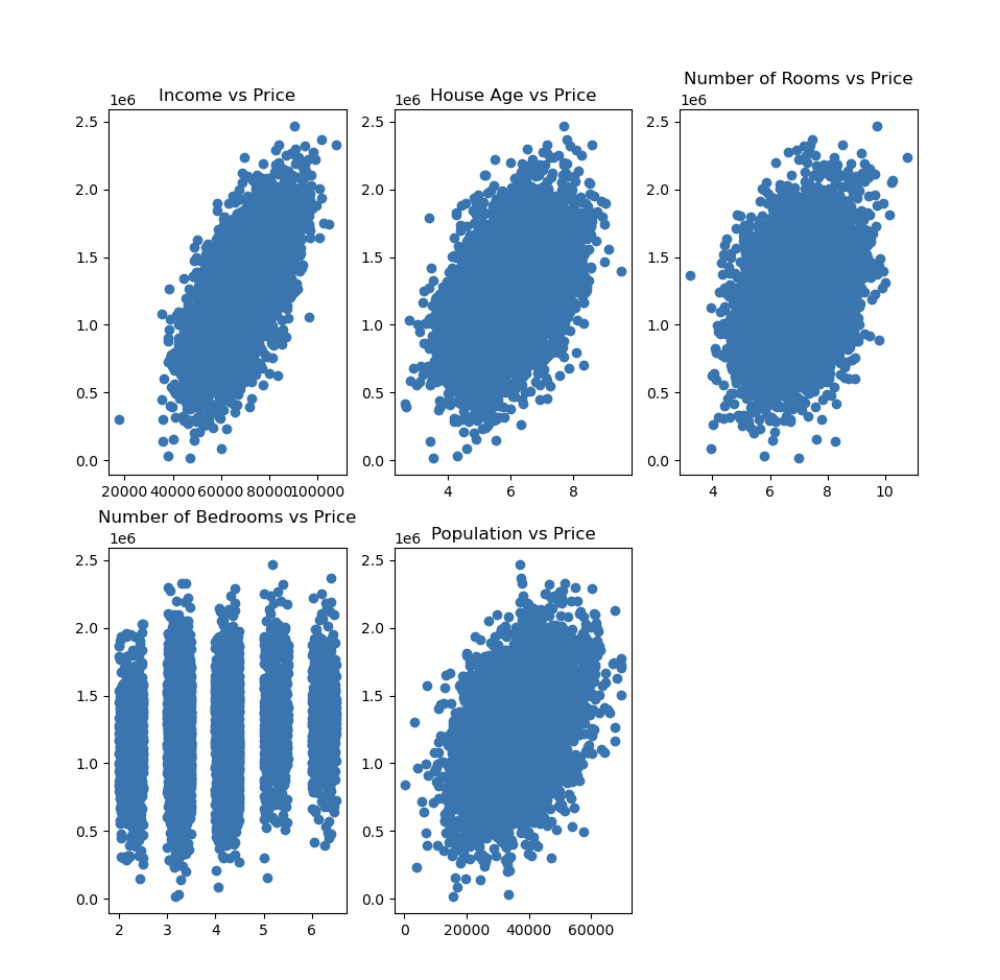
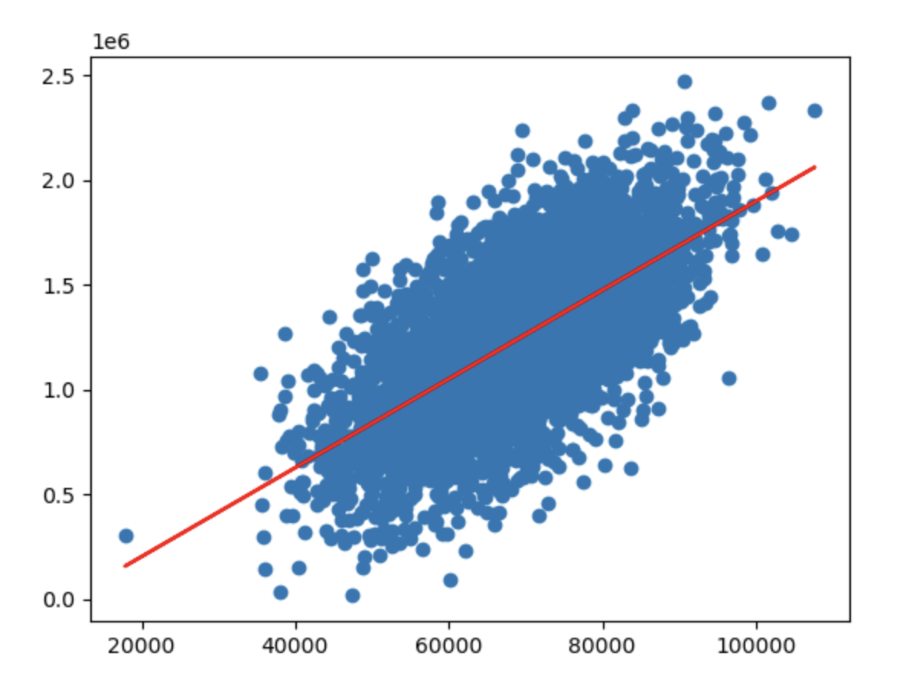
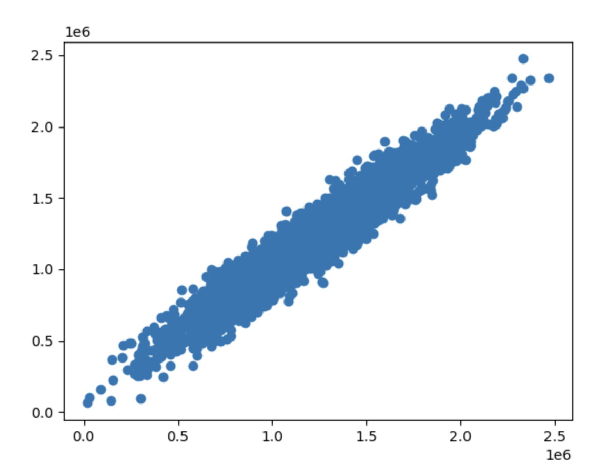

# 1.5. 线性回归实战(进阶)

## 1.5.1. 一些准备工作
在 [1.3. 线性回归实战(基础)](../1.3/1.3._线性回归实战(基础)_单因子线性回归模型.md) 中我们使用了一些小数据对线性回归的代码做了讲解。

在进阶篇中我们会使用特别复杂且巨大的数据。这里需要感谢GitHub用户[Brendan Barsness](https://github.com/bcbarsness)，我们会使用他上传的开源数据——[美国房价统计表`USA_Housing.csv`](https://github.com/bcbarsness/machine-learning/blob/master/USA_Housing.csv)。

对于登不了GitHub的同学，我会把数据上传到[GitCode](https://gitcode.com/weixin_71793197/machine_learning_guide/blob/main/1.5/USA_Housing.csv)，点击链接即可查看和下载。

下载好后，请把文件拖至你的Python项目文件夹中。

接下来，请你确保你的Python环境中有`pandas`、`matplotlib`、`scikit-learn`和`numpy`这几个包，如果没有，请在终端输入指令以下载和安装：
```bash
pip install pandas matplotlib scikit-learn numpy
```

## 1.5.2. 任务目标
- 以`Avg. Area Income`为输入变量，建立单因子模型，评估模型表现，可视化线性回归预测结果
- 以`Avg. Area Income`、`Avg. Area House Age`、`Avg. Area Number of Rooms`、`Avg. Area Number of Bedrooms`、`Area Population`为输入变量，建立多因子模型，评估模型表现
- 预测`Income`为65000，`House Age`为5、`Number of Rooms`为5、`Number of Bedrooms`为3、`Population`为30000的合理房价

## 1.5.3. 加载数据、数据的可视化、数据的定性分析
由于加载数据在每个任务的代码中都是必须的，所以我就先把它写在这里。

通过`pandas`库的函数来加载数据：
```python
# 读取数据  
import pandas as pd  
data = pd.read_csv("USA_Housing.csv")
```

我们还可以写点代码来预览数据：
```python
# 预览数据  
print(type(data),data.shape)  
print(data.head())
```
- `type(data)`获取数据的类型
- `data.shape`获取数据有几行几列
- `data.head`获取数据的前5行

输出：
```
<class 'pandas.core.frame.DataFrame'> (5000, 7)
   Avg. Area Income  ...                                            Address
0      79545.458574  ...  208 Michael Ferry Apt. 674\nLaurabury, NE 3701...
1      79248.642455  ...  188 Johnson Views Suite 079\nLake Kathleen, CA...
2      61287.067179  ...  9127 Elizabeth Stravenue\nDanieltown, WI 06482...
3      63345.240046  ...                          USS Barnett\nFPO AP 44820
4      59982.197226  ...                         USNS Raymond\nFPO AE 09386

[5 rows x 7 columns]
```
- 数据的类型是`DataFrame`
- 数据有5000行7列

我们还可以用`matplotlib`来可视化数据：
```python
# 可视化原始数据  
import matplotlib.pyplot as plt  
fig = plt.figure(figsize=(10, 10))  
  
# 图1  
fig1 = plt.subplot(2, 3, 1)  
plt.scatter(data.loc[:,'Avg. Area Income'], data.loc[:,'Price'])  
plt.title('Income vs Price')  
  
# 图2  
fig2 = plt.subplot(2, 3, 2)  
plt.scatter(data.loc[:,'Avg. Area House Age'], data.loc[:,'Price'])  
plt.title('House Age vs Price')  
  
# 图3  
fig3 = plt.subplot(2, 3, 3)  
plt.scatter(data.loc[:,'Avg. Area Number of Rooms'], data.loc[:,'Price'])  
plt.title('Number of Rooms vs Price')  
  
# 图4  
fig4 = plt.subplot(2, 3, 4)  
plt.scatter(data.loc[:,'Avg. Area Number of Bedrooms'], data.loc[:,'Price'])  
plt.title('Number of Bedrooms vs Price')  
  
# 图5  
fig5 = plt.subplot(2, 3, 5)  
plt.scatter(data.loc[:,'Area Population'], data.loc[:,'Price'])  
plt.title('Population vs Price')  
  
plt.show()
```
- 注意：`plt.scatter`函数的第一个参数是x轴数据，第二个参数是y轴数据

输出图片：



通过这个图，我们可以进行定性的分析（定量得还得写代码）：
- 房价与收入呈现**正相关关系**，收入越高，房价通常越高
- 房龄与房价有一定的**正相关性**，但相关性较弱，较新的房子房价更集中在较高区间。
- 房间数量与房价存在一定**正相关关系**，但数据较为分散，说明房价受其他因素影响较大。
- 卧室数量与房价的关系较为**离散**，表明卧室数量**对房价的影响较小**，可能受房屋面积或地段影响更大
- 人口数量与房价有一定**相关性**，但数据呈现较大的分布范围，说明房价可能受人口密度影响，但不是唯一因素

## 1.5.4. 单因子模型
任务目标：以`Avg. Area Income`为输入变量，建立单因子模型，评估模型表现，可视化线性回归预测结果

### Step 1: 给`x`和`y`赋值
既然以`Avg. Area Income`为输入变量，那么`x`肯定就是`Avg. Area Income`，`y`肯定是`Price`。

接着上面的读取代码部分来写：
```python
# 给x和y赋值  
x = data.loc[:, "Avg. Area Income"]  
y = data.loc[:, "Price"]  

# 顺带输出一下x和y的前几个值来检查代码写对没有  
print(x.head())  
print(y.head())
```

输出：
```
0    79545.458574
1    79248.642455
2    61287.067179
3    63345.240046
4    59982.197226
Name: Avg. Area Income, dtype: float64
0    1.059034e+06
1    1.505891e+06
2    1.058988e+06
3    1.260617e+06
4    6.309435e+05
Name: Price, dtype: float64
```
没有任何问题。

### Step 2: 训练模型
接下来我们导入`scikit-learn`中的线性回归模型，并用`x`和`y`进行训练：
```python
# 导入线性回归模型  
from sklearn.linear_model import LinearRegression  
LR = LinearRegression()  
  
# 给x转化一下维度  
import numpy as np  
x = np.array(x).reshape(-1, 1)  
  
# 训练模型  
LR.fit(x, y)
```
- 转化维度是为了将`x`转换成二维数组，因为`scikit-learn`的`fit`方法要求`x`必须是**二维数组** (`n_samples`, `n_features`)
- `.reshape(-1, 1)`：-1让NumPy自动计算行数（即数据的样本数 `n_samples`）。1表示`x`只有一个特征（即`n_features=1`）

### Step 3: 计算预测值
接下来我们根据训练好的模型来看拟合出的直线在`x`上对应的`y`值是多少，也就是`y_predict`：
```python
# 获得预测值  
y_predict = LR.predict(x)  
print(y_predict)
```

输出：
```
[1464424.9504096  1458133.78934377 1077429.52283635 ... 1122016.75893299
 1219741.59365632 1166948.95599714]
```

### Step 4: 可视化预测结果
使用`matplotlib`画出散点和拟合出的线：
```python
# 可视化  
import matplotlib.pyplot as plt  
plt.scatter(x, y)  
plt.plot(x, y_predict, color="red")  
plt.show()
```

图片输出：



其实你看到，拟合出的线和散点数据的差距还是蛮大的。这就是因为还有其他因素在影响房价，这点我们会在下文的多因子模型中解决。

### Step 5: 评估模型
那么如何定量地评估拟合出的线和散点数据的差距呢？这时候就需要使用 [1.4. 评估线性回归模型模型表现](../1.4/1.4._评估线性回归模型模型表现_均方误差(MSE)、R方值、可视化.md) 中讲过的均方误差(MSE)、R方值两者：
```python
# 评估模型表现  
from sklearn.metrics import r2_score  
from sklearn.metrics import mean_squared_error

print(f"R2 = {r2_score(y, y_predict):.2f}")  
print(f"MSE = {mean_squared_error(y, y_predict):.2f}")
```

输出：
```
R2 = 0.41
MSE = 73645940735.19
```

*注：R方值越接近1就代表效果越好, MSE越小越代表效果越好。*

通过R方值和MSE也确实看得出这个模型的效果不太好。

## 1.5.5. 多因子线性回归模型建立
任务目标：以`Avg. Area Income`、`Avg. Area House Age`、`Avg. Area Number of Rooms`、`Avg. Area Number of Bedrooms`、`Area Population`为输入变量，建立多因子模型，评估模型表现。

### Step 1: 给`x_multi`和`y`赋值
其实多因子的线性回归模型大致上和单因子差不多。在赋值这块`x`就不止一个因子，所以命名为`x_multi`，`y`保持不变，依旧是`Price`：
```python
# 给x_multi和y赋值  
x_multi = data.drop(["Price", "Address"], axis=1)  
y = data.loc[:, "Price"]  
  
print(x_multi.head())  
print(y.head())
```
- `drop`是用于丢弃的方法。`axis = 1`告诉这个函数是丢弃列上指定的字段，`axis = 0`就是丢弃行上指定的字段

输出：
```
   Avg. Area Income  ...  Area Population
0      79545.458574  ...     23086.800503
1      79248.642455  ...     40173.072174
2      61287.067179  ...     36882.159400
3      63345.240046  ...     34310.242831
4      59982.197226  ...     26354.109472

[5 rows x 5 columns]
0    1.059034e+06
1    1.505891e+06
2    1.058988e+06
3    1.260617e+06
4    6.309435e+05
Name: Price, dtype: float64
```

### Step 2: 训练模型
一样的使用线性回归模型，把`x_multi`和`y`喂给它来训练：
```python
# 训练模型  
from sklearn.linear_model import LinearRegression  
model = LinearRegression()  
model.fit(x_multi, y)
```

### Step 3: 计算预测值
```python
# 计算预测值  
y_predict = model.predict(x_multi)
```

### Step 4: 可视化预测结果
由于因子不止一个所以不可能画出来。这里我们采用画`y`和`y_predict`对应关系的散点图的方法：
```python
# 可视化  
import matplotlib.pyplot as plt  
plt.scatter(y, y_predict)
```

散点越接近`y = x`这条直线分布就代表效果越好。

图片输出：



可以看出来效果非常好。

### Step 5: 评估模型
一样的使用R方和MSE来评估：
```python
# 评估模型  
from sklearn.metrics import mean_squared_error  
from sklearn.metrics import r2_score  
  
print(f"MSE = {mean_squared_error(y, y_predict):.2f}")  
print(f"R2 = {r2_score(y, y_predict):.2f}")
```

输出：
```
MSE = 10219734313.25
R2 = 0.92
```

我把单因子模型的结果也附在这里：
```
R2 = 0.41
MSE = 73645940735.19
```

可以直观地看出多因子模型比单因子的效果好了很多。

## 1.5.6. 针对具体值的预测
任务目标：预测`Income`为65000，`House Age`为5、`Number of Rooms`为5、`Number of Bedrooms`为3、`Population`为30000的合理房价。

### Step 1: 输入和转换具体值
首先我们得把这些具体值放到数组里，再转为`numpy`的二维数组：
```python
# 具体值的转化  
import numpy as np  
x_test = [65000, 5, 5, 3, 30000]  
x_test = np.array(x_test).reshape(1, -1)
```
- 注意顺序要保持一致

### Step 2: 用训练好的模型预测
```python
# 用训练好的模型预测  
y_test_predict = model.predict(x_test)  
print(y_test_predict)
```

输出：
```
[657734.79447461]
```

