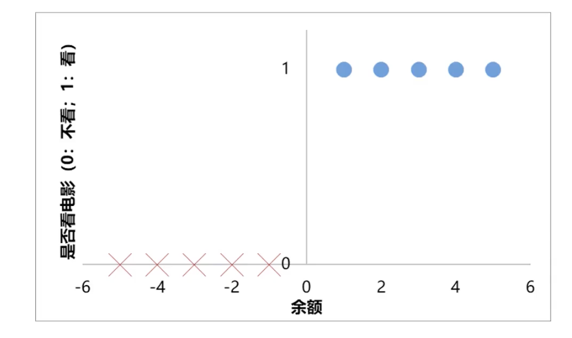

# 1.6. 逻辑回归理论(基础)

## 1.6.1. 如何求解分类问题？
举个简单的例子：根据余额，判断小明是否会去看电影。

从这幅图中我们可以看到：
- `y = 0`代表不看电影、`y = 1`代表去看电影
- 余额为1、2、3、4、5时，去看电影（正样本）
- 余额为-1、-2、-3、-4、-5时，不看电影（负样本）

## 1.6.2. 分类任务基本框架
那么如何让计算器来进行这样的分类任务呢？我们需要数学的帮助：
$$
\left\{
\begin{array}{l}
y = f(x_1, x_2 \cdots x_n) \\
\text{判断为类别 } N, \text{ 如果 } y = n
\end{array}
\right.
$$
分类任务分成两步：
- 第一步是去求解预测出的结果，这个结果还不是我们最终想要的类别，而是类似于0、1、2这样的数字（离散的数）。
- 第二步就是根据这个数字来判断它属于什么类别，比如说0的时候代表不看电影，1的时候代表看电影

具体到我们这里的看电影这个例子中，数学表述就是：
$$
y = f(x) \in \{0,1\}
$$
`f(x)`的结果，也就是`y`，属于`{0, 1}`，也就是说要么是0，要么是1。而在上文的图中我们也说过了`y = 0`代表不看电影（负样本）、`y = 1`代表去看电影（正样本）.

***那么此时这个例子的核心问题就转变为了寻找`f(x)`。***

## 1.6.3. 通过线性回归求解分类问题

我们先采用一个非常简单的模型，就是我们之前讲的线性回归模型（原理详见 [1.2. 线性回归理论](../1.2/1.2._线性回归理论_一元线性回归、最小化平方误差和公式(SSE)、梯度下降法.md)）。使用这个模型的目的在于预测点的分布情况。

我们首先不管是正样本还是负样本，我们现在要做的只是把点的分布给模拟出来：

拟合出来的线是`y = 0.1364x + 0.5`，这就是展现点可能的分布的函数。

这条线上的点不只有0和1怎么办呢？很简单，我们只要取0和1的中点——0.5即可。只要是分布函数的`y`值大于0.5，我们就把它认定为是1，也就是去看电影；反之就认定为0，不会去看电影。

更专业地说，我们会把0.5叫做*阈值*。而这种把很多值(分布函数上的值)根据阈值最终整理为两个值(0或1)的操作叫做*二值化*。

这样一来我们就完成了一个非常简单的分类任务的预测。我们再来总结一下步骤：
$$
\begin{aligned}
(1) \quad Y &= 0.1364x + 0.5 \\
(2) \quad y &= f(x) =
\begin{cases}
1, & Y \geq 0.5 \\
0, & Y < 0.5
\end{cases}
\end{aligned}
$$
- 第一步是找出`f(x)`，也就是这里的`Y`
- 第二步就是确定阈值，根据阈值来进行二次筛选

我们把`Y`带入原来的数据点，看一下效果：

| x   | Y(x)分布函数的值 | y(x)二值化之后的值 | 实际y |
| --- | ---------- | ----------- | --- |
| -5  | -0.18      | 0           | 0   |
| -4  | -0.05      | 0           | 0   |
| -3  | 0.09       | 0           | 0   |
| -2  | 0.23       | 0           | 0   |
| -1  | 0.36       | 0           | 0   |
| 1   | 0.64       | 1           | 1   |
| 2   | 0.77       | 1           | 1   |
| 3   | 0.91       | 1           | 1   |
| 4   | 1.05       | 1           | 1   |
| 5   | 1.18       | 1           | 1   |

这么一看线性回归的效果好像还不错，但其实它的局限性还蛮大的。

## 1.6.4. 线性回归求解分类问题的局限性

***线性回归的主要问题在于：极端离群点会严重扭曲拟合直线，从而降低分类准确率。***

原本的数据中x的值仅在-5到5。而这时如果我们添加一个比较远的点，比如`(50, 1)`，就会对线性回归计算出的线产生巨大的影响。

我们还是一样的把`Y`带入原来的数据点，看一下效果：

| x   | Y(x)分布函数的值 | y(x)二值化之后的值 | 实际y |
| --- | ---------- | ----------- | --- |
| -5  | 0.39       | 0           | 0   |
| -4  | 0.41       | 0           | 0   |
| -3  | 0.43       | 0           | 0   |
| -2  | 0.44       | 0           | 0   |
| -1  | 0.46       | 0           | 0   |
| 1   | ***0.49*** | ***0***     | 1   |
| 2   | 0.51       | 1           | 1   |
| 3   | 0.52       | 1           | 1   |
| 4   | 0.54       | 1           | 1   |
| 5   | 0.55       | 1           | 1   |
| 50  | 1.26       | 1           | 1   |
当`x = 1`时，由于`Y(x)`的结果0.49，小于0.5，导致二值化之后`y(x) = 0`，但是实际情况是`x = 1`时`y = 1`。

## 1.6.5. 逻辑回归的原理
逻辑回归对于求解分类问题的第一步进行了优化：
$$
\begin{aligned}
(1) \quad Y &= \frac{1}{1 + e^{-x}} \\
(2) \quad y &= f(x) =
\begin{cases}
1, & Y \geq 0.5 \\
0, & Y < 0.5
\end{cases}
\end{aligned}
$$
之所以叫做逻辑回归是因为第一步的这个函数叫做**Sigmoid函数**（逻辑函数），它将输入x**映射到 `(0,1)`之间**。

它根据数据的特征或属性，计算其归属于某一类别的概率`P(x)`，根据概率数值来判断其所属类别。

它的主要应用场景就是二分类问题（也就是只有两种可能性的问题）。

它的数学表达式是：
$$
\begin{aligned}
P(x) &= \frac{1}{1 + e^{-x}} \\
y &=
\begin{cases}
1, & P(x) \geq 0.5 \\
0, & P(x) < 0.5
\end{cases}
\end{aligned}
$$
- `y`为类别结果
- `P`为概率分布
- `x`为特征值

它的效果如下：

如果我们使用逻辑函数作为`Y`：

| x    | Y(x)使用逻辑函数 | y(x)二值化之后的值 | 实际y |
| ---- | ---------- | ----------- | --- |
| -5   | 0.01       | 0           | 0   |
| -4   | 0.02       | 0           | 0   |
| -3   | 0.05       | 0           | 0   |
| -2   | 0.12       | 0           | 0   |
| -1   | 0.27       | 0           | 0   |
| 1    | 0.73       | 1           | 1   |
| 2    | 0.88       | 1           | 1   |
| 3    | 0.95       | 1           | 1   |
| 4    | 0.98       | 1           | 1   |
| 5    | 0.99       | 1           | 1   |
| 50   | 1.00       | 1           | 1   |
| 1000 | 1.00       | 1           | 1   |

可以看到，即使加入了极端点 `x = 50`（甚至 `x = 1000`），分类结果仍然保持正确。

逻辑回归只是用于解决分类问题的**一种模型**（你可以使用其它模型，只是效果可能没这么好）。其实它的思想与线性回归差不多，只不过换用了逻辑函数。

## 1.6.6. 利用逻辑函数解问题
我们就用逻辑回归解决一下本文开篇提出的那个问题：根据余额，判断小明是否会去看电影（余额-10、100的情况下）

只需要带入逻辑方程即可：

---

余额为-10的情况下：
$$
P(x = -10) = \frac{1}{1 + e^{10}} = 4.5 \times 10^{-5} < 0.5
$$
由于计算出的值小于0.5，所以会被二值化为0，也就是不会去看电影。

---

余额为100的情况下：
$$
P(x = 100) = \frac{1}{1 + e^{-100}} = 1 > 0.5
$$
由于计算出的值大于0.5，所以会被二值化为1，也就是会去看电影。
