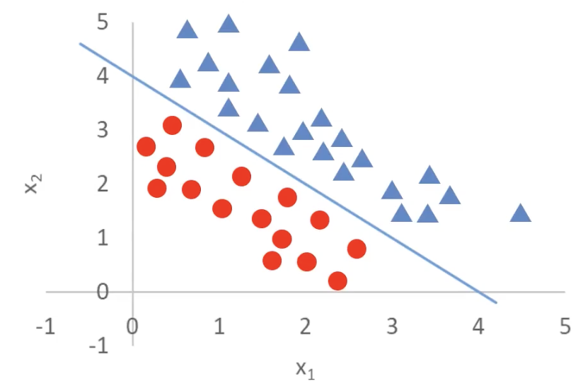
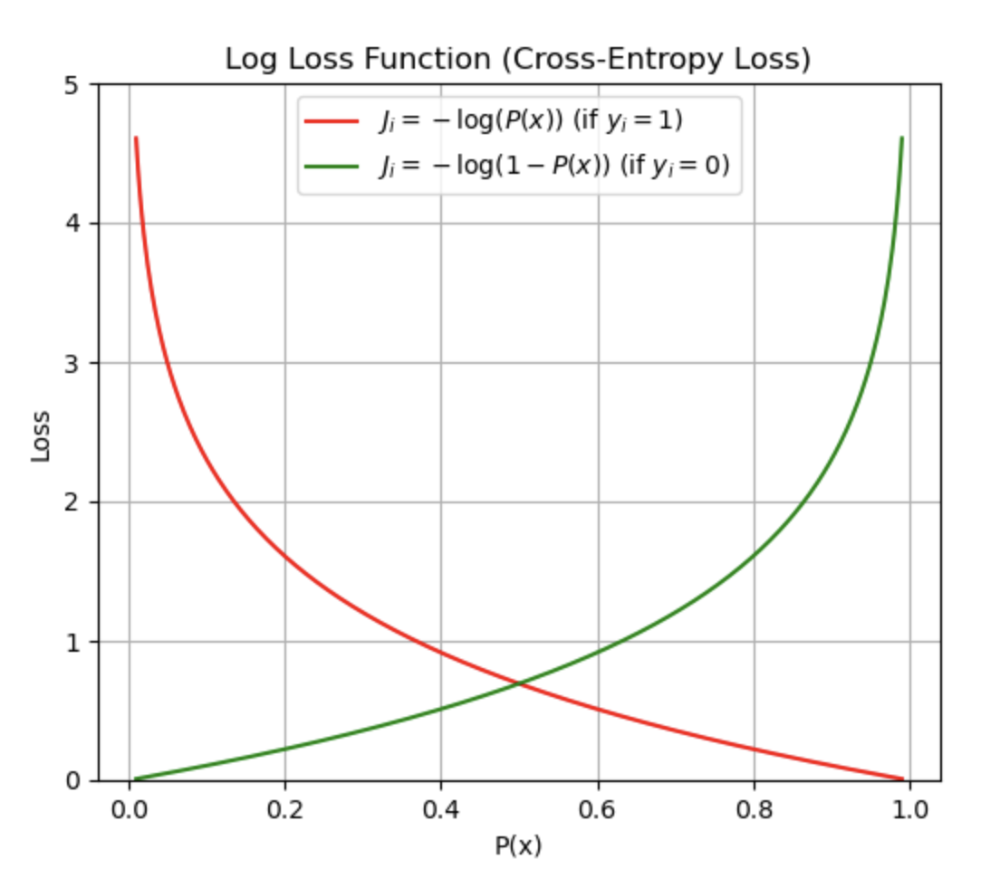

# 1.7. 逻辑回归理论(进阶)

## 1.7.1. 多维度(因子)逻辑回归问题
在上一篇文章 [1.6. 逻辑回归理论(基础)](../1.6/1.6._逻辑回归理论(基础)_逻辑函数、逻辑回归的原理、分类任务基本框架、通过线性回归求解分类问题.md) 中我们讨论了简单的逻辑回归问题。这篇文章我们来讨论复杂的逻辑回归问题：

原来我们只有一个维度（比如说小明的余额），但这个图里我们有两个维度——`x_1`和`x_2`。

虽然这个图看上去仍然是一个二维图像，但是它的两个轴都是输入变量。实际的输出是图中的三角形和圆形。

也就是说，这里的目标是通过`x_1`和`x_2`去分辨三角形和圆形。

怎么去求解呢？对于逻辑回归问题肯定得用逻辑函数：
$$
P(x) = \frac{1}{1 + e^{-x}}
$$
但是这个函数的参数只有一个，所以我们得改一下：
$$
\begin{aligned}
P(x) &= \frac{1}{1 + e^{-g(x)}} \\
g(x) &= \theta_0 + \theta_1 x_1 + \theta_2 x_2
\end{aligned}
$$
- 把`e`的指数中的`x`替换为了`g(x)`
- 而`g(x)`实际上是一个线性回归方程，代表了图中的蓝色线，其中：
  - `θ_0`是**截距（bias）**
  - `θ_1`, `θ_2`是**特征的权重（回归系数）**
  - `x_1`, `x_2`是输入的两个特征（因子）

不仅如此，这里我们只展示了有两个输入变量的情况，`g(x)`还可以有更多的输入变量：
$$
g(x) = \theta_0 + \theta_1 x_1 + \theta_2 x_2 + \dots + \theta_n x_n
$$

`g(x)`,也就是蓝色这条线通过点`(4,0)`和`(0,4)`，可以表示为：
$$
x_1 + x_2 = 4
$$
就可以等价地写为：
$$
g(x) = -4 + x_1 + x_2 = 0
$$

这条线又叫*决策边界（decision boundary）*。有了决策边界之后，我们就能把三角形和圆形的分开：
$$
\begin{aligned}
g(x) = -4 + x_1 + x_2 > 0 & : \text{ 三角形} \\
g(x) = -4 + x_1 + x_2 < 0 & : \text{ 圆形}
\end{aligned}
$$

***对于多维度（因子）的逻辑回归问题来说，最重要也是最难的步骤就是找出这条决策边界。***

---

这时候再增加一点难度，如果决策边界是圆怎么办？

首先确定逻辑函数是保持不变的：
$$
P(x) = \frac{1}{1 + e^{-g(x)}}
$$
目标是要找出决策曲线，也就是逻辑函数中的`g(x)`这一项的表达式。

这里我提供两种解法：
### 方法1: 根据圆的表达式来推导
其实很简单，大家还记得圆在平面直角坐标系的表达式吗：
$$
(x - a)^2 + (y - b)^2 = r^2
$$
由于这里圆心在原点上，所以可以化简为：
$$
x^2 + y^2 = r^2
$$
因为图中决策曲线这个圆过了`(1,0)`、`(-1,0)`、`(0,1)`、`(0,-1)`，所以知道半径`r = 1`，代入原式：
$$
x^2 + y^2 = 1
$$
再移项即可得：
$$
g(x) = -1 + x^2 + y^2 = 0
$$
这就是我们所要的决策边界解析式，由此可得：
$$
g(x) = -1 + x_1^2 + x_2^2 \begin{cases} > 0, & \text{三角形} \\
< 0, & \text{圆形}
\end{cases}
$$

---
### 方法2: 从回归方程推导
我们都知道线性回归方程基本式长这样：
$$
g(x) = \theta_0 + \theta_1 x_1 + \theta_2 x_2
$$
但是我们这里是有曲线的，所以不可能是线性的。也就是说，`x`的指数不可能只有1次。所以我们要引入二次项：
$$
g(x) = \theta_0 + \theta_1 x_1 + \theta_2 x_2 + \theta_3 x_1^2 + \theta_4 x_2^2
$$
- `x_1`^2和`x_2`^2是新的**非线性特征**，用于捕捉**曲线（尤其是圆形）模式**
- 这样，我们的决策边界可以不再是直线，而是更复杂的形状，比如**椭圆或圆**

如果我们进一步简化，只保留二次项（假设`θ_1 = θ_2 = 0`），我们得到：
$$
g(x) = \theta_0 + \theta_3 x_1^2 + \theta_4 x_2^2
$$
令`θ_0 = -r^2 `，`θ_3 = θ_4 = 1`，我们得到：
$$
g(x) = x_1^2 + x_2^2 - r^2
$$
当`g(x) = 0`时：
$$
x_1^2 + x_2^2 = r^2
$$
这正是圆的方程！然后我们就可以根据法1的逻辑推理到`g(x)`的解析式了。

---

***从这些例子我们可以看出：逻辑回归结合多项式边界函数可以解决复杂的分类问题。***

## 1.7.2. 逻辑回归的本质
我们把逻辑回归的函数放在这里：
$$
\begin{aligned}
P(x) &= \frac{1}{1 + e^{-g(x)}} \\
g(x) &= \theta_0 + \theta_1 x_1 + \theta_2 x_2 + ...
\end{aligned}
$$
根据刚才的讲解，我们清楚了：***逻辑回归问题的关键在于寻找决策边界`g(x)`，而寻找逻辑边界`g(x)`的关键就在于寻找参数`θ_0`、`θ_1`、`θ_2`...***

有没有觉得熟悉？**寻找`g(x)`中各项的参数不就是线性回归模型在做的事吗**！那我可不可以用最小化损失函数呢：
$$
\textit{minimize} \left\{ \frac{1}{2m} \sum_{i=1}^{m} (y'_i - y_i)^2 \right\}
$$

会让你感到失望的是，**平方误差在这里并不是好选择**。即便我们使用 Sigmoid 输出的连续概率，对逻辑回归使用 MSE 也会得到非凸优化问题，而且当模型“错得很自信”时梯度会变得很小，训练不稳定。

最小化损失这个思路本身没有问题，我们只是需要更合适的损失函数。常用的是交叉熵（对数）损失，它与逻辑回归天然匹配（也出现在 Nelder 与 Wedderburn 提出的广义线性模型框架中）：
$$
J_i =
\begin{cases}
- \log(P(x_i)), & \text{if } y_i = 1 \\
- \log(1 - P(x_i)), & \text{if } y_i = 0
\end{cases}
$$
它的核心思想是：
- 当`y = 1`时(也就是真实情况是1)，你计算出的`P(x)`（也就是你的模型预估出的情况）越接近1就代表损失越小，越接近0就代表损失越大
- 当`y = 0`时(也就是真实情况是0)，你计算出的`P(x)`（也就是你的模型预估出的情况）越接近0就代表损失越小，越接近1就代表损失越大

把两个方程式结合起来，转化为下面这个方程，获得交叉熵损失的平均值：
$$
J = \frac{1}{m} \sum_{i=1}^{m} J_i = -\frac{1}{m} \left[ \sum_{i=1}^{m} \left( y_i \log P(x_i) + (1 - y_i) \log (1 - P(x_i)) \right) \right]
$$
而其中：
$$
\begin{aligned}
P(x) &= \frac{1}{1 + e^{-g(x)}} \\
g(x) &= \theta_0 + \theta_1 x_1 + \theta_2 x_2 + ...
\end{aligned}
$$
所以说逻辑回归最核心的就是：
$$
\textit{minimize} \left\{ J(\theta) \right\}
$$

## 1.7.3. 最小化损失函数
我们知道了如何计算损失之后，又该如何最小化它呢？其实它的思路跟线性回归的梯度下降法差不多。

我们先来回顾一下梯度下降法：
$$
p_{i+1} = p_i - \alpha \frac{\partial}{\partial p_i} f(p_i)
$$
- `p_i+1`**是更新后的参数值**，由当前值`p_i`进行调整
- `α`（学习率）：控制每次更新的步长
- `α`后面跟的那一串是函数`f(p)` 在当前点`p_i`处的梯度（偏导数），表示`f(p)`在该点变化的方向和大小。

逻辑回归也要运用梯度下降法：
$$
\left\{
\begin{array}{l}
\textit{temp}_{\theta_j} = \theta_j - \alpha \frac{\partial}{\partial \theta_j} J(\theta) \\
\theta_j = \textit{temp}_{\theta_j}
\end{array}
\right.
$$
也是一样的通过系数减梯度不断重复计算直到函数收敛。
