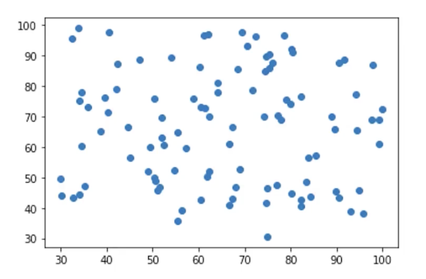
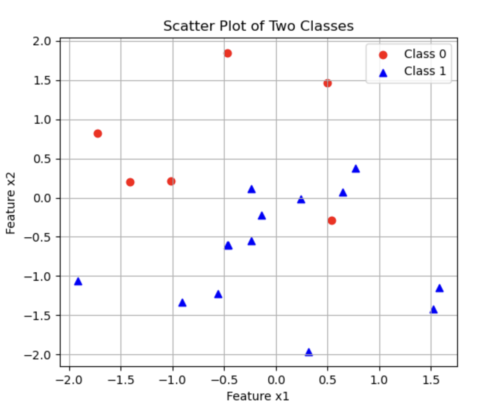
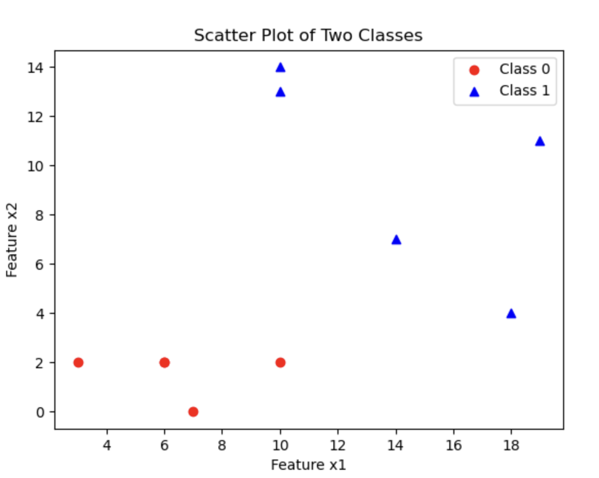
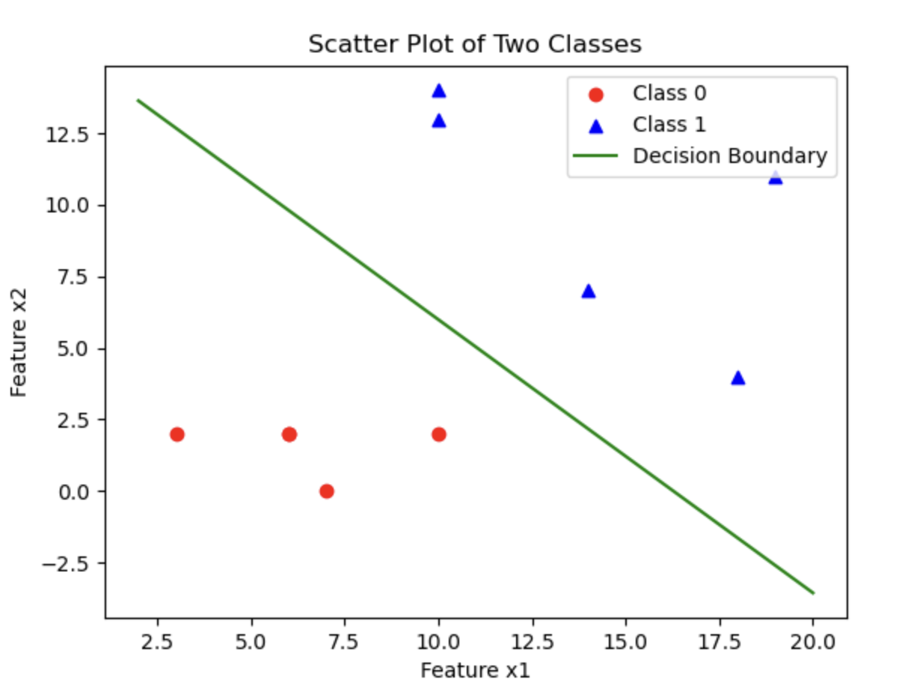

# 1.8. 逻辑回归实战(基础)

## 1.8.1. 使用`matplotlib`画分类散点图
我想大家都知道未分类别的散点图是怎么画的:



```python
plt.scatter(x1, x2)
```

但在分类问题中你会需要把不同的类别的点体现出来，你可以改颜色，也可以改形状，也可以两者都改:

假设我们有两个特征`x1`和`x2`，以及类别标签`y`（0和1）。其中，类别0用**红色圆点（`o`）** 表示，类别1用**蓝色三角形（`^`）** 表示。

```python
import numpy as np
import matplotlib.pyplot as plt

# 生成随机数据
np.random.seed(42)
x1 = np.random.randn(20)
x2 = np.random.randn(20)
y = np.random.randint(0, 2, 20)  # 随机分类 0 或 1

# 过滤数据
class_0 = (y == 0)
class_1 = (y == 1)

# 绘制散点图
plt.figure(figsize=(6, 5))

# 绘制类别 0（红色圆形）
plt.scatter(x1[class_0], x2[class_0], c='red', marker='o', label="Class 0")

# 绘制类别 1（蓝色三角形）
plt.scatter(x1[class_1], x2[class_1], c='blue', marker='^', label="Class 1")

# 添加图例和标签
plt.xlabel("Feature x1")
plt.ylabel("Feature x2")
plt.title("Scatter Plot of Two Classes")
plt.legend()
plt.grid(True)

# 显示图形
plt.show()
```
- **生成数据**：
  - 使用`np.random.randn()`生成两个特征`x1`和`x2`（随机正态分布）
  - `np.random.randint(0, 2, 20)`生成20个随机分类标签（0或1）

- **数据筛选**：
  - 通过`class_0 = (y == 0)`和`class_1 = (y == 1)`选取不同类别的数据

- **绘制散点图**：
  - 用`plt.scatter()`分别绘制类别0和1，并设定不同的 **颜色（`c`）** 和 **形状（`marker`）**：类别 0（红色圆形`o`）、类别 1（蓝色三角形`^`）

- **增强可视化**：
  - 通过`plt.legend()`添加图例，使类别区分更清晰
  - `plt.grid(True)`添加网格，提高可读性

输出图片：



## 1.8.2. 逻辑回归的代码实现

接下来，请你确保你的Python环境中有`pandas`、`matplotlib`、`scikit-learn`和`numpy`这几个包，如果没有，请在终端输入指令以下载和安装：
```bash
pip install pandas matplotlib scikit-learn numpy
```
### Step 1: 准备数据
这里需要使用到我的`csv`文件，我把它上传到了[GitCode](https://gitcode.com/weixin_71793197/machine_learning_guide/blob/main/1.8/Logistic_Regression_Data.csv)，你点击链接即可查看和下载。

它有3栏信息，一栏是`x1`，一栏是`x2`，这两栏代表两个输入变量。另一栏是`success_or_fail`，这一栏数据要么是0要么是1，1代表成功，0代表失败。

下载好后把它移到你的Python项目文件夹里即可。

### Step 2: 读取数据
我们依旧使用`pandas`库来读取数据：
```python
# 读取数据  
import pandas as pd  
data = pd.read_csv('Logistic_Regression_Data.csv')  
  
print(data.head())
```

输出：
```
   x1  x2  success_or_fail
0   6   2                0
1  19  11                1
2  14   7                1
3  10   2                0
4   7   0                0
```
如果你有一样的输出就代表没问题。

我们还可以用上文我们介绍过的画分类别的散点图的知识来可视化这些数据：
```python
# 可视化数据  
import matplotlib.pyplot as plt  
  
x1 = data.loc[:,'x1'].to_numpy()  
x2 = data.loc[:,'x2'].to_numpy()  
y = data.loc[:,'success_or_fail'].to_numpy()  
  
class_0 = (y == 0)  
class_1 = (y == 1)  
  
# 绘制类别 0（红色圆形）  
plt.scatter(x1[class_0], x2[class_0], c='red', marker='o', label="Class 0")  
  
# 绘制类别 1（蓝色三角形）  
plt.scatter(x1[class_1], x2[class_1], c='blue', marker='^', label="Class 1")  
  
# 添加图例和标签  
plt.xlabel("Feature x1")  
plt.ylabel("Feature x2")  
plt.title("Scatter Plot of Two Classes")  
plt.legend()  
  
# 显示图形  
plt.show()
```

输出图片：



### Step 2: 给`x`和`y`赋值
我们要首先明确`x`和`y`代表什么：
- `x`代表的是输入变量，也就是`x1`和`x2`
- `y`是`success_or_fail`这一栏的数据

```python
# 给x和y赋值  
x = data.drop(['success_or_fail'], axis=1)  
y = data.loc[:,'success_or_fail']
```
- 使用`drop`函数丢弃指定的字段，保留其它字段。这里写的是`'success_or_fail'`，那就丢弃它，`axis=1`告诉程序丢弃的是`'success_or_fail'`这一列而不是行。

### Step 3: 训练模型
把数据喂给`scikit-learn`下的逻辑回归模型进行训练即可：
```python
# 训练模型  
from sklearn.linear_model import LogisticRegression  
model = LogisticRegression()  
model.fit(x, y)
```

### Step 4: 获取决策边界
我们可以通过`coef_`和`intercept_`两个方法分别获得截距和系数：
```python
# 获取决策边界  
theta1, theta2 = model.coef_[0]  
theta0 = model.intercept_[0]

print(f"Decision Boundary: y = {theta1}x1 + {theta2}x2 + {theta0}")
```
- 由于我们有两个输入变量，所以就有两个系数`theta1`和`theta2`

这些值也就对应了上一篇文章 [1.7. 逻辑回归理论(进阶)](../1.7/1.7._逻辑回归理论(进阶)_多维度(因子)逻辑回归问题、决策边界、交叉熵损失函数、最小化损失函数.md) 中所讲的公式的各个参数：
$$
g(x) = \theta_0 + \theta_1 x_1 + \theta_2 x_2
$$
输出：
```
Decision Boundary: y = 0.5729567667358711x1 + 0.5997810709872152x2 + -9.324928012209842
```

### Step 5: 获取预测值
```python
# 获取预测值  
prediction = model.predict(x)

print(prediction)
```

输出：
```
[0 1 1 0 0 0 1 1 1 0]
```

### Step 6: 可视化决策边界
我们现在来把决策边界画出来：
```python
# 可视化数据  
import matplotlib.pyplot as plt  
  
x1 = data.loc[:, 'x1'].to_numpy()  
x2 = data.loc[:, 'x2'].to_numpy()  
y = data.loc[:, 'success_or_fail'].to_numpy()  
  
class_0 = (y == 0)  
class_1 = (y == 1)  
  
# 绘制类别 0（红色圆形）  
plt.scatter(x1[class_0], x2[class_0], c='red', marker='o', label="Class 0")  
  
# 绘制类别 1（蓝色三角形）  
plt.scatter(x1[class_1], x2[class_1], c='blue', marker='^', label="Class 1")  
  
# 绘制决策边界  
import numpy as np  
  
# 计算 x1 的范围  
x1_min, x1_max = x1.min() - 1, x1.max() + 1  
x1_range = np.linspace(x1_min, x1_max, 100)  
  
# 使用决策边界公式计算 x2
x2_boundary = -(theta1 * x1_range + theta0) / theta2  
  
# 绘制决策边界  
plt.plot(x1_range, x2_boundary, color='green', label="Decision Boundary")  
  
# 添加图例和标签  
plt.xlabel("Feature x1")  
plt.ylabel("Feature x2")  
plt.title("Scatter Plot of Two Classes")  
plt.legend()  
  
# 展示  
plt.show()
```
- `x1.min()`和`x1.max()`：找到训练数据中 `x_1` 的最小值和最大值

- `x1.min() - 1` 和 `x1.max() + 1`：在边界外稍微扩展一点，保证绘制的直线不会刚好卡在边界上，视觉上更好

- `np.linspace(x1_min, x1_max, 100)`：
  - 生成 100 个均匀分布的`x_1`值，形成一个连续的 **x 轴范围**
  - 这样可以绘制一条**平滑的直线**

- `x1_range`传入后，可以计算出100个对应的`x_2`值，形成一条**直线**

输出图片：



## 1.8.3. 评估模型表现
对于比较少的数据，我们可以直接画图来看模型效果（如上图）。对于比较多的数据，我们要定量地评估就不能只靠图了。

评估逻辑回归模型相比起评估线性回归模型要简单一些，使用准确率来评判即可：
$$
Accuracy = \frac{正确预测样本数量}{总样本数量}
$$
准确率肯定是越接近1越好。但是不要过于追求准确率，否则会导致过拟合问题。

我们可以用`scikit-learn`提供的代码来计算准确率：
```python
# 计算准确率  
from sklearn.metrics import accuracy_score  
accuracy = accuracy_score(y, prediction)  
print(f"Accuracy: {accuracy}")
```

输出：
```
Accuracy: 1.0
```
这说明我们的模型非常成功，是百分百的正确率（其实看图也看得出来）。
