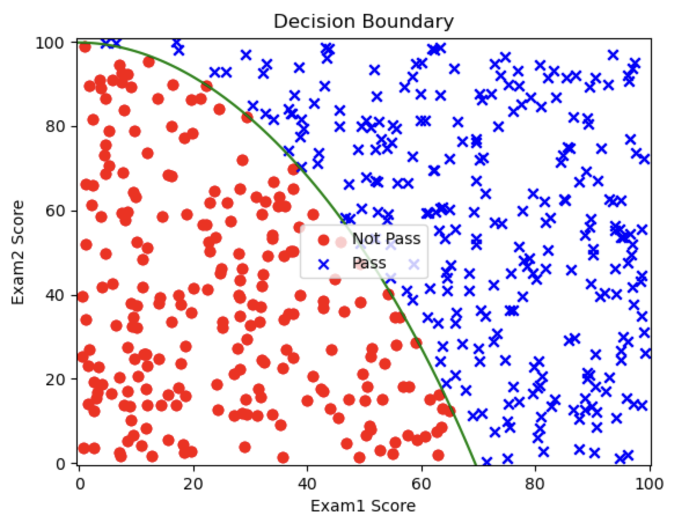

# 1.9. 逻辑回归实战(进阶)

## 1.9.1. 一些准备工作
接下来，请你确保你的Python环境中有`pandas`、`matplotlib`、`scikit-learn`和`numpy`这几个包，如果没有，请在终端输入指令以下载和安装：
```bash
pip install pandas matplotlib scikit-learn numpy
```

我把`.csv`数据文件放在[GitCode](https://gitcode.com/weixin_71793197/machine_learning_guide/blob/main/1.9/exam_results.csv?init=initTree)上了，点击链接即可下载。

训练数据有3栏：`exam1`、`exam2`和`exam3_pass_or_not`。`exam1`和`exam2`里填写的是学生在两次考试中的成绩（可以是浮点数，满分100），`exam3_pass_or_not`代表第三次考试有没有通过，通过是1，没通过是0。我们的目标就是训练逻辑回归模型去找到`exam3_pass_or_not`的决策边界。

下载好后把它移到你的Python项目文件夹里即可。

## 1.9.2. 建立一阶边界模型
在上一篇文章 [1.8. 逻辑回归实战(基础)](../1.8/1.8._逻辑回归实战(基础)_建立一阶边界模型、画分类散点图、逻辑回归模型的代码实现、可视化决策边界.md) 中我们介绍了如何建立简单的一阶边界模型，这里就不再详细讲解了，我就直接把代码和输出贴在这里：
```python
# 读取数据  
import pandas as pd  
data = pd.read_csv('exam_results.csv')  
  
# 给x和y赋值  
x = data.drop(['exam3_pass_or_not'], axis=1)  
y = data.loc[:, 'exam3_pass_or_not']  
  
# 训练模型  
from sklearn.linear_model import LogisticRegression   
model = LogisticRegression()  
model.fit(x, y)  
  
# 获取决策边界  
theta1, theta2 = model.coef_[0]  
theta0 = model.intercept_[0]  
  
# 获取预测值  
prediction = model.predict(x)  
  
# 可视化  
import matplotlib.pyplot as plt  
import numpy as np

x1 = data.loc[:, 'exam1'].to_numpy()  
x2 = data.loc[:, 'exam2'].to_numpy()  
y = data.loc[:, 'exam3_pass_or_not'].to_numpy()  
  
class0 = (y == 0)  
class1 = (y == 1)  
  
plt.scatter(x1[class0], x2[class0], c='r', marker='o')  
plt.scatter(x1[class1], x2[class1], c='b', marker='x')  
plt.xlabel('exam1')  
plt.ylabel('exam2')  
  
# 计算 x1 的范围  
x1_min, x1_max = x1.min() - 1, x1.max() + 1  
x1_range = np.linspace(x1_min, x1_max, 100)  
  
# 使用决策边界公式计算 x2  
x2_boundary = -(theta1 * x1_range + theta0) / theta2  
  
# 绘制决策边界  
plt.plot(x1_range, x2_boundary, color='green', label="Decision Boundary")  
  
# 展示  
plt.legend()  
plt.show()  
  
# 计算准确率  
from sklearn.metrics import accuracy_score  
accuracy = accuracy_score(y, prediction)  
print(f'Accuracy: {accuracy}')
```

输出：
```
Accuracy: 0.972
```

输出图片：


可以看到，有一些数据确实呗决策曲线错分类了，这是一阶决策边界（一条直线）的极限了。如果还要提升准确率就需要建立二阶的决策边界（一条曲线）。

## 1.9.3.建立二阶决策边界
### Step 1: 读取数据
一样的使用`pandas`库来读取`csv`文件，顺便使用`head`方法来查看一下数据的前几项：
```python
# 读取数据  
import pandas as pd  
data = pd.read_csv('exam_results.csv')  
  
print(data.head())
```

输出：
```
       exam1      exam2  exam3_pass_or_not
0  37.454012  69.816171                  0
1  95.071431  53.609637                  1
2  73.199394  30.952762                  1
3  59.865848  81.379502                  1
4  15.601864  68.473117                  0
```

我们还可以使用上一篇文章 [1.8. 逻辑回归实战(基础)](../1.8/1.8._逻辑回归实战(基础)_建立一阶边界模型、画分类散点图、逻辑回归模型的代码实现、可视化决策边界.md) 中教过的画有分类的散点图方法来直观的看看数据：
```python
# 可视化原始数据  
import matplotlib.pyplot as plt  
x1 = data.loc[:, 'exam1'].to_numpy()  
x2 = data.loc[:, 'exam2'].to_numpy()  
y = data.loc[:, 'exam3_pass_or_not'].to_numpy()  
  
class0 = ( y == 0 )  
class1 = ( y == 1 )  
  
plt.scatter(x1[class0], x2[class0], c='r', marker='o')  
plt.scatter(x1[class1], x2[class1], c='b', marker='x')  
plt.xlabel('exam1')  
plt.ylabel('exam2')  
plt.show()
```

输出图片：


### Step 2: 给`x`和`y`赋值
我们要首先明确`x`和`y`代表什么：
- `y`是`exam3_pass_or_not`这一栏的数据

`x`有些特别，由于我们建立的是二阶模型，所以方程的项跟原来比更复杂：
$$
\theta_0 + \theta_1 X_1 + \theta_2 X_2 + \theta_3 X_1^2 + \theta_4 X_2^2 + \theta_5 X_1 X_2 = 0
$$
有`x_1`^2、`x_2`^2、`X_1 * x_2`这些项。所以我们得把这些项打包在字典里，再转为模型能使用的`DataFrame`格式给它使用。


```python
# 给x和y赋值  
y = data.loc[:, 'exam3_pass_or_not']  
x1 = data.loc[:, 'exam1']  
x2 = data.loc[:, 'exam2']  
x = {  
    'x1': x1,  
    'x2': x2,  
    'x1^2': x1 ** 2,  
    'x2^2': x2 ** 2,  
    'x1*x2': x1 * x2,  
}  
  
x = pd.DataFrame(x)  
print(x.head())
```

输出：
```
          x1         x2         x1^2         x2^2        x1*x2
0  37.454012  69.816171  1402.803006  4874.297789  2614.895713
1  95.071431  53.609637  9038.576924  2873.993140  5096.744851
2  73.199394  30.952762  5358.151308   958.073452  2265.723399
3  59.865848  81.379502  3583.919807  6622.623341  4871.852929
4  15.601864  68.473117   243.418162  4688.567787  1068.308266
```

这是最基础的一种方法，还有一种简单的方法来生成这个字典：
```python
from sklearn.preprocessing import PolynomialFeatures
poly = PolynomialFeatures(degree=2, include_bias=False)
x = data.drop(['exam3_pass_or_not'], axis=1)
x = poly.fit_transform(x)
```
- `poly = PolynomialFeatures(degree=2, include_bias=False)`中先创建了一个`PolynomialFeatures`实例，然后通过`degree`参数来调整是几次的多项式，我写的是2生成的就会是2次多项式；`include_bias=False`避免再额外生成一列全为1的偏置项（截距仍由`LogisticRegression`的`intercept_`负责）。
- 使用`data.drop(['exam3_pass_or_not'], axis = 1)`来去掉最后一列的数据，保留前两列
- 使用`poly`上的`fit_transform`方法来生成特征矩阵。注意：`PolynomialFeatures`生成的特征列顺序与上面手动字典不完全相同，因此后面按手动字典顺序解包`theta`、打印和画边界的代码，应配合手动字典那条路径使用。

### Step 3: 训练模型
把数据喂给`scikit-learn`下的逻辑回归模型进行训练即可：
```python
# 训练模型  
from sklearn.linear_model import LogisticRegression  
model = LogisticRegression()  
model.fit(x, y)
```

### Step 4: 获取决策边界
我们可以通过`coef_`和`intercept_`两个方法分别获得截距和系数：
```python
# 获取决策边界  
theta1, theta2, theta3, theta4, theta5 = model.coef_[0]  
theta0 = model.intercept_[0]

print(f'Decision Boundary: {theta0} + {theta1}x1 + {theta2}x2 + {theta3}x1^2 + {theta4}x2^2 + {theta5}x1*x2')
```

这里面的每个变量都对应着方程中的参数：
$$
\theta_0 + \theta_1 X_1 + \theta_2 X_2 + \theta_3 X_1^2 + \theta_4 X_2^2 + \theta_5 X_1 X_2 = 0
$$

输出：
```
Decision Boundary: -204.44094927587327 + -1.0566693402530631x1 + 1.3772537803356335x2 + 0.057584352318122055x1^2 + 0.006716600903162952x2^2 + 0.010830701167147672x1*x2
```

### Step 5: 获取预测值
```python
# 获取预测值  
prediction = model.predict(x)
```
由于我们有500个数据，打出来太多了，这里就不进行打印了。


### Step 6: 可视化决策边界
这里可视化决策边界稍微有点复杂，因为是二阶的项变多了，但是思路是暴力且简单的：我们都知道了所有的`theta`值，就是把解析式得出来了。接着根据`x_1`、`x_2`值和直接算对应的点即可。
```python
# 可视化  
import matplotlib.pyplot as plt  
import numpy as np  
  
x1 = x1.to_numpy()  
x2 = x2.to_numpy()  
y = y.to_numpy()  
  
class0 = (y == 0)  
class1 = (y == 1)  
  
plt.scatter(x1[class0], x2[class0], c='r', marker='o')  
plt.scatter(x1[class1], x2[class1], c='b', marker='x')  
plt.xlabel('exam1')  
plt.ylabel('exam2')  
  
# 可视化二阶决策边界  
  
# 定义exam1和exam2的范围，为了画网格  
x1_min, x1_max = x1.min() - 1, x1.max() + 1  
x2_min, x2_max = x2.min() - 1, x2.max() + 1  
  
# 生成网格数据  
xx1, xx2 = np.meshgrid(np.linspace(x1_min, x1_max, 500),  
                       np.linspace(x2_min, x2_max, 500))  
  
# 计算每个点的决策边界值  
z = (theta0 +  
     theta1 * xx1 +  
     theta2 * xx2 +  
     theta3 * xx1 ** 2 +  
     theta4 * xx2 ** 2 +  
     theta5 * xx1 * xx2)  
  
# 绘制样本点  
plt.scatter(x1[class0], x2[class0], c='r', label='Not Pass', marker='o')  
plt.scatter(x1[class1], x2[class1], c='b', label='Pass', marker='x')  
  
# 绘制决策边界  
plt.contour(xx1, xx2, z, levels=[0], colors='g')  
  
# 添加标签和图例  
plt.xlabel('Exam1 Score')  
plt.ylabel('Exam2 Score')  
plt.legend()  
plt.title('Decision Boundary')  
plt.show()
```
- **网格生成 (`np.meshgrid`)**：生成 `exam1` 和 `exam2` 值的坐标网格，用于计算每一个点的决策值
- **决策值计算 (`z`)**：`z` 是决策函数的值，基于 logistic 回归的系数和截距
- **等高线画图 (`plt.contour`)**：`plt.contour()` 方法可以绘制出特定值（比如 `0` 对应决策边界）的等高线

输出图片：



可以看到，这个决策边界的误判率低了很多。下面我们通过计算准确率来定量分析。

### Step 7: 计算准确率
```python
# 计算准确率  
from sklearn.metrics import accuracy_score  
accuracy = accuracy_score(y, prediction)  
print(f'Accuracy: {accuracy}')
```

输出：
```
Accuracy: 1.0
```
百分百的正确率说明我们这个模型很成功。
