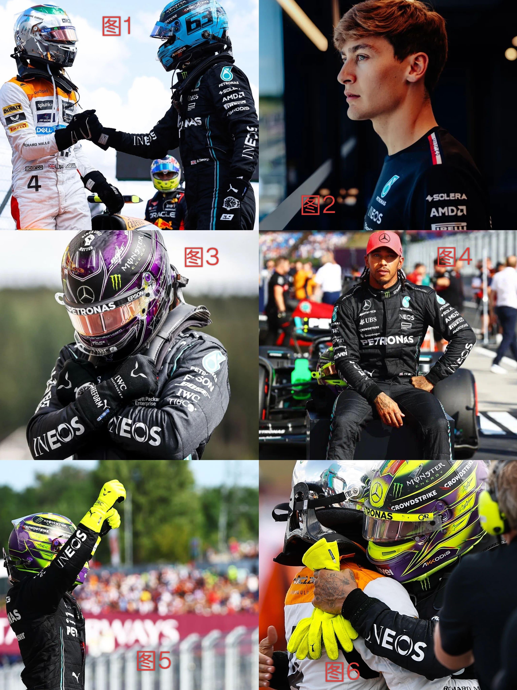
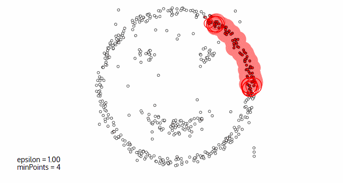

# 2.1. 无监督学习(Unsupervised Learning)

## 2.1.1. 什么是无监督学习(Unsupervised Learning)？
我们来看一个例子：

对于上面这张图，你会怎么把它们分成两组呢？有什么依据呢？肯定会观察图片的一些共同点和不同点。

按照图片里有一个人还是多个人来区分：
- 一个人：图2、3、4、5
- 多个人：图1、6

按照图片里的人有没有戴赛车头盔来区分：
- 没戴头盔：图2、4
- 戴了头盔：图1、3、5、6

等等...

这些划分方式是没有对错之分的，都完成了分成两组的任务。

这就是无监督学习的核心：**没有标准的答案（正确的标签），只要你能找到数据共同点并分类。**

## 2.1.2. 无监督学习的优点与应用
***无监督学习是一种机器学习方法，它在没有标签或监督信息的情况下，从数据中发现隐藏的模式或结构，自动进行分类或分群。***

这种学习方法的优点在于：
- 算法不受监督信息（偏见）的约束，可能考虑到新的信息。
  就以上文的例子来说，如果你告诉计算机按照图片里有一个人还是多个人来区分那它就不会去按照图片里的人有没有戴赛车头盔来区分，但其实确实也可以这么区分。也就是说他可以帮你找到一些额外的相似之处。

- 不需要标签数据，极大程度扩大数据样本。
  监督式学习的每个数据你都需要有正确与否的标注，但是无监督学习不需要这些标注，意味着它可以接收更多的数据。

无监督学习的主要应用场景有：
- 聚类分析：将数据分成不同的组，使得同一组内的数据点相似，而不同组的数据点差异较大
- 关联规则：找到数据之间的关系
- 维度缩减：减少数据的维度，同时尽可能保留原始数据的重要信息

这其中运用最广的就是**聚类分析**，也是这章的重点。

## 2.1.3. 监督学习 vs. 无监督学习
### 监督学习

在监督学习中，每一个数据都是标记好的，也就是图中圆形和`x`的标注。

用数学式表达的话，监督学习的训练数据是：
$$
\{(x^{(1)}, y^{(1)}), (x^{(2)}, y^{(2)}), \dots, (x^{(m)}, y^{(m)})\}
$$
- 有输入`x`还有对应的标签`y`

### 无监督学习

无监督学习没有标注，数据都是一个样，计算机需要自己去找其中的区别。

用数学式表达的话，无监督学习的训练数据是：
$$
\{x^{(1)}, x^{(2)}, \dots, x^{(m)}\}
$$
- 只有数据`x`，没有标签`y`

## 2.1.4. 聚类分析
聚类分析又称为*群分析*，根据对象某些*属性的相似度*，将其自动化分为不同的类别。

它会用在以下几个领域：
- 商业领域：对客户进行划分
- 生物领域：基因聚类分析
- 新闻领域：把不同的新闻划分到不同点关键词下

下面我们来介绍一下聚类分析常用的算法：
### 1. KMeans聚类
- 根据数据与中心点距离划分类别
- 基于类别数据更新中心点
- 重复过程直到收敛

它的优点是：
- 实现简单、收敛快

它的缺点是：
- 需要指定类别数量

### 2. 均值漂移聚类(MeanShift)
- 在中心点一定区域检索数据点
- 更新中心
- 重复流程直到中心点稳定

它的优点：
- 自动发现类别数量，不需要人工选择

它的缺点：
- 需要选择区域半径

### 3. DBScan算法(基于密度的空间聚类算法)
- 基于区域点密度筛选有效数据
- 基于有效数据向周边扩张，直到没有新点加入

它的优点：
- 过滤噪音数据
- 不需要人为选择类别数量

它的缺点：
- 数据密度不同时影响结果
