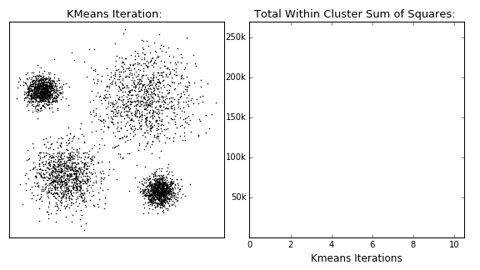
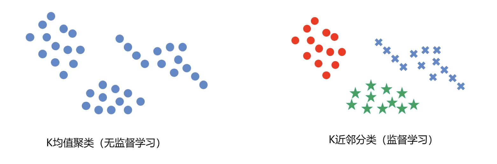
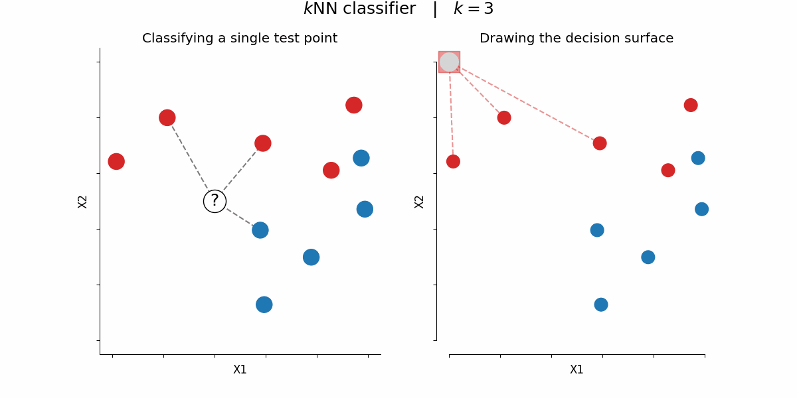

# 2.2. 聚类分析算法理论

## 2.2.1. K均值聚类(KMeans Analysis)
K均值算法是以空间中K个点为中心进行聚类，对最靠近他们的对象归类，是聚类算法中*最为基础*但也**最为重要**的算法。
### 数学原理
计算数据点与各簇中心点的距离：
$$
{dist}(x_i, u_j^t)
$$
然后根据距离归类：
$$
x_i \in u^t_{\text{nearest}}
$$
最后更新中心：
$$
u_j^{t+1} = \frac{1}{k} \sum_{x_i \in S_j} x_i
$$
- $S_j$: $t$ 时刻第 $j$ 个区域簇
- $k$: 包含在 $S_j$ 范围内点的个数
- $x_i$: 包含在 $S_j$ 范围内的点
- $u_j^t$: $t$ 状态下第 $j$ 区域中心

### 展开分析
我们来一步一步展开分析一下：
#### 1. 计算数据点与各簇中心点的距离
$$
\text{dist}(x_i, u_j^t)
$$
这表示计算 **数据点**$x_i$与**第**$j$ **个簇中心** $u_j^t$ (注：$u_j^t$指的是**第**$j$**个簇在第**$t$**轮迭代时的中心点**)之间的距离。计算时一般都使用欧几里得距离：
$$
\text{dist}(x_i, u_j^t) = \sqrt{\sum_{d} (x_{id} - u_{jd}^t)^2}
$$

#### 2. 根据距离归类
$$
x_i \in u^t_{\text{nearest}}
$$
这表示 **将数据点**$x_i$**归类到最近的簇中心**（即属于距离最近的$u_j^t$代表的簇）。

具体步骤是：
- 计算所有簇中心$u_j^t$与数据点$x_i$的距离。
- 找到最近的中心：
$$
j^* = \arg\min_j \text{dist}(x_i, u_j^t)
$$
- 将$x_i$归类到最近的簇，即属于$j^*$号簇。

#### 3. 更新中心
$$
u_j^{t+1} = \frac{1}{k} \sum_{x_i \in S_j} x_i
$$
这一公式用于**更新每个簇的中心点**，通过计算该簇内所有点的**均值**来更新中心。
- $S_j$是第$j$个簇内的所有数据点集合。
- $k$是该簇内数据点的个数。

**计算步骤**：
- **找到第**  j  **个簇的所有数据点**，即所有归入该簇的$x_i$。
- **计算这些点的均值**，更新该簇的中心：
$$
u_j^{t+1} = \frac{1}{k} \sum_{x_i \in S_j} x_i
$$
- **重复以上步骤，直到收敛**（即簇中心不再变化）。

### 算法流程
- 选择聚类的个数$k$
- 确定聚类中心
- 根据点到聚类中心距离来确定各个点所属类别
- 根据各个类别数据更新聚类中心
- 重复以上步骤直到收敛(中心点不再变化时)

### 优缺点
优点：
- 原理简单，实现容易，收敛速度快
- 参数少，方便使用

缺点：
- 必须确定簇的数量
- 随机选择初始聚类中心会导致结果缺乏一致性

## 2.2.2. KMeans vs. KNN
KMeans的中文是K均值聚类，KNN的中文名是K近邻分类。这两者虽然名字很像，但是确是完全不同的两种算法。

有很多人容易搞混这两种算法，所以这里专门比较一下。

这幅图已经非常直观地展现了两者本质上的区别——KMeans是无监督学习，K近邻分类是监督学习。

在这里我们也介绍一下KNN：

给定一个训练数据集，对新的输入实例，在训练数据集中找到与该实例最邻近的K个实例，这K个实例的**多数属于某个类**，就把该输入实例分类到这个类中。

## 2.2.3. 均值漂移聚类(MeanShift)
均值漂移算法是一种**基于密度梯度上升**的聚类算法（沿着密度上升方向寻找聚类中心点）

均值漂移算法相比K均值算法最大的优势就在于**它不需要知道最终要分成几个簇**。

### 数学原理
先均值偏移：
$$
M(x) = \frac{1}{k} \sum_{x_i \in S_h} (x_i - u)
$$

再更新中心：
$$
u^{t+1} = u^t + M^t
$$

其中：
- $S_h$: 以 $u$ 为中心点，半径为 $h$ 的高维球区域
- $k$: 包含在 $S_h$ 范围内点的个数
- $x_i$: 包含在 $S_h$ 范围内的点
- $M^t$: $t$ 状态下求得的均值偏移向量
- $u^t$: $t$ 状态下的中心

### 展开分析
接下来我们来展开分析一下：

#### 1. 均值偏移计算
$$
M(x) = \frac{1}{k} \sum_{x_i \in S_h} (x_i - u)
$$
其中：
- $S_h$：以$u$为中心，半径为$h$的**高维球区域**（即邻域）
- $k$：邻域$S_h$内的点个数
- $x_i$：邻域$S_h$内的点
- $M(x)$：**均值偏移向量**，从当前中心指向邻域点均值（密度上升方向）

这个公式会：
- 计算邻域内所有点$x_i$相对当前中心点$u$的偏差 ($x_i - u$)
- 对所有偏差求均值，得到中心点的漂移方向$M(x)$
- **如果**$M(x)$**不为零**，说明局部密度均值不在$u$处，需要沿$M(x)$方向调整$u$的位置

核心思想是：
- 计算 **当前中心点**$u$位置的偏移量$M(x)$ 
- 这个偏移量基于$u$周围的**邻域点**进行计算

#### 2. 更新中心点
$$
u^{t+1} = u^t + M^t
$$
这一公式用于**更新均值漂移的中心点**：
- 当前中心点$u^t$**沿着均值偏移量**$M^t$**方向移动**，得到新的中心$u^{t+1}$
- 该迭代过程 **不断调整中心点位置**，直到收敛（即$M(x)$接近0）

### 算法流程
- 随机选择未分类的点作为中心点
- 找出离中心点距离在带宽之内的点，记作集合$S$
- 计算从中心点到集合$S$中每个元素的偏移向量$M$
- 中心点以向量$M$移动
- 重复步骤2-4直到收敛
- 重复以上所有步骤直到所有的点都被归类
- 分类：根据每个类对每个点的访问频率，取访问频率最大的那个类作为当前集的所属类

