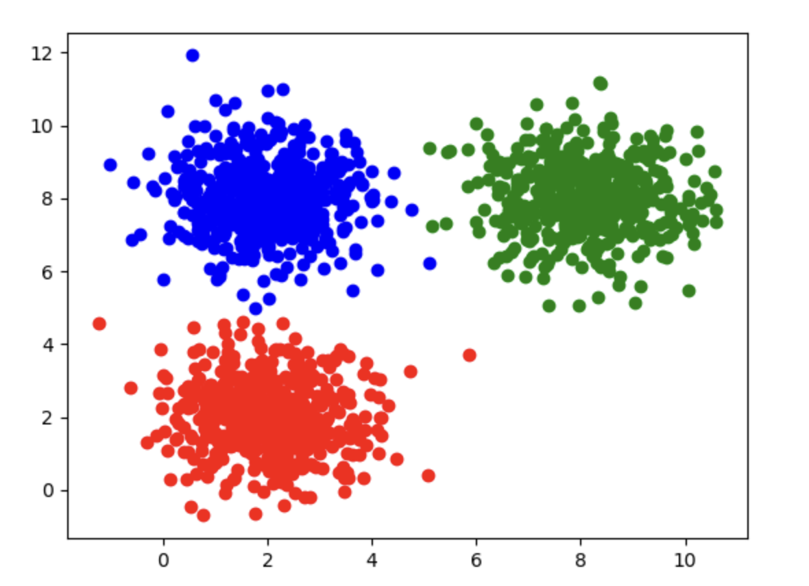

# 2.5. 使用KNN与MeanShift实战

本文接续 [2.3. K均值聚类(KMeans Analysis)实战(基础)](../2.3/2.3._K均值聚类(KMeans_Analysis)实战(基础).md) 和 [2.4. K均值聚类(KMeans Analysis)实战(进阶)](../2.4/2.4._K均值聚类(KMeans_Analysis)实战(进阶).md)， 没看过的建议先看。

**重要区分：** KNN（`KNeighborsClassifier`）是**有监督分类**算法——训练时需要标签 `y`。MeanShift 是**无监督聚类**——不使用标签。把两者放在同一篇文章里是为了对照（另见 [2.2](../2.2/2.2._聚类分析算法理论_K均值聚类(KMeans_Analysis)、KNN(K近邻分类)、均值漂移聚类(MeanShift).md)），并不是因为 KNN 属于聚类方法。

## 2.5.1. 一些准备工作
接下来，请你确保你的Python环境中有`pandas`、`matplotlib`、`scikit-learn`和`numpy`这几个包，如果没有，请在终端输入指令以下载和安装：
```bash
pip install pandas matplotlib scikit-learn numpy
```

我把`.csv`数据文件放在[GitCode](https://gitcode.com/weixin_71793197/machine_learning_guide/blob/main/2.3/KMeans_Data.csv)上了，点击链接即可下载。

训练数据有3栏：`x1`、`x2`和`label`，`x1`和`x2`是两个输入变量，`label`是标签(0,1,2其中一个)。KNN 会同时使用特征和标签；MeanShift 只使用特征。这些数据在特征空间中形成三个自然分组。

下载好后把它移到你的Python项目文件夹里即可。

## 2.5.2. 用KNN做分类（有监督；不是聚类）

### Step 1: 读取数据
一样的使用`pandas`库来读取`csv`文件，顺便使用`head`方法来查看一下数据的前几项：
```python
# 读取数据  
import pandas as pd  
data = pd.read_csv('KMeans_Data.csv')  
  
print(data.head())
```

输出：
```
         x1        x2  label
0  2.496714  2.926178      0
1  1.861736  3.909417      0
2  2.647689  0.601432      0
3  3.523030  2.562969      0
4  1.765847  1.349357      0
```

其散点分布如图所示：



### Step 2: 给`x`和`y`赋值
```python
# 给x和y赋值  
x = data.drop(['label'], axis=1)  
y = data.loc[:,'label']
```

### Step 3: 训练模型
把特征和标签喂给`scikit-learn`下的KNN分类器进行训练：
```python
# 训练模型  
from sklearn.neighbors import KNeighborsClassifier  
knn = KNeighborsClassifier(n_neighbors=3)  
knn.fit(x, y)
```
- `n_neighbors`是KNN中指定的K值(详见 [2.2. 聚类分析算法理论](../2.2/2.2._聚类分析算法理论_K均值聚类(KMeans_Analysis)、KNN(K近邻分类)、均值漂移聚类(MeanShift).md))
- 与 KMeans/MeanShift 不同，KNN 训练时使用标签：`fit(x, y)`

### Step 4: 获取预测值
训练完成后，可以随便找一个点看KNN模型会给它分到哪一类：
```python
# 一个小测
y_predict = knn.predict([[10, 10]])  
print(y_predict)
```

输出：
```
[1]
```

### Step 5: 计算准确率
```python
# 计算准确率  
from sklearn.metrics import accuracy_score  
y_predict = knn.predict(x)  
print(accuracy_score(y, y_predict))
```

输出:
```
1.0
```

因为 KNN 是有监督的，并且用 `label` 进行了训练，其预测类别 ID 在设计上就与 `label` 对齐（这里训练集准确率为 1.0）。这与 KMeans/MeanShift 不同：后者的簇编号是任意的，与 `label` 比较前可能需要重映射（见 [2.4](../2.4/2.4._K均值聚类(KMeans_Analysis)实战(进阶).md)）。

## 2.5.3. MeanShift实现聚类分析
### Step 1: 读取数据
与上文相同，这里不再重复。

### Step 2: 给`x`和`y`赋值
与上文相同，这里不再重复。MeanShift 只需要 `x`；`y` 仅在后面评估时使用。

### Step 3: 训练模型
把数据喂给`scikit-learn`下的MeanShift模型进行训练即可：
```python
# 训练模型  
from sklearn.cluster import MeanShift, estimate_bandwidth  
bandwidth = estimate_bandwidth(x, quantile=0.3)  
  
model = MeanShift(bandwidth=bandwidth)  
model.fit(x)
```
- `estimate_bandwidth(x, quantile=0.3)` 用于根据数据估计带宽，再传入 `MeanShift(bandwidth=bandwidth)`。`quantile` 控制带宽大小（与 sklearn 在 `MeanShift(bandwidth=None)` 时默认估计带宽的方式一致）。也可以传入 `n_samples` 用子样本来估计(详见 [2.2. 聚类分析算法理论](../2.2/2.2._聚类分析算法理论_K均值聚类(KMeans_Analysis)、KNN(K近邻分类)、均值漂移聚类(MeanShift).md))。

### Step 4: 获取预测值
```python
# 获取预测值  
y_predict = model.predict(x)
```

### Step 5: 计算准确率
```python
# 计算准确率  
from sklearn.metrics import accuracy_score  
print(accuracy_score(y, y_predict))
```

输出：
```
0.9986666666666667
```
这说明我们的模型效果非常好，准确率非常接近百分百。

还是强调一下MeanShift模型本身不知道`label`，所以它的划分是随意的，虽然也会分为3类，但MeanShift划分的0、1、2类不一定和`label`的0、1、2类一一对应。

这里只是凑巧一一对应上了，如果你发现正确率异常的低，大概率是标签没对上。

如果你需要校正标签，详见 [2.4. K均值聚类(KMeans Analysis)实战(进阶)](../2.4/2.4._K均值聚类(KMeans_Analysis)实战(进阶).md)。
