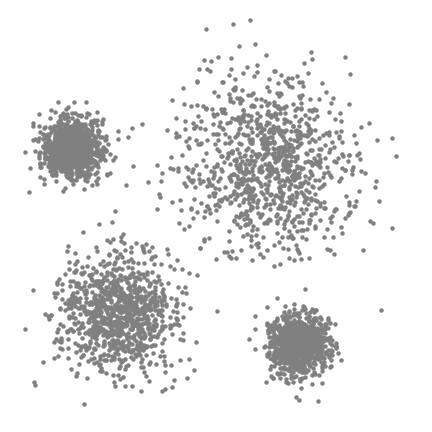
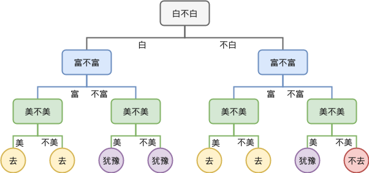
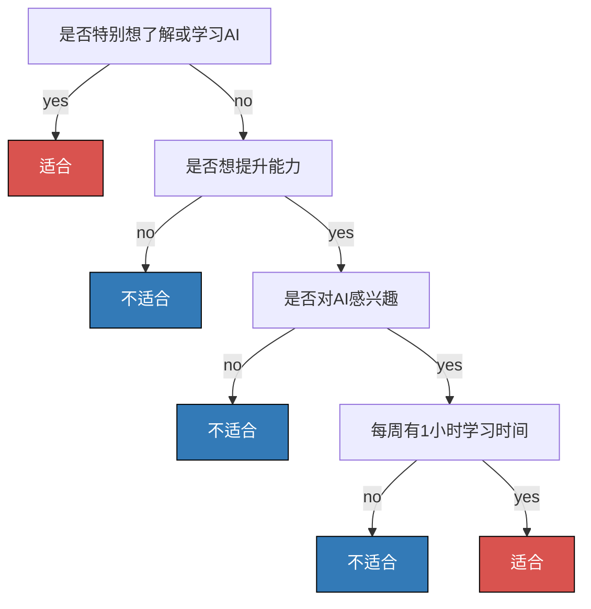
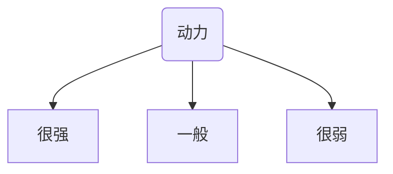
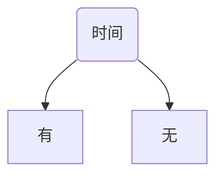

# 3.1. 决策树理论(基础)

## 3.1.1. 常用的分类方法
在之前的文章中我们介绍了以下的这些分类方法：
- 逻辑回归：在知道标签的情况下来寻找决策边界

- KMeans和MeanShift：在不知道标签的情况下进行划分

MeanShift:

- KNN：根据已知标签的近邻对新样本进行分类

## 3.1.2. 新的分类方法：决策树
这里我们介绍一个新的分类方法：决策树。

它的特点在于会形成多层的“是否判断”：

## 3.1.3. 逻辑回归 vs. 决策树
我们用一个例子来了解一下决策树，顺便借此把它和逻辑回归做一个清晰的分析：

>根据用户的学习动力、能力提升意愿、兴趣度、空余时间，判断其是否适合学习AI的课程。假设判断需要4个因素——学习，能力、兴趣、时间。

### 逻辑回归解法
使用逻辑回归来解决这个问题会需要先建立一个模型：
$$
Z = w_1 \times 动力 + w_2 \times 时间 + w_3 \times 兴趣 + w_4 \times 能力
$$
- 其中$w_1$、$w_2$、$w_3$、$w_4$是权重参数

再搭配上逻辑回归的逻辑(Sigmoid)函数：
$$
P(x) = \frac{1}{1 + e^{-x}}
$$
即可算出$P(x)$，也就是适合学习某个课程的概率。

### 决策树解法
而使用决策树会使用到如下的框架：

### 总结
逻辑回归的思路是把所有的因子都一次性都给模型，然后让它建立一个方程，预测出对应的概率。

决策树则是进行很多是否(`if-else`)的判断。

## 3.1.4. 决策树的定义
决策树是一种对实例进行**分类**的**树形结构**，通过**多层判断**区分目标所属类别。

其本质是通过多层判断，从训练数据集中归纳出一组分类规则。

它的优点在于：
- 计算量小，运算速度快
- 易于理解，可以清晰地查看各属性的重要性

它的缺点在于：
- 没有考虑到属性间的相关性
- 样本类别分布不均时，容易影响模型表现

## 3.1.5. 决策树求解核心问题
假设给定训练数据集：

$$
D = \{(x_1, y_1), (x_2, y_2), ..., (x_N, y_N)\}
$$

其中， $x_i = (x_i^{(1)}, x_i^{(2)}, ..., x_i^{(m)})^T$ 为输入实例，$m$ 为特征个数，$y_i \in \{1,2,3,...,K\}$为类标记，$i = 1,2,...,N$，$N$ 为样本容量。

我们的目标是根据训练数据集结构创建一个**决策树模型**，使它能对实例进行正确的分类。

决策树求解的核心问题就在于**特征选择**。更具体地说是：**每一个节点应该选用哪个特征。**

节点之后会按所选特征的取值进行分叉，因此选择节点本身的特征是比较关键的。

## 3.1.6. 决策树求解举例
我们还是使用上文的那个简单例子：

>根据用户的学习动力、能力提升意愿、兴趣度、空余时间，判断其是否适合学习AI的课程。假设判断需要4个因素——学习，能力、兴趣、时间。

数据如下：

| ID  | 动力  | 想提升能力 | 有兴趣 | 时间  | 类别    |
| --- | --- | ----- | --- | --- | ----- |
| 1   | 一般  | 否     | 否   | 有   | 否     |
| 2   | 一般  | 否     | 是   | 无   | 否     |
| 3   | 很强  | 是     | 是   | 有   | **是** |
| 4   | 一般  | 否     | 否   | 有   | 否     |
| 5   | 一般  | 否     | 否   | 无   | 否     |
| 6   | 一般  | 是     | 否   | 无   | 否     |
| 7   | 一般  | 是     | 是   | 有   | **是** |
| 8   | 一般  | 是     | 是   | 有   | **是** |
| 9   | 很强  | 是     | 是   | 有   | **是** |
| 10  | 很弱  | 否     | 否   | 无   | 否     |

这些数据有些因子有3种分支，有的只有2种：

...

**建立决策树我们就得决定是以哪个因子作为顶点**，这点非常重要，因为不同的特征决定不同的决策树：是以动力呢？还是以时间呢？亦或者是以其它因子呢？

我们一般有3种方法：
- ID3（详见 [3.2. 决策树理论(进阶)](../3.2/3.2._决策树理论(进阶)_ID3算法、信息熵原理、信息增益.md)）
- C4.5
- CART
