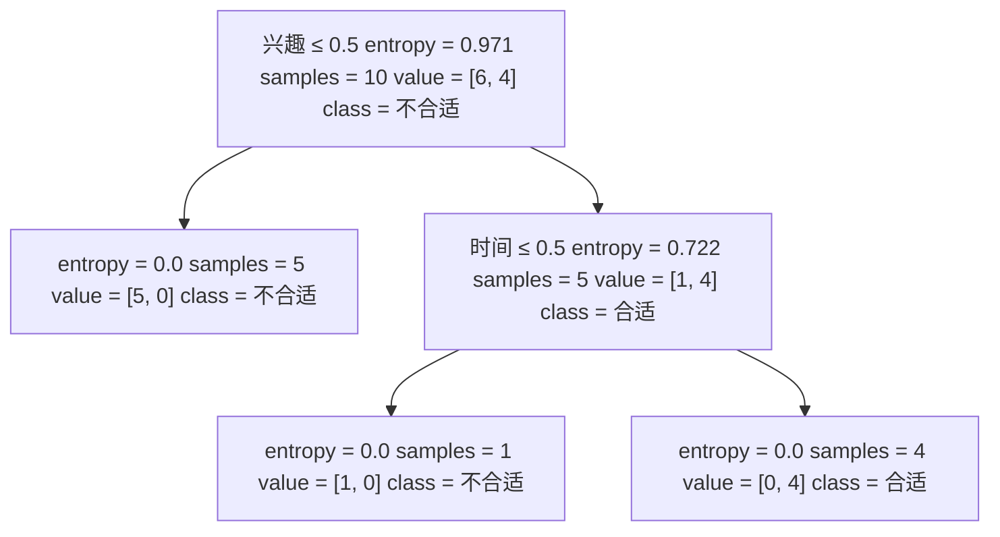

# 3.2. 决策树理论(进阶)：ID3算法、信息熵原理、信息增益

本文承接 [3.1. 决策树理论(基础)](../3.1/3.1._决策树理论(基础).md)，没看过的建议先看前文。

## 3.2.1. ID3算法数学原理
ID3方法利用*信息熵原理*选择**信息增益最大**的属性作为分类属性，递归地拓展决策树的分支，完成决策树的构造。

信息熵(entropy)是度量随机变量不确定性的指标。熵越大，变量的不确定性就越大。假定当前样本集合$D$中第$k$类样本所占的比例为$p_k$，则$D$的信息熵为：
$$
\text{Ent}(D) = - \sum_{k=1}^{|y|} p_k \log_2 p_k
$$
$Ent(D)$的值越小，变量的不确定性越小。$p_k=1$时，就只有一种情况，代表没有不确定性，所以熵就是$Ent(D) = 0$。

根据信息熵，可以计算以属性$a$进行样本划分带来的信息增益：
$$
\text{Gain}(D, a) = \text{Ent}(D) - \sum_{v=1}^{V} \frac{D^v}{D} \text{Ent}(D^v)
$$
- $V$为根据属性$a$划分出的类别数
- $D$为当前样本总数
- $D^v$为类别$v$样本数，也就是属性$a$取值$v$时的子数据集。

其中：
- $\text{Ent}(D)$是划分前的信息熵，在划分前，数据集$D$可能包含多个类别

- $\sum_{v=1}^{V} \frac{D^v}{D} \text{Ent}(D^v)$是划分后的信息熵：
  - 通过属性$a$进行划分后，$D$被分割成多个子集$D^1$, $D^2$, $\dots$, $D^V$，每个子集有各自的信息熵$\text{Ent}(D^v)$
  - 计算时，每个子集的信息熵按其占总数据集的比例$\frac{D^v}{D}$进行加权求和

假如我们有以下数据：

| ID  | 动力  | 想提升能力 | 有兴趣 | 时间  | 类别    |
| --- | --- | ----- | --- | --- | ----- |
| 1   | 一般  | 否     | 否   | 有   | 否     |
| 2   | 一般  | 否     | 是   | 无   | 否     |
| 3   | 很强  | 是     | 是   | 有   | **是** |
| 4   | 一般  | 否     | 否   | 有   | 否     |
| 5   | 一般  | 否     | 否   | 无   | 否     |
| 6   | 一般  | 是     | 否   | 无   | 否     |
| 7   | 一般  | 是     | 是   | 有   | **是** |
| 8   | 一般  | 是     | 是   | 有   | **是** |
| 9   | 很强  | 是     | 是   | 有   | **是** |
| 10  | 很弱  | 否     | 否   | 无   | 否     |

假如我们要算动力的信息增益：
- 属性$a$就是动力
- 类别数$V$就是3(动力有一般、很强、很弱三个类别)
- 样本总数$D$就是10

## 3.2.2. 举例计算
使用ID3的目标就是**划分后样本分布不确定性尽可能小**，即划分后信息熵小，信息增益大。

我们就使用上文表格里的数据来计算该使用哪一个因子作为顶点节点。

为了判断属性，我们得计算每一个属性下对应的信息增益。

先计算进行属性划分之前的信息熵，套用公式：
- 总共有两个类别——“是”和“否”
- “否”一共有6
- 所以$p_1 = 6/10$，$p_2 = 4/10$

代入公式：
$$
\text{Ent}(D) = - \left( \frac{6}{10} \log_2 \frac{6}{10} + \frac{4}{10} \log_2 \frac{4}{10} \right)  \approx 0.971
$$
这是属性划分之前的信息熵，接下来计算划分之后的，这里我们取兴趣这个属性为例：

属性有两种划分——“是”和“否”，那我们就分别计算“是”和“否”对应的信息熵然后乘上比例再求和：

“否”有5个，且每当兴趣为“否”时最后的类别一栏的值就是“否”，没有其它可能性，就代表$Ent(D_1) = 0$。

“是”有5个，且当兴趣为“是”时最后的类别一栏的值有1个是“否”，4个是“是”，也就是$p_1 = 1/5$，$p_2 = 4/5$，代入计算$Ent(D_2)$:
$$
\text{Ent}(D_2) = - \left( \frac{1}{5} \log_2 \frac{1}{5} + \frac{4}{5} \log_2 \frac{4}{5} \right) \approx 0.722
$$
有了这些信息就可以计算划分后的信息熵：
$$
\sum_{v=1}^{V} \frac{D^v}{D} \text{Ent}(D^v) = \frac{5}{10} \times Ent(D_1) + \frac{5}{10} \times Ent(D_2)
$$
最后的结果是：
$$
\sum_{v=1}^{V} \frac{D^v}{D} \text{Ent}(D^v) \approx 0.361
$$

再把这个结果带入计算信息增益的函数即可：
$$
Gain = Ent(D) - \sum_{v=1}^{V} \frac{D^v}{D} \text{Ent}(D^v) \approx 0.971 - 0.361 = 0.61
$$
我们把其他也算出来，方法同上，我就只展示结果不展示过程了:

|      | 动力  | 能力  | 兴趣  | 时间  |
|------|------|------|------|------|
| **Ent**  | 0.60  | 0.36  | 0.36  | 0.55  |
| **Gain** | 0.37  | **0.61**  | **0.61**  | 0.42  |

兴趣和能力划分后的信息增益并列最大（划分后的纯度相同）。二者都可以作为根节点；这里我们取兴趣作为第一个节点。

## 3.2.3. 最终效果
我们可以看一下决策树算法最后算出来的效果：

可以看到，原本有4个属性，但是这里只是用了2个属性就把所有可能性划分出来了（基于表格提供的数据）。

