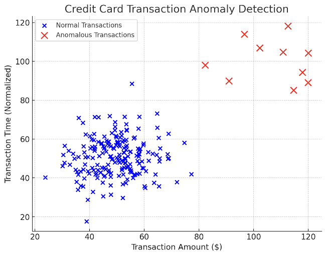
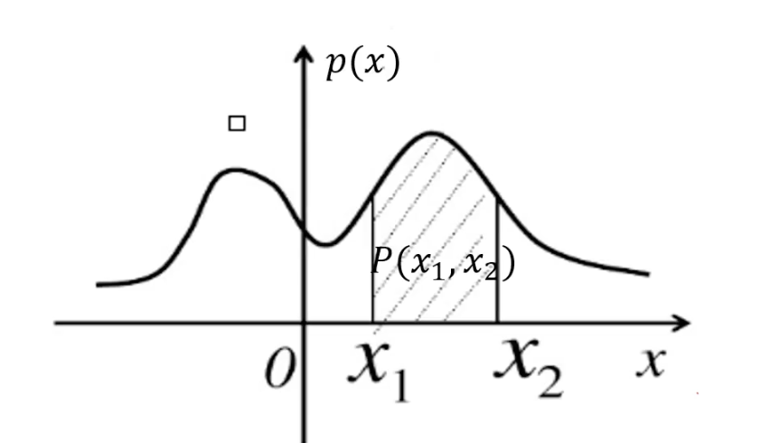
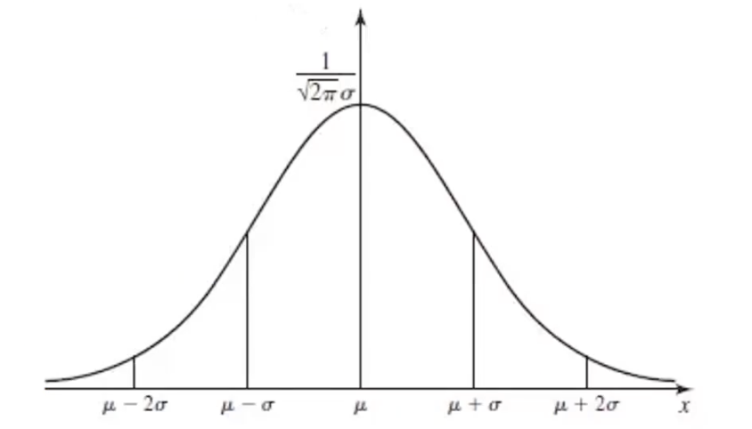

# 3.3. 异常检测(Anomaly Detection)理论：概率密度、正态分布

## 3.3.1.什么是异常检测？
我们来举一个现实生活中的例子：

>银行是如何判断信用卡的消费是不是被盗刷的呢？有2个很重要的因素就是交易金额的大小和交易时间的早晚，那些交易金额异常的大且交易时间异常的晚的消费会被识别为有盗刷嫌疑。

图中的蓝点代表正常的消费，红点代表有盗刷嫌疑的消费。我们就可以通过异常检测来找出有盗刷嫌疑的消费并进行阻止。

更多的案例：
- 劣质产品检测（工业）
- 缺陷基因检测（医疗）
- ......

## 3.3.2. 一维异常检测的数学原理
### 整体思路
异常检测就是根据输入数据，对**不符合预期模式**的数据进行识别。

假设我们有一个一维的数据集：
$$
\{ x^{(1)}, x^{(2)}, \dots, x^{(m)} \}
$$
它在一维中的分布如下：

我们需要找到异常点得先画出概率密度，如下：

左右的概率密度比较低，中间的概率密度高。当有些数据出现在密度小于$\epsilon$（决策阈值）的时候，就认为这个数据是异常的。

### 概率密度
概率密度函数是一个描述随机变量在**某个确定的取值点附近**的可能性的函数。

其中x轴对应可能的数据点或某一个事件，$p(x)$是概率密度（本身并不是概率）。

如果我们要算区间$(x_1,x_2)$的概率，就是概率密度求积分：
$$
P(x_1, x_2) = \int_{x_1}^{x_2} p(x) \,dx
$$

### 正态分布(高斯分布)
正态分布(高斯分布)的概率密度函数是：
$$
p(x) = \frac{1}{\sigma \sqrt{2\pi}} e^{-\frac{(x - \mu)^2}{2\sigma^2}}
$$
其中：
- $p(x)$：在正态分布下，随机变量$x$取值在某个位置的概率密度
- $\mu$（均值，Mean）：决定正态分布的中心位置，表示数据的平均值
- $\sigma$（标准差，Standard Deviation）：衡量数据的离散程度，决定正态分布的**宽度**，值越大，曲线越平缓；值越小，曲线越陡峭
- $\sigma^2$（方差，Variance）：标准差的平方，衡量数据分布的**离散程度**
- $\sqrt{2\pi}$：归一化常数，确保概率密度函数的总面积为1

$\mu$(数据均值)和$\sigma$(标准差)的计算公式是：
$$
\mu = \frac{1}{m} \sum_{i=1}^{m} x^{(i)}, \quad

\sigma^2 = \frac{1}{m} \sum_{i=1}^{m} (x^{(i)} - \mu)^2
$$
正态分布（高斯分布）的图形如下：

这是一条对称分布的曲线，以均值$\mu$作为对称轴。两侧的$\sigma$越小代表数据越集中，在图像上就会形成一个更窄的峰。

### 计算流程
- 计算数据均值$\mu$和标准差$\sigma$
- 计算对应的高斯分布概率函数：
$$
p(x) = \frac{1}{\sigma \sqrt{2\pi}} e^{-\frac{(x - \mu)^2}{2\sigma^2}}
$$
- 根据数据点的概率密度进行判断：如果该点对应的密度小于决策阈值$\epsilon$，那么就把该点视为异常点。
### 举例计算
我们举个小例子：

| $x_1$ | $x_2$ | $x_3$ | $x_4$ |
| ----- | ----- | ----- | ----- |
| -1    | 0     | 1     | 2     |

我们先来算数据均值$\mu$：
$$
\mu = \frac{1}{m} \sum_{i=1}^{m} x^{(i)} = \frac{(-1) + 0 + 1 + 2}{4} = \frac{2}{4} = 0.5
$$
再算标准差$\sigma$：
$$
\sigma^2= \frac{1}{4} \left[ (-1 - 0.5)^2 + (0 - 0.5)^2 + (1 - 0.5)^2 + (2 - 0.5)^2 \right] = 1.25
$$
带入概率密度函数（这里我们只展示$x_1$的计算过程，其他的算法一样）：
- 计算前导因子：
$$
\frac{1}{\sigma \sqrt{2\pi}} = \frac{1}{1.118 \times \sqrt{2\pi}}
= \frac{1}{1.118 \times 2.506}
= \frac{1}{2.801} \approx 0.3571
$$

- 计算指数部分：
$$
-\frac{(x - \mu)^2}{2\sigma^2} = -\frac{(-1 - 0.5)^2}{2 \times (1.118)^2}
= -\frac{(-1.5)^2}{2 \times 1.25}
= -\frac{2.25}{2.5}
= -0.9
e^{-0.9} \approx 0.4066
$$

- 计算最终的概率密度：
$$
p(-1) = 0.3571 \times 0.4066 \approx 0.1451
$$

## 3.3.3. 高维异常检测的数学原理
但是在实际场景中我们的数据往往是高于一维的：
$$
\left\{
\begin{array}{cccc}
x_1^{(1)}, & x_1^{(2)}, & \dots, & x_1^{(m)} \\
\vdots & \vdots & \ddots & \vdots \\
x_n^{(1)}, & x_n^{(2)}, & \dots, & x_n^{(m)}
\end{array}
\right\}
$$
这个时候该如何计算呢？

其实核心思路和一维是一样的：
- 我们先计算出数据均值$\mu_1, \mu_2, \dots, \mu_n$和标准差$\sigma_1, \sigma_2, \dots, \sigma_n$，公式同上：
$$
\mu = \frac{1}{m} \sum_{i=1}^{m} x^{(i)}, \quad
\sigma^2 = \frac{1}{m} \sum_{i=1}^{m} (x^{(i)} - \mu)^2
$$
- 计算好了这些以后就能计算出对应维度下的概率密度函数$p(x_1),\dots,p(x_n)$，把它们相乘就得到高维下的总概率密度函数：
$$
p(x) = \prod_{j=1}^{n} p(x_j; \mu_j, \sigma_j^2) = \prod_{j=1}^{n} \frac{1}{\sigma_j \sqrt{2\pi}} e^{-\frac{(x_j - \mu_j)^2}{2\sigma_j^2}}
$$
- 最后用高维下的总概率密度来和决策阈值$\epsilon$做比较，小于阈值的部分就是异常数据：
$$
p(x) < \epsilon
$$
