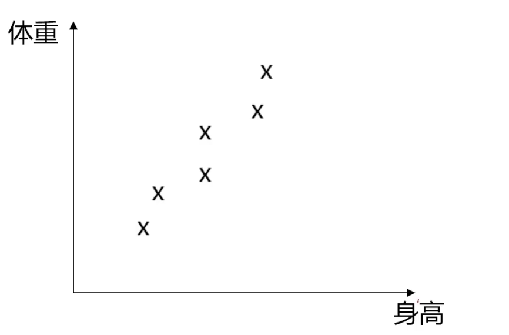
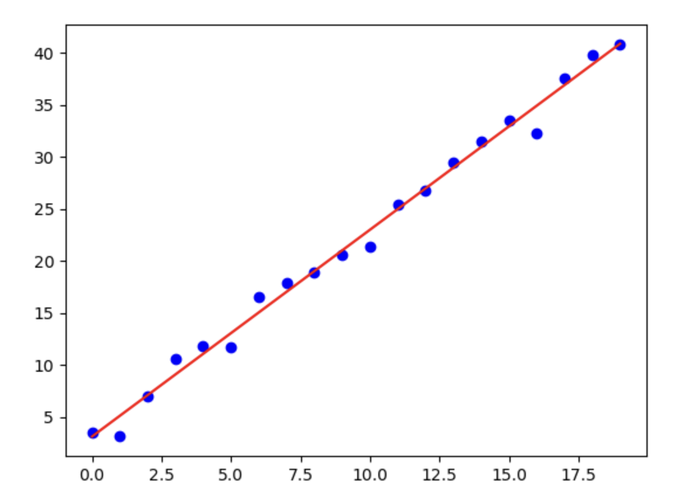

# 3.4. 主成分分析(Principal Component Analysis)理论

## 3.4.1. 数据降维(Dimensionality Reduction)
数据降维指的是把数据从高维度转为低维度，在这个过程中尽可能保证最后创建出的模型的精度。

具体是怎么样的我们通过一个例子来讲解：

>通过美国1929-1938年各年经济数据，预测国民收入与支出。具体的数据包括17个指标：雇主补贴、消费资料和生产资料、纯公共支出、净增库存、股息、利息、外贸平衡等...

如果按照标准的做法我们需要为每一个指标都进行一次建模，但这对于当时的计算机能力来说非常棘手。

所以当时的统计学家就使用了数据降维把数据降到了只剩3维：
- 总收入$F_1$
- 总收入变化率$F_2$
- 经济发展趋势$F_3$

仅仅通过这三个指标就达到了97.4%的预测精度，可以说非常厉害。

### 定义
数据降维是指在某些限定条件下，降低随机变量个数，得到一组“不相关”的主变量的过程。

其作用在于：
- 减少模型分析的数据量，提升处理效率，降低计算难度
- 实现数据的可视化

### 例子
我们先看一个从2维降到1维的例子：

原本这些散点都是二维数据，但是我们发现身高和体重之间有正相关性，所以我们可以把这些散点投影到一条直线上。用这个直线的解析式来代替身高和体重。

这条直线不叫身高也不叫体重，而是一个综合因子，是身高和体重的组合。然后我们把对应的数据点投影在上面。

## 3.4.2. 数据降维的实现：主成分分析(Principal Component Analysis)
主成分分析(Principal Component Analysis，简称PCA)是数据降维技术中应用最多的方法。

使用主成分分析的目标是**寻找$k(k<n)$ 维的新数据，使它们反映事物的主要特征**。其核心是**在信息损失尽可能小的情况下，降低数据维度。**

而在降维过程中损失的信息就是散点和直线的偏差值之和。也就是说，**散点到直线的距离$\delta$之和要尽可能小**。

从三维降二维就是投影到向量$u_1$和$u_2$形成的平面，保持所有散点到这个平面的偏差值最小：

从$n$维降到$k$维就是投影到$u_1, u_2, \dots, u_k$形成的空间，保持所有散点到这个空间的偏差值最小。

---

那怎么样保证投影的空间能保留最主要的信息呢？

我们之前讲到了当数据的维度很高时，每个维度之间会有很多的相关性。降维到最后你会希望每一个维度里的数据相关性最少，如果多个维度的特征高度相关，就意味着数据中的信息是**冗余的**，可以用更少的维度来表示相同的信息，就得继续使用PCA。

---

那么如何实现降维到最后你会希望每一个维度里的数据不要有太多的相关性呢？

我们需要使投影后数据的方差最大，因为方差越大数据也越分散。

计算过程是：
- 原始数据预处理：也就是标准化，因为不同维度的量纲不一定一样。我们先把数据进行一次变换，保证均值$\mu = 0$, 标准差$\sigma = 1$
- 计算协方差矩阵特征向量、及数据在各特征向量投影后的方差
- 按投影方差（特征值）对主成分方向排序：保留方差最大的$k$个方向，丢弃低方差方向（信息较少），最后降到$k$维
- 选取这$k$维特征向量，计算数据在其形成空间的投影

## PCA  vs. 线性回归
PCA在2维转1维时会涉及散点到线的拟合，这时候很多人会把它和线性回归搞混，但实际上它们背后的数学方法完全不一样：

| **比较项**        | **PCA（降维）**              | **线性回归（预测）**                  |
| -------------- | ------------------------ | ----------------------------- |
| **目标**         | 发现数据中**最大方差的方向**，进行降维    | 预测因变量 ($y$)                   |
| **方法**         | 计算数据的**协方差矩阵**，找到最大主成分方向 | 通过最小二乘法（OLS）拟合回归直线            |
| **是否有因变量（标签）** | **无监督学习**                | **有监督学习**                     |
| **拟合方式**       | 使数据点沿**最大方差方向**投影        | 使预测值 ($\hat{y}$)尽可能接近实际值 ($y$) |
| **直线的方向**      | **主成分方向**，最大化数据分布的方差     | **最优回归直线**，最小化预测误差            |
| **损失函数**       | **最大化数据的方差**             | **最小化均方误差（MSE）**              |
| **适用场景**       | **降维、特征提取**，无因变量         | **预测、回归分析**，有因变量              |

